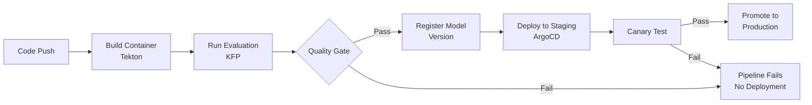
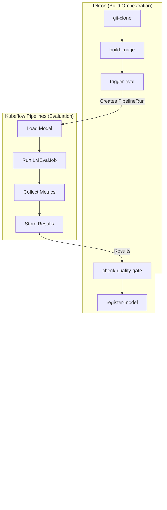

# L3-M5.2 -- CI/CD for AI Applications

**Level:** Expert
**Duration:** 1 hour


## Overview

Traditional CI/CD deploys code: a Git push triggers a build, tests run, and the artifact rolls out. AI applications break this model because you are deploying two things -- code AND models -- and quality is measured by evaluation metrics, not just tests passing. A code change, a model retrain, or even a data shift can each independently require a new deployment, and each needs its own quality gate.

This lesson builds an end-to-end CI/CD pipeline that integrates three systems: Tekton (OpenShift Pipelines) for build orchestration, Kubeflow Pipelines (KFP) for model evaluation, and ArgoCD (OpenShift GitOps) for deployment. The pipeline triggers on a Git push, builds the application container, runs model evaluation as a quality gate, registers the model version in Model Registry, and deploys through a GitOps workflow with canary validation. This extends the main tutorial L08 (CI/CD with Tekton) and L09 (GitOps with ArgoCD) with AI-specific stages that make the pipeline aware of model quality, not just build success.


## Prerequisites

- Completed: [L3-M5.1 -- GitOps for AI Workloads](../1_gitops/) (ArgoCD configured for AI deployments)
- Familiarity with Tekton pipelines (reference main tutorial L08)
- Familiarity with Kubeflow Pipelines (L2-M4)
- Model Registry configured (L1-M4)
- ArgoCD configured and syncing from a Git repository (L3-M5.1)
- OpenShift Pipelines operator installed
- `oc` and `tkn` CLIs authenticated to the cluster


## Concepts

### The AI CI/CD Pipeline

The full pipeline has seven stages. Each stage is implemented as a Tekton Task, with the evaluation stage delegating to a KFP pipeline for heavy lifting:



The pipeline is a Tekton `Pipeline` resource with six tasks chained via `runAfter`. The evaluation task does not run the eval itself -- it triggers a KFP pipeline (which may run on GPU nodes, use specialized eval frameworks like LMEval, or take significant time) and waits for it to complete. This separation keeps the Tekton pipeline lightweight while leveraging KFP for compute-intensive evaluation.

---

### Why AI CI/CD Is Different from Traditional CI/CD

In traditional CI/CD, the trigger is always a code change and the quality gate is always tests:

| Aspect | Traditional CI/CD | AI CI/CD |
|--------|------------------|----------|
| **Trigger** | Code push | Code push, model retrain, data change |
| **Build artifact** | Container image | Container image + model artifact |
| **Quality gate** | Unit tests, integration tests | Evaluation metrics (accuracy, latency, toxicity) |
| **Rollback unit** | Code version (Git SHA) | Code version + model version (both must match) |
| **Canary validation** | HTTP status codes, error rates | Model output comparison, metric drift |
| **Registry** | Container registry | Container registry + Model Registry |

Three things can independently trigger a deployment:

1. **Code change** -- the application code (agent logic, prompt templates, API handlers) changes. The model stays the same.
2. **Model change** -- a new model version is trained or fine-tuned. The code stays the same.
3. **Data change** -- the evaluation dataset or reference data changes, requiring re-evaluation of the current model.

Each trigger follows the same pipeline, but the evaluation focus shifts. A code change needs to verify the new code works with the current model. A model change needs to verify the new model meets quality thresholds. A data change needs to re-validate that the current model still performs well on updated benchmarks.

---

### Integration Points

The three systems -- Tekton, KFP, and ArgoCD -- each own a specific part of the pipeline:



- **Tekton** triggers on a Git push via an EventListener. It clones the repo, builds the container image, and then delegates evaluation to KFP by creating a KFP PipelineRun. After evaluation completes, Tekton checks the results against quality thresholds, registers the model version in Model Registry, and commits the updated image tag to the GitOps repository.
- **KFP** runs the evaluation pipeline. This may involve loading a model, running LMEvalJob (from L3-M2), collecting metrics, and storing results. KFP is better suited for this than Tekton because evaluation tasks may need GPUs, can run for extended periods, and benefit from KFP's experiment tracking.
- **ArgoCD** watches the GitOps repository. When Tekton commits a new image tag, ArgoCD detects the change and syncs the new version to the staging environment. After canary validation, the same version is promoted to production.

---

### Rollback Strategy

AI rollback is more complex than traditional rollback because you must consider both code and model state:

1. **Metric degradation detected** -- monitoring (L2-M5) detects that the deployed model's metrics have degraded below thresholds (e.g., accuracy drops, latency spikes, toxicity increases).
2. **Automatic rollback** -- the monitoring system or a human operator triggers a rollback. This means reverting to the previous model version AND the code version that was validated with it.
3. **Git revert** -- the rollback is implemented as a Git revert in the GitOps repository. This triggers ArgoCD to sync back to the known-good state.
4. **Model Registry update** -- the reverted model version is re-tagged as the active version in Model Registry.

The key insight: you cannot roll back code independently of the model, or vice versa. The Git commit in the GitOps repository pins both the container image (code) and the model version together. Rolling back means reverting to a commit where both were validated together.


## Step-by-Step

### Step 1: Create the Tekton Pipeline

The pipeline defines six tasks that execute sequentially. Each task receives parameters from the pipeline and passes results to downstream tasks via workspace files or Tekton results.

Review the pipeline manifest:

```yaml
# manifests/tekton-pipeline.yaml (abbreviated -- see full file in manifests/)
apiVersion: tekton.dev/v1
kind: Pipeline
metadata:
  name: ai-cicd-pipeline
spec:
  params:
    - name: git-url
    - name: git-revision
      default: main
    - name: image-name
    - name: model-name
    - name: eval-threshold
      default: "0.85"
  workspaces:
    - name: shared-workspace
    - name: git-credentials
  tasks:
    - name: git-clone
      taskRef:
        name: git-clone
        kind: ClusterTask
      ...
    - name: build-image
      runAfter: [git-clone]
      ...
    - name: trigger-eval
      runAfter: [build-image]
      ...
    - name: check-quality-gate
      runAfter: [trigger-eval]
      ...
    - name: register-model
      runAfter: [check-quality-gate]
      ...
    - name: update-gitops
      runAfter: [register-model]
      ...
```

Apply the pipeline and its custom tasks:

```bash
oc apply -f manifests/tekton-pipeline.yaml
```

Expected output:

```
task.tekton.dev/trigger-evaluation created
task.tekton.dev/check-quality-gate created
task.tekton.dev/register-model-version created
task.tekton.dev/update-gitops-repo created
pipeline.tekton.dev/ai-cicd-pipeline created
```

Verify the pipeline was created:

```bash
tkn pipeline describe ai-cicd-pipeline
```

You should see the pipeline with all six tasks listed in order, along with the parameters and workspaces.


### Step 2: Create the Evaluation Trigger Task

The `trigger-evaluation` task is a custom Tekton Task that bridges Tekton and KFP. It uses the KFP SDK to create a PipelineRun in Kubeflow Pipelines, then polls until the run completes.

The task is defined in `manifests/tekton-pipeline.yaml` as part of the pipeline manifest. Its key steps are:

1. Build the model endpoint URL from the image that was just built
2. Call the `scripts/trigger_evaluation.py` script with the endpoint and eval dataset
3. The script creates a KFP PipelineRun, waits for completion, and writes results to the workspace

```yaml
# From manifests/tekton-pipeline.yaml -- trigger-evaluation Task
apiVersion: tekton.dev/v1
kind: Task
metadata:
  name: trigger-evaluation
spec:
  params:
    - name: model-endpoint
      description: URL of the model to evaluate
    - name: eval-dataset
      description: Path or name of the evaluation dataset
      default: "default-eval-set"
    - name: kfp-endpoint
      description: Kubeflow Pipelines API endpoint
      default: "https://ds-pipeline-dspa.redhat-ods-applications.svc.cluster.local:8443"
  results:
    - name: eval-score
      description: Primary evaluation score from the KFP run
    - name: eval-run-id
      description: KFP PipelineRun ID for traceability
  steps:
    - name: run-evaluation
      image: registry.redhat.io/ubi9/python-311:latest
      script: |
        #!/usr/bin/env bash
        pip install kfp requests > /dev/null 2>&1
        python3 /workspace/source/scripts/trigger_evaluation.py \
          --endpoint "$(params.model-endpoint)" \
          --dataset "$(params.eval-dataset)" \
          --kfp-endpoint "$(params.kfp-endpoint)" \
          --output-file /tmp/eval-results.json
        # Extract results for downstream tasks
        SCORE=$(python3 -c "import json; d=json.load(open('/tmp/eval-results.json')); print(d['primary_score'])")
        RUN_ID=$(python3 -c "import json; d=json.load(open('/tmp/eval-results.json')); print(d['run_id'])")
        echo -n "$SCORE" > "$(results.eval-score.path)"
        echo -n "$RUN_ID" > "$(results.eval-run-id.path)"
```

The `trigger_evaluation.py` script (in `scripts/`) handles the KFP interaction. Review it:

```bash
cat scripts/trigger_evaluation.py
```

This script is the bridge between Tekton and KFP -- it translates a Tekton task execution into a KFP pipeline run and waits for the result.


### Step 3: Create the Quality Gate Task

The quality gate task compares evaluation results against configurable thresholds. If any metric falls below its threshold, the task fails and the pipeline stops -- no deployment occurs.

The task is defined in `manifests/tekton-pipeline.yaml`:

```yaml
# From manifests/tekton-pipeline.yaml -- check-quality-gate Task
apiVersion: tekton.dev/v1
kind: Task
metadata:
  name: check-quality-gate
spec:
  params:
    - name: eval-score
      description: Primary evaluation score from the eval run
    - name: threshold
      description: Minimum acceptable score
      default: "0.85"
  steps:
    - name: check-threshold
      image: registry.redhat.io/ubi9/python-311:latest
      script: |
        #!/usr/bin/env python3
        import sys
        score = float("$(params.eval-score)")
        threshold = float("$(params.threshold)")
        print(f"Evaluation score: {score:.4f}")
        print(f"Threshold:        {threshold:.4f}")
        if score >= threshold:
            print("PASSED -- score meets or exceeds threshold")
            sys.exit(0)
        else:
            print("FAILED -- score below threshold, blocking deployment")
            sys.exit(1)
```

This is intentionally simple. In production, you would check multiple metrics:

| Metric | Threshold | Rationale |
|--------|-----------|-----------|
| `accuracy` | > 0.85 | Model correctness |
| `latency_p99` | < 2.0s | User experience |
| `toxicity` | < 0.01 | Safety compliance |
| `hallucination_rate` | < 0.05 | Factual reliability |

You can extend the quality gate task to read a JSON file with multiple thresholds and check each one.


### Step 4: Create the Model Registration Task

When the quality gate passes, the pipeline registers the model version in Model Registry. This creates an auditable record of every deployed model version, linked to the Git commit, pipeline run, and evaluation scores.

```yaml
# From manifests/tekton-pipeline.yaml -- register-model-version Task
apiVersion: tekton.dev/v1
kind: Task
metadata:
  name: register-model-version
spec:
  params:
    - name: model-name
    - name: image-name
    - name: git-revision
    - name: eval-score
    - name: eval-run-id
    - name: pipeline-run-id
  results:
    - name: model-version-id
      description: Registered model version ID
  steps:
    - name: register
      image: registry.redhat.io/ubi9/python-311:latest
      script: |
        #!/usr/bin/env bash
        pip install model-registry > /dev/null 2>&1
        python3 -c "
        from model_registry import ModelRegistry
        registry = ModelRegistry(
            server_address='https://model-registry-service.redhat-ods-applications.svc.cluster.local',
            port=8443,
            is_secure=True
        )
        rm = registry.get_registered_model('$(params.model-name)')
        if rm is None:
            rm = registry.register_model(
                '$(params.model-name)',
                uri='oci://$(params.image-name)',
                version='$(params.git-revision)',
                description='Registered by AI CI/CD pipeline',
                metadata={
                    'git_commit': '$(params.git-revision)',
                    'pipeline_run': '$(params.pipeline-run-id)',
                    'eval_score': '$(params.eval-score)',
                    'eval_run_id': '$(params.eval-run-id)',
                }
            )
        else:
            mv = registry.register_model_version(
                rm,
                uri='oci://$(params.image-name)',
                version='$(params.git-revision)',
                description='Registered by AI CI/CD pipeline',
                metadata={
                    'git_commit': '$(params.git-revision)',
                    'pipeline_run': '$(params.pipeline-run-id)',
                    'eval_score': '$(params.eval-score)',
                    'eval_run_id': '$(params.eval-run-id)',
                }
            )
        print('Model version registered successfully')
        "
```

The metadata links the model version to the pipeline run and evaluation results, making it possible to trace any deployed model back to the exact evaluation that validated it.


### Step 5: Create the GitOps Update Task

The final Tekton task commits the new image tag to the GitOps repository. This triggers ArgoCD to sync the new version to the staging environment.

```yaml
# From manifests/tekton-pipeline.yaml -- update-gitops-repo Task
apiVersion: tekton.dev/v1
kind: Task
metadata:
  name: update-gitops-repo
spec:
  params:
    - name: gitops-repo-url
    - name: image-name
    - name: git-revision
    - name: environment
      default: staging
  workspaces:
    - name: git-credentials
  steps:
    - name: update-and-push
      image: registry.redhat.io/openshift-pipelines/pipelines-git-init-rhel8:latest
      script: |
        #!/usr/bin/env bash
        set -euo pipefail
        # Clone the GitOps repository
        git clone "$(params.gitops-repo-url)" /tmp/gitops-repo
        cd /tmp/gitops-repo
        # Update the image tag in the Kustomize overlay
        cd "overlays/$(params.environment)"
        kustomize edit set image "model-server=$(params.image-name)"
        # Commit and push
        git config user.email "tekton-pipeline@openshift.local"
        git config user.name "Tekton AI CI/CD Pipeline"
        git add .
        git commit -m "chore: update model-server to $(params.git-revision)

        Image: $(params.image-name)
        Pipeline: $(context.pipelineRun.name)
        Commit: $(params.git-revision)"
        git push origin main
```

After this task completes, ArgoCD detects the commit and syncs the staging environment. The ArgoCD Application resource (configured in L3-M5.1) handles the actual deployment.


### Step 6: Set Up Tekton Triggers

Tekton Triggers automate pipeline execution on Git push events. The setup requires three resources: an EventListener (receives webhooks), a TriggerBinding (extracts data from the webhook payload), and a TriggerTemplate (creates a PipelineRun from the extracted data).

Apply the trigger resources:

```bash
oc apply -f manifests/tekton-trigger.yaml
```

Expected output:

```
serviceaccount/pipeline-trigger-sa created
role.rbac.authorization.k8s.io/pipeline-trigger-role created
rolebinding.rbac.authorization.k8s.io/pipeline-trigger-binding created
triggerbinding.triggers.tekton.dev/github-push-binding created
triggertemplate.triggers.tekton.dev/ai-cicd-trigger-template created
eventlistener.triggers.tekton.dev/ai-cicd-listener created
route.route.openshift.io/ai-cicd-webhook created
```

Get the webhook URL to configure in your Git repository:

```bash
oc get route ai-cicd-webhook -o jsonpath='{.spec.host}'
```

Configure this URL as a webhook in your Git repository settings (Settings > Webhooks) with the following:
- **Payload URL:** `https://<route-host>`
- **Content type:** `application/json`
- **Events:** Just the push event

Verify the EventListener pod is running:

```bash
oc get pods -l eventlistener=ai-cicd-listener
```

Expected output:

```
NAME                                        READY   STATUS    RESTARTS   AGE
el-ai-cicd-listener-5b8f9c4d5-x7k2m        1/1     Running   0          30s
```


### Step 7: Demonstrate the Full Pipeline

Now run the pipeline end-to-end. You can either push a code change to trigger it via the webhook, or start a manual run for testing.

Start a manual pipeline run:

```bash
oc apply -f manifests/tekton-pipelinerun.yaml
```

Or using the `tkn` CLI:

```bash
tkn pipeline start ai-cicd-pipeline \
  --param git-url=https://github.com/your-org/your-ai-app.git \
  --param git-revision=main \
  --param image-name=image-registry.openshift-image-registry.svc:5000/ai-cicd/model-server:latest \
  --param model-name=my-llm-agent \
  --param eval-threshold=0.85 \
  --workspace name=shared-workspace,volumeClaimTemplateFile=manifests/workspace-pvc.yaml \
  --workspace name=git-credentials,secret=git-credentials \
  --use-param-defaults
```

Watch the pipeline run:

```bash
tkn pipelinerun logs -f --last
```

You will see each task execute in sequence:

```
[git-clone] Cloning https://github.com/your-org/your-ai-app.git ...
[git-clone] Successfully cloned to /workspace/source

[build-image] Building image ...
[build-image] Image built and pushed: image-registry.openshift-image-registry.svc:5000/ai-cicd/model-server:abc123

[trigger-eval] Creating KFP PipelineRun ...
[trigger-eval] Run created: run-id-12345
[trigger-eval] Waiting for completion ...
[trigger-eval] Run completed. Primary score: 0.92

[check-quality-gate] Evaluation score: 0.9200
[check-quality-gate] Threshold:        0.8500
[check-quality-gate] PASSED -- score meets or exceeds threshold

[register-model] Registering model version ...
[register-model] Model version registered successfully

[update-gitops] Cloning GitOps repository ...
[update-gitops] Updated image tag in overlays/staging
[update-gitops] Pushed commit: chore: update model-server to abc123
```

After the pipeline completes, verify ArgoCD has synced:

```bash
oc get application ai-staging -n openshift-gitops -o jsonpath='{.status.sync.status}'
```

Expected output:

```
Synced
```

**Demonstrating rollback on metric degradation:**

To demonstrate rollback, simulate a failing evaluation by lowering the threshold temporarily or deploying a model that scores below the threshold:

```bash
tkn pipeline start ai-cicd-pipeline \
  --param git-url=https://github.com/your-org/your-ai-app.git \
  --param git-revision=bad-model-branch \
  --param image-name=image-registry.openshift-image-registry.svc:5000/ai-cicd/model-server:bad \
  --param model-name=my-llm-agent \
  --param eval-threshold=0.95 \
  --workspace name=shared-workspace,volumeClaimTemplateFile=manifests/workspace-pvc.yaml \
  --workspace name=git-credentials,secret=git-credentials \
  --use-param-defaults
```

Watch the pipeline fail at the quality gate:

```bash
tkn pipelinerun logs -f --last
```

```
[check-quality-gate] Evaluation score: 0.8200
[check-quality-gate] Threshold:        0.9500
[check-quality-gate] FAILED -- score below threshold, blocking deployment

PipelineRun failed: task check-quality-gate failed
```

The pipeline stops. No model is registered, no GitOps commit is made, no deployment occurs. The quality gate prevented a bad model from reaching staging.

For rollback of an already-deployed model that degrades over time, use ArgoCD's Git-based rollback:

```bash
# In the GitOps repository, revert the last image update
cd /tmp/gitops-repo
git revert HEAD --no-edit
git push origin main
```

ArgoCD will sync the revert, restoring the previous model version.


## Verification

Run through this checklist to confirm the lesson is complete:

1. **Tekton Pipeline exists:**

```bash
tkn pipeline describe ai-cicd-pipeline
```

Confirm six tasks are listed: `git-clone`, `build-image`, `trigger-eval`, `check-quality-gate`, `register-model`, `update-gitops`.

2. **Tekton Triggers are running:**

```bash
oc get eventlistener ai-cicd-listener
oc get pods -l eventlistener=ai-cicd-listener --no-headers | grep Running
```

3. **Webhook Route is accessible:**

```bash
WEBHOOK_URL=$(oc get route ai-cicd-webhook -o jsonpath='{.spec.host}')
curl -sk -o /dev/null -w "%{http_code}" "https://${WEBHOOK_URL}"
```

Expected: `200` or `202`

4. **PipelineRun completed successfully (manual run):**

```bash
tkn pipelinerun list --limit 1
```

Expected status: `Succeeded`

5. **Model version registered:**

```bash
python3 -c "
from model_registry import ModelRegistry
registry = ModelRegistry(
    server_address='https://model-registry-service.redhat-ods-applications.svc.cluster.local',
    port=8443,
    is_secure=True
)
rm = registry.get_registered_model('my-llm-agent')
versions = registry.get_model_versions(rm)
for v in versions:
    print(f'  Version: {v.version}, Score: {v.metadata.get(\"eval_score\", \"N/A\")}')
"
```

6. **ArgoCD synced to staging:**

```bash
oc get application ai-staging -n openshift-gitops -o jsonpath='{.status.sync.status}'
```

Expected: `Synced`

7. **Rollback demo works** -- a pipeline run with a high threshold fails at the quality gate and produces no deployment.


## Key Takeaways

- AI CI/CD integrates three systems: Tekton for build orchestration, KFP for model evaluation, and ArgoCD for GitOps deployment -- each owns the part of the pipeline it does best
- Quality gates based on evaluation metrics (accuracy, latency, toxicity) replace traditional test suites as the primary deployment guard for AI applications
- Model versions are tracked alongside code versions in Model Registry, with metadata linking each version to the pipeline run and evaluation results that validated it
- Rollback must consider both code and model state -- the GitOps repository pins both together in a single commit, so reverting one commit rolls back both
- Tekton Triggers automate the pipeline on Git push, but the same pipeline can be triggered manually or by a model retraining job -- the pipeline does not care what triggered it, only that the quality gate passes
- The evaluation stage delegates to KFP rather than running inline in Tekton, because model evaluation may need GPUs, specialized frameworks, and extended execution time


## Cleanup

Remove the pipeline, triggers, and any PipelineRuns:

```bash
# Delete Tekton Triggers
oc delete eventlistener ai-cicd-listener
oc delete triggertemplate ai-cicd-trigger-template
oc delete triggerbinding github-push-binding
oc delete route ai-cicd-webhook

# Delete the pipeline and custom tasks
oc delete pipeline ai-cicd-pipeline
oc delete task trigger-evaluation check-quality-gate register-model-version update-gitops-repo

# Delete all PipelineRuns (cleans up completed runs)
oc delete pipelinerun --all

# Delete RBAC for triggers
oc delete rolebinding pipeline-trigger-binding
oc delete role pipeline-trigger-role
oc delete serviceaccount pipeline-trigger-sa

# Delete workspace PVCs
oc delete pvc -l tekton.dev/pipeline=ai-cicd-pipeline
```

If you created a dedicated project for this lesson:

```bash
oc delete project ai-cicd
```


## Next Steps

In the next lesson, [L3-M5.3 -- Scaling and Performance Tuning](../3_scaling_tuning/), you will configure horizontal pod autoscaling for AI inference workloads, tune KServe's batching and concurrency settings, and set up resource quotas that account for GPU scheduling -- ensuring your AI applications handle production traffic without over-provisioning expensive hardware.
