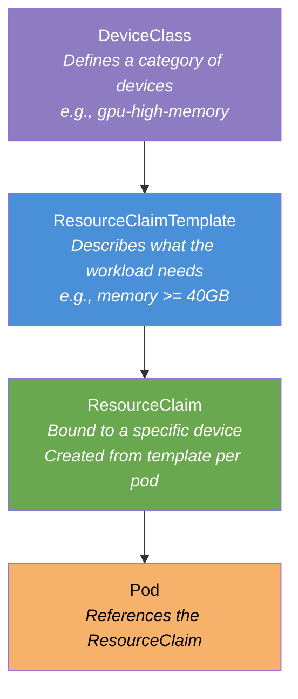

# L3-M5.3 -- Scaling and Performance Tuning

**Level:** Expert
**Duration:** 45 min

## Overview

A working inference deployment is not a cost-efficient one. GPU hours are the most expensive line item in any AI platform budget, and the default configuration of vLLM, KServe, and the Kubernetes scheduler leaves significant performance on the table. This lesson covers the full optimization stack: profiling GPU utilization to find waste, tuning vLLM serving parameters for throughput or latency, partitioning expensive GPUs with MIG to run multiple small models on one device, configuring Kueue priorities so training jobs get GPUs before dev experiments, and understanding Dynamic Resource Allocation (DRA) for fine-grained GPU scheduling. Every GPU hour costs money -- this lesson is about getting maximum value from every GPU.

## Prerequisites

- Completed: [L3-M5.1 -- GitOps for AI](../1_gitops/) and [L3-M5.2 -- CI/CD for AI](../2_cicd/)
- Completed: [L3-M3 -- Advanced Serving](../../M3_advanced_serving/) -- particularly llm-d and quantization
- Completed: [L2-M6 -- Distributed Computing](../../../level_2/M6_distributed/) -- KubeRay, Kueue
- GPU-equipped cluster with NVIDIA GPU Operator and DCGM exporter running
- vLLM-based InferenceService deployed (e.g., the `gemma-4-e4b` model from L1-M2.2)
- User-workload monitoring enabled (L1-M5.3)
- `cluster-admin` access (required for Kueue ClusterQueues and DRA DeviceClasses)

## Concepts

### 1. GPU Utilization Optimization

The first step in tuning is measurement. Most GPU clusters run at 30-50% average utilization -- meaning half the GPU budget is wasted on idle compute. Common waste patterns include:

- **Over-provisioned GPUs** -- Running a 2B parameter model on an A100 80GB when a T4 16GB would suffice. The model uses 4GB of VRAM; the remaining 76GB sits empty.
- **Idle inference pods** -- Inference endpoints scaled to multiple replicas during peak hours remain at that replica count during off-peak. Without KEDA scale-to-zero (L1-M2.4), idle pods hold GPUs 24/7.
- **Batch jobs holding GPUs while waiting for data** -- A training job requests 4 GPUs, then spends 40% of wall-clock time downloading data or checkpointing to S3 while the GPUs idle.
- **No right-sizing feedback loop** -- Teams request "4 A100s" because that is what worked last time, without checking whether the workload actually saturates the hardware.

#### Model Size vs Recommended GPU

This table provides rough guidance for matching models to GPUs. Actual requirements depend on quantization, sequence length, and batch size.

| Model Size | Parameters (FP16) | VRAM Required (FP16) | Recommended GPU | Notes |
|-----------|-------------------|---------------------|-----------------|-------|
| Small | 1-3B | 2-6 GB | T4 (16GB) | Inference only; fine-tuning needs more headroom |
| Medium | 7-8B | 14-16 GB | T4 (16GB) or L4 (24GB) | T4 is tight at FP16; use quantization or L4 |
| Large | 13-14B | 26-28 GB | A10G (24GB) or L40S (48GB) | A10G requires quantization; L40S fits FP16 |
| XL | 30-34B | 60-68 GB | A100 (80GB) or 2x A10G | Single A100 or tensor-parallel across 2 GPUs |
| XXL | 70B+ | 140+ GB | 2x A100 (80GB) or H100 (80GB) | Multi-GPU tensor parallelism required |

The key insight: if your GPU memory utilization (reported by `nvidia-smi` or DCGM) is consistently below 50%, you are likely over-provisioned.

---

### 2. MIG (Multi-Instance GPU) Partitioning

MIG (Multi-Instance GPU) is an NVIDIA hardware feature available on A100, A30, H100, and H200 GPUs that partitions a single physical GPU into up to seven isolated instances. Each MIG instance has its own dedicated compute cores, memory, and memory bandwidth -- workloads in different MIG slices cannot see or interfere with each other.

#### MIG Profiles (A100 40GB)

| Profile | Compute Slices | Memory | Use Case |
|---------|---------------|--------|----------|
| `1g.5gb` | 1/7 | 5 GB | Tiny models (<1B), development, CI testing |
| `2g.10gb` | 2/7 | 10 GB | Small models (1-3B), batch inference |
| `3g.20gb` | 3/7 | 20 GB | Medium models (7B quantized), production inference |
| `4g.20gb` | 4/7 | 20 GB | Medium models with more compute headroom |
| `7g.40gb` | 7/7 | 40 GB | Full GPU -- equivalent to non-MIG mode |

#### MIG Profiles (A100 80GB)

| Profile | Compute Slices | Memory | Use Case |
|---------|---------------|--------|----------|
| `1g.10gb` | 1/7 | 10 GB | Small models, development |
| `2g.20gb` | 2/7 | 20 GB | Medium models (7B quantized) |
| `3g.40gb` | 3/7 | 40 GB | Large models (13B quantized) |
| `4g.40gb` | 4/7 | 40 GB | Large models with more compute |
| `7g.80gb` | 7/7 | 80 GB | Full GPU |

#### Hardware Profile for MIG

On OpenShift AI, MIG instances appear as distinct Kubernetes resources (e.g., `nvidia.com/mig-3g.20gb` instead of `nvidia.com/gpu`). You create a Hardware Profile that references the MIG resource name, and users can select it from the dashboard dropdown just like a regular GPU profile.

The GPU Operator manages MIG configuration through the `ClusterPolicy` CR. Once MIG mode is enabled on a node, the GPU Feature Discovery (GFD) component adds labels for each MIG profile, and the device plugin registers the MIG instances as schedulable resources.

**When to use MIG:**
- Running multiple small models on a single expensive GPU
- Development environments where full GPU access is unnecessary
- Batch inference of small models that do not need the full GPU
- Cost optimization in multi-tenant clusters

**Limitations:**
- Only supported on A100, A30, H100, and H200 GPUs
- Changing MIG profiles requires a GPU reset (disrupts running workloads)
- Not all MIG profile combinations fit on a single GPU -- consult the NVIDIA MIG user guide
- Some profiles cannot coexist (e.g., you cannot create both `3g.20gb` and `4g.20gb` on the same GPU)

---

### 3. Dynamic Resource Allocation (DRA)

Dynamic Resource Allocation (DRA) is a Kubernetes feature that reached GA in OpenShift 4.21. It replaces the traditional device plugin model for GPU allocation with a more expressive, structured approach.

#### The Problem with Device Plugins

The traditional device plugin model treats GPUs as opaque integers -- you request `nvidia.com/gpu: 1` and the scheduler picks any available GPU. You cannot express preferences like "give me a GPU with at least 40GB of memory" or "give me an A100, not a T4." Multi-GPU requests may land on different nodes, and there is no way to request specific GPU topology (e.g., NVLink-connected pairs).

#### How DRA Works

DRA introduces three key resources:



| Resource | Scope | Purpose |
|----------|-------|---------|
| **DeviceClass** | Cluster | Defines a category of devices with filters (e.g., "all GPUs with memory >= 40GB"). Analogous to a StorageClass for persistent volumes. |
| **ResourceClaimTemplate** | Namespace | A template that describes what a workload needs. Each pod gets its own ResourceClaim created from this template. |
| **ResourceClaim** | Namespace | A bound allocation -- similar to a PVC. Represents a specific device assigned to a specific pod. |

#### Benefits over Device Plugins

| Capability | Device Plugin | DRA |
|-----------|--------------|-----|
| Request "any GPU" | Yes | Yes |
| Request GPU by attributes (memory, compute capability) | No | Yes |
| Request specific GPU topology (NVLink pairs) | No | Yes (via selectors) |
| Dynamic sharing between pods | No (static partition only) | Yes |
| Structured parameters in pod spec | No (opaque integer) | Yes (CEL expressions) |
| Vendor-neutral API | No (vendor-specific resource names) | Yes (DeviceClass abstraction) |

DRA does not replace MIG -- they are complementary. MIG partitions hardware; DRA provides the scheduling API to request specific partitions or GPU attributes.

---

### 4. vLLM Tuning Parameters

vLLM exposes dozens of configuration flags. The table below covers the parameters with the most impact on production performance. Each one trades off between throughput, latency, and memory consumption.

#### Parameter Reference

| Parameter | Default | Effect | Tradeoff |
|-----------|---------|--------|----------|
| `--tensor-parallel-size` | 1 | Splits the model across N GPUs. Must match the GPU count in resource requests. | More GPUs = lower latency per request, but uses more hardware. |
| `--max-model-len` | Model's max | Maximum sequence length (prompt + generation). Determines KV cache size. | Lower = less memory used for KV cache, more concurrent requests. Higher = supports longer prompts. |
| `--gpu-memory-utilization` | 0.9 | Fraction of GPU memory reserved for model weights + KV cache. The remaining fraction stays free for CUDA overhead. | Higher = more KV cache space = more concurrent requests. Too high = OOM crashes. |
| `--max-num-seqs` | 256 | Maximum number of sequences processed concurrently. Controls the batch size for continuous batching. | Higher = more throughput. Lower = lower per-request latency. |
| `--max-num-batched-tokens` | Varies | Maximum number of tokens in a single batch iteration. Controls how many tokens are processed in parallel. | Higher = more throughput. Can increase latency for individual requests. |
| `--enforce-eager` | false | Disables CUDA graph capture. CUDA graphs pre-compile execution plans for faster kernel launches. | `true` = saves ~1-2GB GPU memory, but reduces throughput by 10-30%. Use when memory-constrained. |
| `--quantization` | none | Enable weight quantization: `awq`, `gptq`, `fp8`, `bitsandbytes`. Cross-reference L3-M3.2. | Reduces memory by 2-4x. May reduce quality slightly. |
| `--enable-chunked-prefill` | false | Processes long prompts in chunks interleaved with decode steps, instead of blocking until the full prompt is prefilled. | Improves TTFT for concurrent requests with long prompts. May slightly reduce throughput. |
| `--speculative-model` | none | Path to a smaller draft model for speculative decoding. The draft model generates candidate tokens that the main model verifies in parallel. | Can improve generation speed 1.5-3x for agreeable draft models. Adds complexity and memory. |
| `--disable-log-requests` | false | Disables per-request logging. | Reduces CPU overhead in high-throughput scenarios. Less visibility for debugging. |
| `--swap-space` | 4 | CPU swap space (in GiB) for offloading KV cache blocks when GPU memory is full. | Higher = more resilience to memory pressure. Uses CPU RAM and PCIe bandwidth. |

#### Tuning Profiles

Three common profiles for different optimization goals:

| Setting | Latency-Optimized | Throughput-Optimized | Memory-Optimized |
|---------|-------------------|---------------------|------------------|
| `--max-num-seqs` | 8-16 | 128-512 | 32-64 |
| `--max-model-len` | Model default | Model default | 2048-4096 (reduced) |
| `--gpu-memory-utilization` | 0.85 | 0.95 | 0.80 |
| `--enable-chunked-prefill` | true | false | false |
| `--enforce-eager` | false | false | true |
| `--quantization` | none | none | awq or fp8 |
| `--swap-space` | 0 | 8 | 4 |
| **Use case** | Chat, interactive | Batch processing, high QPS APIs | Fitting large models on smaller GPUs |
| **Key metric** | TTFT, P99 latency | Requests/sec, tokens/sec | GPU memory usage |

---

### 5. Kueue Tuning for AI Workloads

In L2-M6.2 you configured Kueue with basic queues and priorities. For a production AI platform, the Kueue configuration must reflect the real priority hierarchy of GPU workloads and enable efficient resource sharing across teams.

#### Priority Hierarchy for AI Workloads

| Priority Class | Value | Workload Type | Preemptible? |
|---------------|-------|---------------|-------------|
| `training-critical` | 1000 | Scheduled production training runs with SLA deadlines | No |
| `inference-production` | 800 | Production inference endpoints that serve customers | No |
| `batch-standard` | 400 | Batch inference, embedding generation, evaluation jobs | Yes, by training-critical or inference-production |
| `dev-experiments` | 100 | Interactive experiments, notebook GPU access, prototyping | Yes, by anything higher |

#### Preemption Strategy

For a GPU cluster, the preemption policy should balance responsiveness with stability:

- **withinClusterQueue: LowerPriority** -- A production training job can preempt a dev experiment in the same queue. This is the most common policy.
- **reclaimWithinCohort: LowerPriority** -- If the training queue lent GPUs to the dev queue (borrowing), a new training job can reclaim those GPUs by preempting the dev workload.
- **borrowWithinCohort.policy: LowerPriority** with **maxPriorityThreshold** -- Borrowing queues can only preempt workloads below a certain priority threshold. This prevents a batch job from preempting a production inference endpoint.

#### Fair Sharing and Borrowing

In a multi-tenant GPU cluster:

- Each team gets a **nominal quota** (guaranteed allocation)
- **borrowingLimit** caps how much a team can use beyond its quota when other teams' GPUs are idle
- **lendingLimit** controls how many idle GPUs a team makes available to others
- **Fair sharing weights** can be set per ClusterQueue to give proportionally more resources to some teams

---

### 6. Network Tuning for Distributed Training

For single-GPU inference workloads, standard Kubernetes networking (OVN-Kubernetes, Calico) is sufficient. Network tuning matters for distributed training of large models (70B+ parameters) across multiple nodes, where GPU-to-GPU communication bandwidth becomes the bottleneck.

#### SR-IOV (Single Root I/O Virtualization)

SR-IOV bypasses the kernel networking stack by providing hardware-level virtual network interfaces directly to pods. On OpenShift, the SR-IOV Network Operator manages SR-IOV devices and creates NetworkAttachmentDefinitions for pods to consume.

- **Benefit:** 2-5x higher bandwidth and significantly lower latency compared to OVN-Kubernetes
- **Requirement:** SR-IOV-capable NICs (e.g., Mellanox ConnectX-6) and the SR-IOV Network Operator
- **Use case:** Multi-node distributed training with NCCL all-reduce operations

#### GPUDirect RDMA

GPUDirect RDMA allows GPUs on different nodes to communicate directly, bypassing both the CPU and the kernel network stack entirely. Data moves from GPU memory on Node A directly to GPU memory on Node B through the InfiniBand or RoCE network.

- **Benefit:** Near-linear scaling of multi-node training throughput
- **Requirement:** NVIDIA GPUs with GPUDirect support, InfiniBand or RoCE v2 NICs, MOFED drivers
- **Use case:** Training 70B+ parameter models across 4-16 nodes

#### NCCL Configuration

NCCL (NVIDIA Collective Communications Library) handles GPU-to-GPU communication in distributed training. Key environment variables for tuning:

| Variable | Purpose | Recommended Value |
|----------|---------|-------------------|
| `NCCL_NET_GDR_LEVEL` | Controls GPUDirect RDMA usage level | `5` (all operations use GDR) |
| `NCCL_IB_HCA` | Specifies which InfiniBand adapters to use | Adapter name from `ibstat` |
| `NCCL_SOCKET_IFNAME` | Network interface for TCP fallback | `eth0` or the SR-IOV interface |
| `NCCL_DEBUG` | Logging verbosity | `INFO` for troubleshooting, `WARN` for production |
| `NCCL_P2P_LEVEL` | Controls peer-to-peer GPU communication | `NVL` (use NVLink when available) |

**When network tuning matters:** Distributed training of models with >30B parameters across multiple nodes. For single-node multi-GPU (tensor parallelism via NVLink) and single-GPU inference, standard networking is fine.

---

### 7. Cost Optimization Strategies

#### GPU Cost per Inference Request

Calculating the cost per inference request helps justify optimization work:

```
Cost per request = (GPU cost per hour / requests per hour)
```

Example with a single A100 at $3.00/hour:
- Unoptimized: 50 req/sec = 180,000 req/hour = $0.000017/request
- Optimized (2x throughput): 100 req/sec = 360,000 req/hour = $0.0000083/request
- The optimization halves the per-request cost without adding hardware

#### Key Strategies

| Strategy | Savings Potential | Complexity | Reference |
|----------|------------------|------------|-----------|
| Right-size model to GPU | 30-70% | Low | This lesson, Section 1 |
| vLLM parameter tuning | 2-5x throughput | Medium | This lesson, Section 4 |
| MIG partitioning | 2-7x GPU efficiency | Medium | This lesson, Section 2 |
| Quantization (AWQ/FP8) | 2-4x memory savings | Medium | L3-M3.2 |
| KEDA scale-to-zero | 50-90% off-peak savings | Low | L1-M2.4 |
| Kueue borrowing | 15-30% better utilization | Low | L2-M6.2, this lesson |
| Spot instances for training | 50-70% compute cost | High (needs checkpointing) | Cloud-provider specific |
| Off-peak batch scheduling | 10-30% cost reduction | Low | CronJob + Kueue |

## Step-by-Step

### Step 1: Profile Current GPU Utilization

Before tuning, establish a baseline. Query DCGM metrics from Prometheus to understand your current GPU utilization.

Verify DCGM exporter is running:

```bash
oc get pods -n nvidia-gpu-operator -l app=nvidia-dcgm-exporter
```

Expected output:

```
NAME                                READY   STATUS    RESTARTS   AGE
nvidia-dcgm-exporter-xxxxx         1/1     Running   0          5d
```

Query GPU utilization from the OpenShift Prometheus (via Thanos):

```bash
# GPU compute utilization (0-100%)
oc exec -n openshift-monitoring \
  $(oc get pod -n openshift-monitoring -l app.kubernetes.io/name=thanos-query -o name | head -1) \
  -- curl -s --data-urlencode \
  'query=avg_over_time(DCGM_FI_DEV_GPU_UTIL{exported_namespace="gemma-model"}[1h])' \
  'http://localhost:9090/api/v1/query' | python3 -m json.tool
```

Key PromQL queries for GPU profiling:

```promql
# Average GPU compute utilization over the last hour
avg_over_time(DCGM_FI_DEV_GPU_UTIL{exported_namespace="gemma-model"}[1h])

# GPU memory utilization percentage
DCGM_FI_DEV_FB_USED{exported_namespace="gemma-model"}
  / DCGM_FI_DEV_FB_TOTAL{exported_namespace="gemma-model"} * 100

# GPU power draw (watts) -- shows if the GPU is actually working
DCGM_FI_DEV_POWER_USAGE{exported_namespace="gemma-model"}

# GPU temperature (Celsius) -- sustained high temps indicate sustained load
DCGM_FI_DEV_GPU_TEMP{exported_namespace="gemma-model"}
```

Also check the vLLM-specific metrics:

```bash
ROUTE_URL=$(oc get route -l serving.kserve.io/inferenceservice=gemma-4-e4b \
  -n gemma-model -o jsonpath='{.items[0].spec.host}')
curl -sk "https://${ROUTE_URL}/metrics" | grep -E "vllm:(num_requests|gpu_cache|kv_cache)"
```

**Interpreting the results:**

| Metric | Healthy Range | Action if Outside |
|--------|--------------|-------------------|
| GPU compute utilization | 60-90% | Below 60%: over-provisioned. Above 95%: needs scaling. |
| GPU memory utilization | 70-95% | Below 50%: over-provisioned GPU. Above 98%: risk of OOM. |
| `vllm:num_requests_waiting` | 0-5 | Consistently > 10: scale up or tune parameters. |
| `vllm:kv_cache_usage_perc` | 0.5-0.9 | Consistently > 0.95: reduce `--max-model-len` or add replicas. |

---

### Step 2: Tune vLLM Parameters

Start with the currently deployed InferenceService as a baseline. Run a GuideLLM benchmark to establish baseline metrics (see L1-M5.2 for GuideLLM setup):

```bash
# Record baseline throughput and latency
oc create -n gemma-model -f - <<'EOF'
apiVersion: batch/v1
kind: Job
metadata:
  name: guidellm-baseline
  labels:
    tutorial-level: "3"
    tutorial-module: "M5"
spec:
  template:
    spec:
      containers:
        - name: guidellm
          image: ghcr.io/neuralmagic/guidellm:latest
          command:
            - guidellm
            - benchmark
            - --target
            - "http://gemma-4-e4b-predictor.gemma-model.svc.cluster.local:8080/v1"
            - --model
            - "gemma-4-e4b"
            - --rate
            - "constant:4"
            - --max-seconds
            - "120"
          resources:
            requests:
              cpu: "2"
              memory: "4Gi"
      restartPolicy: Never
  backoffLimit: 0
EOF
```

Wait for the benchmark to complete and record the results:

```bash
oc wait --for=condition=complete job/guidellm-baseline -n gemma-model --timeout=300s
oc logs job/guidellm-baseline -n gemma-model | tail -30
```

Now apply the throughput-optimized InferenceService:

```bash
oc apply -f manifests/optimized-inferenceservice.yaml
```

The manifest contains three variants separated by `---`. By default, only the first document (latency-optimized) will apply since they share the same resource name. Choose the profile that matches your optimization goal:

- **Latency-optimized:** Best for interactive chat applications where TTFT matters most
- **Throughput-optimized:** Best for batch APIs and high-QPS workloads
- **Memory-optimized:** Best for fitting large models on smaller GPUs

To apply a specific variant, extract it from the file:

```bash
# Apply the throughput-optimized variant (second document in the YAML)
oc apply -f manifests/optimized-inferenceservice.yaml
```

Wait for the rollout to complete:

```bash
oc rollout status deployment/gemma-4-e4b-predictor -n gemma-model --timeout=600s
```

Run the benchmark again to measure improvement:

```bash
oc create -n gemma-model -f - <<'EOF'
apiVersion: batch/v1
kind: Job
metadata:
  name: guidellm-optimized
  labels:
    tutorial-level: "3"
    tutorial-module: "M5"
spec:
  template:
    spec:
      containers:
        - name: guidellm
          image: ghcr.io/neuralmagic/guidellm:latest
          command:
            - guidellm
            - benchmark
            - --target
            - "http://gemma-4-e4b-predictor.gemma-model.svc.cluster.local:8080/v1"
            - --model
            - "gemma-4-e4b"
            - --rate
            - "constant:4"
            - --max-seconds
            - "120"
          resources:
            requests:
              cpu: "2"
              memory: "4Gi"
      restartPolicy: Never
  backoffLimit: 0
EOF
```

Compare results:

```bash
echo "=== Baseline ==="
oc logs job/guidellm-baseline -n gemma-model | grep -E "throughput|latency|TTFT"
echo ""
echo "=== Optimized ==="
oc logs job/guidellm-optimized -n gemma-model | grep -E "throughput|latency|TTFT"
```

---

### Step 3: Configure a MIG Hardware Profile

This step requires an A100, A30, H100, or H200 GPU with MIG mode enabled. If your cluster does not have MIG-capable hardware, review the manifests and concepts but skip the apply commands.

First, verify that MIG mode is enabled on the GPU node:

```bash
# Check for MIG-capable GPUs
oc debug node/<gpu-node-name> -- chroot /host nvidia-smi --query-gpu=mig.mode.current --format=csv,noheader
```

Expected output if MIG is enabled:

```
Enabled
```

Check available MIG instances:

```bash
oc debug node/<gpu-node-name> -- chroot /host nvidia-smi mig -lgi
```

Expected output (A100 40GB with 3g.20gb instances):

```
+----------------------------------------------------+
| GPU instances:                                     |
| GPU   Name          Profile  Instance   Placement  |
|                       ID       ID       Start:Size |
|=====================================================|
|   0  MIG 3g.20gb       9        0          0:4     |
|   0  MIG 3g.20gb       9        1          4:4     |
+----------------------------------------------------+
```

Verify the MIG resources are registered as schedulable resources:

```bash
oc get nodes -l nvidia.com/gpu.present=true \
  -o jsonpath='{range .items[*]}{.metadata.name}{"\t"}{.status.allocatable}{"\n"}{end}' | \
  grep -o 'nvidia.com/mig-[^"]*"[^"]*"'
```

Expected output:

```
nvidia.com/mig-3g.20gb":"2"
```

Create the Hardware Profile for MIG:

```bash
oc apply -f manifests/mig-hardware-profile.yaml
```

Verify the Hardware Profile appears in the dashboard:

```bash
oc get hardwareprofile -n redhat-ods-applications gpu-mig-3g-20gb
```

Expected output:

```
NAME               AGE
gpu-mig-3g-20gb    5s
```

Deploy a small model on the MIG instance to verify it works:

```bash
oc apply -n gemma-model -f - <<'EOF'
apiVersion: serving.kserve.io/v1beta1
kind: InferenceService
metadata:
  name: small-model-mig
  labels:
    tutorial-level: "3"
    tutorial-module: "M5"
spec:
  predictor:
    model:
      modelFormat:
        name: vLLM
      runtime: gemma-4-e4b
      resources:
        requests:
          cpu: "2"
          memory: "8Gi"
          nvidia.com/mig-3g.20gb: "1"
        limits:
          cpu: "4"
          memory: "16Gi"
          nvidia.com/mig-3g.20gb: "1"
    tolerations:
      - key: "nvidia.com/gpu"
        operator: "Exists"
        effect: "NoSchedule"
EOF
```

Verify the pod landed on a MIG instance:

```bash
oc get pod -n gemma-model -l serving.kserve.io/inferenceservice=small-model-mig \
  -o jsonpath='{.items[0].spec.containers[0].resources}'
```

---

### Step 4: Configure Kueue Priorities for AI Workloads

Build on the Kueue foundation from L2-M6.2. Create production-grade priority classes and a ClusterQueue with preemption and borrowing for a multi-tenant AI platform.

Apply the Kueue configuration:

```bash
oc apply -f manifests/kueue-config.yaml
```

This creates:
- Four `WorkloadPriorityClass` resources with the AI workload priority hierarchy
- Two `ResourceFlavor` resources (full GPU and MIG instances)
- A `ClusterQueue` with preemption and borrowing policies
- Two `LocalQueue` resources for the training and inference teams

Verify the priority classes:

```bash
oc get workloadpriorityclass
```

Expected output:

```
NAME                    VALUE   AGE
training-critical       1000    5s
inference-production    800     5s
batch-standard          400     5s
dev-experiments         100     5s
```

Verify the ClusterQueue:

```bash
oc get clusterqueue ai-gpu-cluster-queue -o wide
```

Expected output:

```
NAME                    COHORT        PENDING WORKLOADS   ADMITTED WORKLOADS   AGE
ai-gpu-cluster-queue    ai-platform   0                   0                    5s
```

Verify the LocalQueues:

```bash
oc get localqueues -A
```

Expected output:

```
NAMESPACE        NAME                CLUSTERQUEUE            PENDING   ADMITTED
training-team    training-queue      ai-gpu-cluster-queue    0         0
inference-team   inference-queue     ai-gpu-cluster-queue    0         0
```

Demonstrate preemption by submitting a low-priority job that consumes available GPUs, then a high-priority job that preempts it:

```bash
# Submit a low-priority dev experiment
oc apply -n training-team -f - <<'EOF'
apiVersion: batch/v1
kind: Job
metadata:
  name: dev-experiment-low-priority
  labels:
    kueue.x-k8s.io/queue-name: training-queue
    kueue.x-k8s.io/priority-class: dev-experiments
    tutorial-level: "3"
    tutorial-module: "M5"
spec:
  template:
    spec:
      containers:
        - name: experiment
          image: registry.access.redhat.com/ubi9/ubi-minimal:latest
          command: ["sh", "-c", "echo 'Dev experiment running...'; sleep 300"]
          resources:
            requests:
              cpu: "4"
              memory: "16Gi"
      restartPolicy: Never
  backoffLimit: 0
EOF

# Wait for it to be admitted
sleep 10
oc get workloads -n training-team

# Now submit a high-priority training job
oc apply -n training-team -f - <<'EOF'
apiVersion: batch/v1
kind: Job
metadata:
  name: training-critical-job
  labels:
    kueue.x-k8s.io/queue-name: training-queue
    kueue.x-k8s.io/priority-class: training-critical
    tutorial-level: "3"
    tutorial-module: "M5"
spec:
  template:
    spec:
      containers:
        - name: training
          image: registry.access.redhat.com/ubi9/ubi-minimal:latest
          command: ["sh", "-c", "echo 'Critical training running...'; sleep 60"]
          resources:
            requests:
              cpu: "4"
              memory: "16Gi"
      restartPolicy: Never
  backoffLimit: 0
EOF
```

Watch Kueue preempt the low-priority job:

```bash
oc get workloads -n training-team --watch
```

When resources are constrained, the `dev-experiment-low-priority` workload will be evicted to make room for the `training-critical-job`.

---

### Step 5: Cost Analysis

Calculate the cost impact of the optimizations applied in this lesson.

Query the current throughput of the optimized endpoint:

```bash
# Get requests per second over the last hour
oc exec -n openshift-monitoring \
  $(oc get pod -n openshift-monitoring -l app.kubernetes.io/name=thanos-query -o name | head -1) \
  -- curl -s --data-urlencode \
  'query=rate(vllm:request_success_total{namespace="gemma-model"}[1h])' \
  'http://localhost:9090/api/v1/query' | python3 -m json.tool
```

Use this template to compare costs:

```
=== Cost Comparison ===

GPU Type:           ___________ (e.g., A100 80GB)
GPU Cost/Hour:      $___________ (check your cloud provider pricing)

--- Unoptimized Baseline ---
Throughput:         ___________ req/sec
Requests/Hour:      ___________ (throughput * 3600)
Cost/Request:       $___________ (GPU cost / requests per hour)
GPUs Required:      ___________

--- After vLLM Tuning ---
Throughput:         ___________ req/sec (from benchmark)
Requests/Hour:      ___________
Cost/Request:       $___________
Savings:            ___________%

--- After MIG (if applicable) ---
Models per GPU:     ___________ (e.g., 2 models on 2x 3g.20gb)
Effective GPUs:     ___________ (reduced by MIG sharing)
Additional Savings: ___________%

--- After Kueue Borrowing ---
Cluster Utilization Before: ___________%
Cluster Utilization After:  ___________%
Idle GPU Reduction:         ___________%
```

Typical savings from a full optimization pass:

| Optimization | Typical Impact |
|-------------|---------------|
| vLLM parameter tuning | 2-5x throughput improvement |
| MIG partitioning (for small models) | 2-7x more models per GPU |
| KEDA scale-to-zero | 50-90% savings during off-peak |
| Kueue borrowing | 15-30% better cluster utilization |
| Combined | 60-80% cost reduction vs. naive deployment |

## Verification

1. **GPU utilization metrics show improvement:**

```bash
# Compare GPU utilization before and after tuning
oc exec -n openshift-monitoring \
  $(oc get pod -n openshift-monitoring -l app.kubernetes.io/name=thanos-query -o name | head -1) \
  -- curl -s --data-urlencode \
  'query=DCGM_FI_DEV_GPU_UTIL{exported_namespace="gemma-model"}' \
  'http://localhost:9090/api/v1/query' | python3 -m json.tool
```

Expected: GPU utilization is closer to the 60-90% target range.

2. **Benchmark results show throughput/latency improvement:**

```bash
# Compare baseline and optimized benchmark results
oc logs job/guidellm-baseline -n gemma-model 2>/dev/null | tail -5
oc logs job/guidellm-optimized -n gemma-model 2>/dev/null | tail -5
```

Expected: Throughput (req/sec or tokens/sec) is measurably higher with the optimized configuration.

3. **MIG partitioning working (if applicable):**

```bash
oc get pods -n gemma-model -l serving.kserve.io/inferenceservice=small-model-mig \
  -o jsonpath='{.items[0].spec.containers[0].resources.requests}' 2>/dev/null
```

Expected: The pod shows `nvidia.com/mig-3g.20gb: 1` in resource requests.

4. **Kueue preemption works correctly:**

```bash
oc get workloads -n training-team
```

Expected: The `training-critical` workload is `Admitted` and the `dev-experiments` workload was preempted (its Job was re-suspended or evicted).

5. **Kueue priority classes exist:**

```bash
oc get workloadpriorityclass --no-headers | wc -l
```

Expected: `4` (training-critical, inference-production, batch-standard, dev-experiments).

## Key Takeaways

- **GPU utilization below 60% is wasted money.** Use DCGM metrics and `nvidia-smi` to profile before spending time on application-level tuning. Right-sizing the model to the GPU is the highest-impact optimization.
- **vLLM tuning can improve throughput 2-5x without hardware changes.** The key parameters are `--max-num-seqs`, `--gpu-memory-utilization`, `--max-model-len`, and `--enable-chunked-prefill`. Always benchmark before and after with GuideLLM.
- **MIG partitioning enables running multiple small models on one GPU.** This is ideal for development environments and batch inference of sub-7B models. Hardware Profiles make MIG transparent to users.
- **Kueue priorities ensure training jobs get GPUs before dev experiments.** Define a clear priority hierarchy (training > production inference > batch > dev) and configure preemption so critical workloads are never blocked by low-priority work.
- **DRA (GA in OpenShift 4.21) provides fine-grained GPU allocation.** It replaces the opaque `nvidia.com/gpu: 1` model with structured parameters -- request GPUs by memory size, compute capability, or topology.
- **Network tuning matters for distributed training but not for inference.** SR-IOV and GPUDirect RDMA are worth the complexity only for multi-node training of 70B+ models.

## Cleanup

```bash
# Delete benchmark jobs
oc delete job guidellm-baseline guidellm-optimized -n gemma-model 2>/dev/null

# Delete MIG test model (if created)
oc delete inferenceservice small-model-mig -n gemma-model 2>/dev/null

# Revert InferenceService to original configuration (re-apply your baseline manifest)
# oc apply -f <your-original-inferenceservice.yaml>

# Delete Kueue test jobs
oc delete job dev-experiment-low-priority training-critical-job -n training-team 2>/dev/null

# Delete Kueue configuration
oc delete -f manifests/kueue-config.yaml 2>/dev/null

# Delete DRA resources (if created)
oc delete -f manifests/dra-resourceclaim.yaml 2>/dev/null

# Delete MIG Hardware Profile
oc delete -f manifests/mig-hardware-profile.yaml 2>/dev/null

# Delete team namespaces created for Kueue demo
oc delete project training-team inference-team 2>/dev/null
```

## Next Steps

Continue to [L3-M5.4 -- Capstone: End-to-End AI Platform](../4_capstone/) where you will design and deploy a complete production AI platform that integrates everything from this module: GitOps-managed infrastructure (L3-M5.1), CI/CD pipelines for model delivery (L3-M5.2), and the scaling and performance tuning techniques from this lesson. The capstone ties together all three levels of the tutorial into a cohesive, production-grade OpenShift AI deployment.
