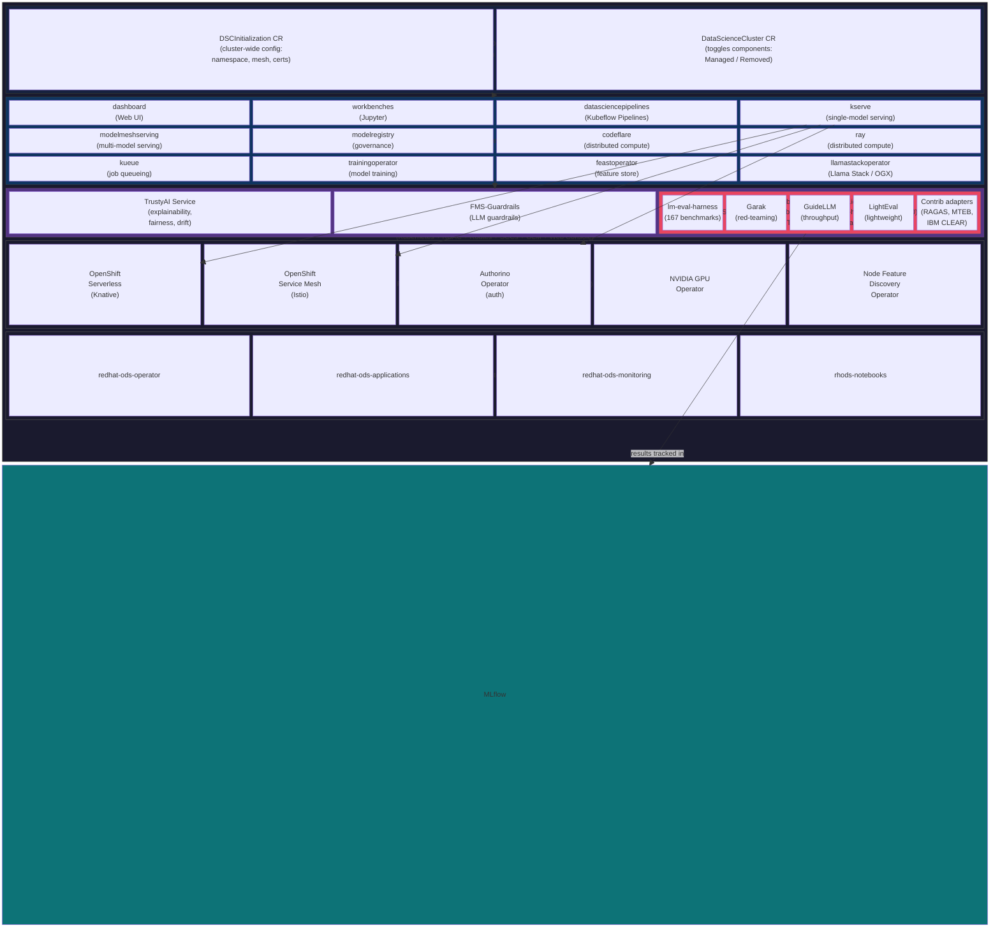

# AI Tutorial

A project-based AI tutorial for developers who already know Kubernetes and OpenShift. Covers two tracks: the **Red Hat AI Ecosystem** (desktop to server) and **OpenShift AI** (the cluster-scale platform).

## Two Tracks, One Journey

Red Hat provides a three-tier journey for AI adoption: **Podman AI Lab** (desktop), **RHEL AI** (server/bare-metal), and **OpenShift AI** (platform/cluster). This tutorial is split into two tracks that mirror that journey:

| Track | What It Covers | Lessons | Time |
|-------|---------------|---------|------|
| [**01 — Red Hat AI Ecosystem**](01_redhat_ai/syllabus.md) | Everything *below* the platform: Podman AI Lab, RHEL AI, Granite models, model optimization, cross-tier workflows | 17 lessons | ~14-18h |
| [**02 — OpenShift AI**](02_openshift_ai/syllabus.md) | The platform itself: KServe/vLLM serving, fine-tuning, RAG, agents, MCP, pipelines, governance, observability, production ops | 66 lessons | ~56-67h |

**Start with Track 01** if you want the big picture — how models move from a laptop prototype (Podman AI Lab) to a single-server deployment (RHEL AI) to a cluster-scale platform (OpenShift AI). It provides the ecosystem context that makes Track 02 more concrete.

**Start with Track 02** if you already understand the ecosystem and want to go hands-on with OpenShift AI immediately.

Track 01 finishes with an on-ramp lesson (L1-4.1) that previews what OpenShift AI adds and directs you to Track 02 for hands-on coverage. Track 02 assumes you've completed the [main OpenShift tutorial](../tutorial/) or equivalent.

## Environment

The ideal environment for this tutorial is the **Red Hat Demo Platform** — a pre-configured OpenShift cluster with GPUs and full admin access:

**[OpenShift AI v3 Demo Environment](https://catalog.demo.redhat.com/catalog/babylon-catalog-prod?item=babylon-catalog-prod/published.openshift-ai-v3.prod&utm_source=webapp&utm_medium=share-link)**

Why not the alternatives?

| Environment | Problem |
|-------------|---------|
| [Developer Sandbox](https://sandbox.redhat.com/) | No cluster-admin access — you cannot install operators, enable/disable DataScienceCluster components, or configure the platform. Only useful for exploring the dashboard. |
| [OpenShift Local (CRC)](https://console.redhat.com/openshift/create/local) | No GPU, limited resources (~9 GB RAM default). You can install the OpenShift AI operator and explore the DataScienceCluster CR, but model serving, fine-tuning, and evaluation workloads will fail. |

## Structure

```
tutorial_ai/
├── 01_redhat_ai/                        # Red Hat AI Ecosystem (2 levels, 17 lessons, ~14-18h)
│   ├── syllabus.md
│   ├── level_1/                         #   Foundations: Podman AI Lab, RHEL AI, Granite
│   └── level_2/                         #   Practitioner: model customization, cross-tier workflows
├── 02_openshift_ai/                     # OpenShift AI platform (3 levels, 66 lessons, ~56-67h)
│   ├── syllabus.md
│   ├── level_1/                         #   Foundations: setup, serving, fine-tuning, evaluation
│   ├── level_2/                         #   Practitioner: RAG, MCP, agents, pipelines, observability
│   └── level_3/                         #   Expert: governance, evaluation, production ops
├── openshift_ai_docs.md                 # Reference links to official 3.5 docs
├── other_docs.md                        # Paths to sub-tutorial repos and source code
└── README.md                            # This file
```

### Sub-Tutorials (separate repos)

Each OpenShift AI sub-component has its own tutorial with dedicated syllabus:

| Sub-Tutorial | Repo | Lessons | Focus |
|-------------|------|---------|-------|
| [MLflow](https://github.com/lukaskellerstein/mlflow-tutorial) | `mlflow-tutorial` | 21 | Experiment tracking, model registry, tracing |
| [OGX](https://github.com/lukaskellerstein/ogx-tutorial) | `ogx-tutorial` | 21 | OpenAI-compatible APIs, Responses API, RAG |
| [AutoRAG](https://github.com/lukaskellerstein/autorag-tutorial) | `autorag-tutorial` | 13 | RAG pipeline optimization (AutoML for RAG) |
| [EvalHub](https://github.com/lukaskellerstein/evalhub-tutorial) | `evalhub-tutorial` | 14 | Evaluation orchestration, CI/CD quality gates |
| [NeMo Guardrails](https://github.com/lukaskellerstein/nemo-guardrails-tutorial) | `nemo-guardrails-tutorial` | 17 | Safety rails with Colang 2.0, guardrails orchestrator |

## Prerequisites

- Completed the [main OpenShift tutorial](../tutorial/) or equivalent
- Familiar with Python, LLMs, and basic ML concepts
- Existing experience with [MLflow](https://github.com/lukaskellerstein/mlflow-tutorial), [LangChain/LangGraph](https://github.com/lukaskellerstein/ai-agents-course), and [MCP](https://github.com/lukaskellerstein/ai-agents-course)

## Architecture Overview



**Key takeaway:** OpenShift AI is an operator installed on OpenShift. That operator manages a `DataScienceCluster` CR whose `spec.components` section toggles ~13 sub-components on/off. One of those components is `trustyai`, which is itself an operator (TrustyAI Service Operator) that manages the TrustyAI Service, FMS-Guardrails, and **EvalHub** — a separate Go project with its own repo that the TrustyAI Operator deploys via an EvalHub custom resource.

## Getting Started

1. Start with the [Red Hat AI Ecosystem syllabus](01_redhat_ai/syllabus.md) for the big picture — Podman AI Lab, RHEL AI, Granite models, and how they connect to OpenShift AI.
2. Then work through the [OpenShift AI syllabus](02_openshift_ai/syllabus.md) — it references sub-tutorials when you need them.
