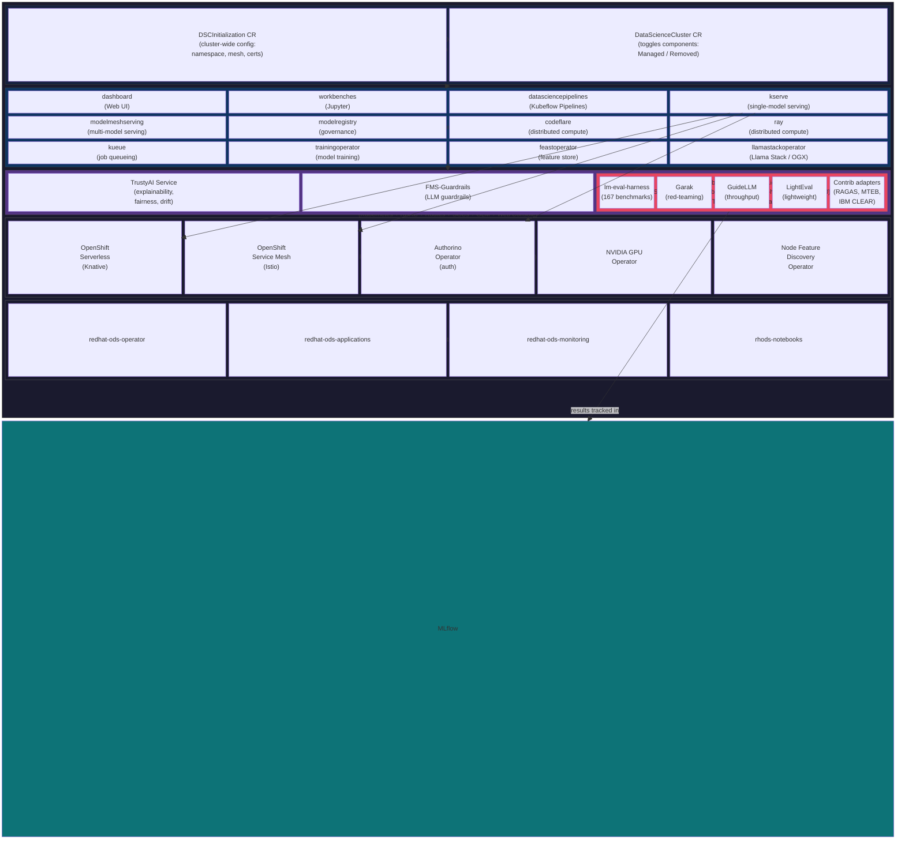

# OpenShift AI Tutorial

A project-based OpenShift AI tutorial for developers who already know Kubernetes and OpenShift. Covers both **OpenShift AI** (the platform) and the broader **Red Hat AI** ecosystem.

## Environment

The ideal environment for this tutorial is the **Red Hat Demo Platform** — a pre-configured OpenShift cluster with GPUs and full admin access:

**[OpenShift AI v3 Demo Environment](https://catalog.demo.redhat.com/catalog/babylon-catalog-prod?item=babylon-catalog-prod/published.openshift-ai-v3.prod&utm_source=webapp&utm_medium=share-link)**

Why not the alternatives?

| Environment | Problem |
|-------------|---------|
| [Developer Sandbox](https://sandbox.redhat.com/) | No cluster-admin access — you cannot install operators, enable/disable DataScienceCluster components, or configure the platform. Only useful for exploring the dashboard. |
| [OpenShift Local (CRC)](https://console.redhat.com/openshift/create/local) | No GPU, limited resources (~9 GB RAM default). You can install the OpenShift AI operator and explore the DataScienceCluster CR, but model serving, fine-tuning, and evaluation workloads will fail. |

## Structure

```
tutorial_ai/
├── openshift_ai/                        # OpenShift AI tutorial (3 levels, 66 lessons, ~56-67h)
│   ├── syllabus.md
│   └── manifests/                       # Working manifests (used in lessons)
│       ├── gemma4-e4b-servingruntime.yaml    # → L1-2.2
│       └── gemma4-e4b-inferenceservice.yaml  # → L1-2.2
├── redhat_ai/                           # Red Hat AI Ecosystem tutorial (2 levels, 15 lessons, ~11-15h)
│   └── syllabus.md
├── openshift_ai_docs.md                 # Reference links to official 3.5 docs
├── other_docs.md                        # Paths to sub-tutorial repos and source code
└── README.md                            # This file
```

### Sub-Tutorials (separate repos)

Each OpenShift AI sub-component has its own tutorial with dedicated syllabus:

| Sub-Tutorial | Repo | Lessons | Focus |
|-------------|------|---------|-------|
| [MLflow](https://github.com/lukaskellerstein/mlflow-tutorial) | `mlflow-tutorial` | 21 | Experiment tracking, model registry, tracing |
| [OGX](https://github.com/lukaskellerstein/ogx-tutorial) | `ogx-tutorial` | 21 | OpenAI-compatible APIs, Responses API, RAG |
| [AutoRAG](https://github.com/lukaskellerstein/autorag-tutorial) | `autorag-tutorial` | 13 | RAG pipeline optimization (AutoML for RAG) |
| [EvalHub](https://github.com/lukaskellerstein/evalhub-tutorial) | `evalhub-tutorial` | 14 | Evaluation orchestration, CI/CD quality gates |
| [NeMo Guardrails](https://github.com/lukaskellerstein/nemo-guardrails-tutorial) | `nemo-guardrails-tutorial` | 17 | Safety rails with Colang 2.0, guardrails orchestrator |

## Prerequisites

- Completed the [main OpenShift tutorial](../tutorial/) or equivalent
- Familiar with Python, LLMs, and basic ML concepts
- Existing experience with [MLflow](https://github.com/lukaskellerstein/mlflow-tutorial), [LangChain/LangGraph](https://github.com/lukaskellerstein/ai-agents-course), and [MCP](https://github.com/lukaskellerstein/ai-agents-course)

## Architecture Overview



**Key takeaway:** OpenShift AI is an operator installed on OpenShift. That operator manages a `DataScienceCluster` CR whose `spec.components` section toggles ~13 sub-components on/off. One of those components is `trustyai`, which is itself an operator (TrustyAI Service Operator) that manages the TrustyAI Service, FMS-Guardrails, and **EvalHub** — a separate Go project with its own repo that the TrustyAI Operator deploys via an EvalHub custom resource.

## Working Manifests

The `openshift_ai/manifests/` directory contains tested, working manifests deployed on a real OpenShift AI cluster. These are referenced directly from lesson steps:

| Manifest | Used In | What It Does |
|----------|---------|-------------|
| `gemma4-e4b-servingruntime.yaml` | L1-2.2 | vLLM ServingRuntime for Gemma 4 E4B (NVIDIA GPU, `dtype=half`, `max-model-len=8192`) |
| `gemma4-e4b-inferenceservice.yaml` | L1-2.2 | InferenceService deploying Gemma 4 E4B (RawDeployment mode, 1x GPU, 24Gi memory) |

## Getting Started

1. Start with the [OpenShift AI syllabus](openshift_ai/syllabus.md) — it references sub-tutorials when you need them.
2. Optionally explore the [Red Hat AI Ecosystem syllabus](redhat_ai/syllabus.md) for Podman AI Lab, RHEL AI, and Granite models.
