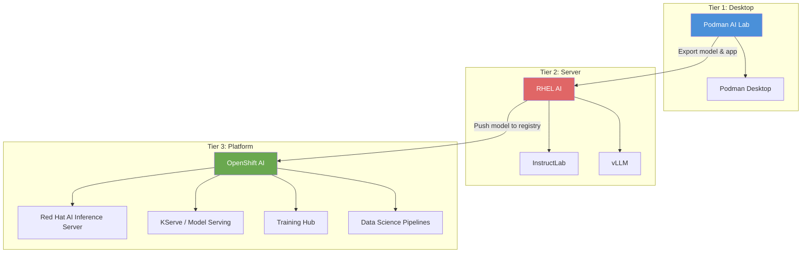
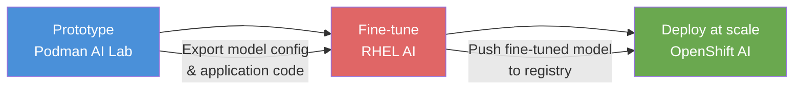

# L1-M1.1 — Red Hat AI Vision and Architecture

**Level:** Foundations
**Duration:** 30 min

## Overview

This lesson introduces Red Hat's three-tier AI deployment model and the strategic thinking behind it. You will learn how Podman AI Lab, RHEL AI, and OpenShift AI form a coherent progression from desktop experimentation to enterprise-scale production, and how Red Hat's upstream-first approach differentiates its AI platform from proprietary alternatives.

## Prerequisites

- Familiarity with containers and Kubernetes concepts
- Basic understanding of LLM concepts (inference, fine-tuning, serving)
- No cluster or software installation required — this is a conceptual lesson

## Concepts

### Red Hat's AI Strategy

Red Hat's AI strategy rests on three pillars:

1. **Open-source first** — Every component in the stack is built on upstream open-source projects. There is no proprietary runtime, no closed model format, and no vendor-specific API that locks you in.
2. **Hybrid cloud** — AI workloads run on laptops, bare-metal servers, private clouds, and public clouds with the same tools. The same model you prototype on your laptop can run on RHEL AI on-prem or on OpenShift AI in AWS.
3. **No vendor lock-in** — Models are Apache 2.0 licensed (IBM Granite). Serving uses vLLM (open source). Fine-tuning uses InstructLab (open source). You can leave at any time and take your models, data, and workflows with you.

This strategy targets a real enterprise pain point: most AI platforms require you to commit to a specific cloud provider, a proprietary model API, or a closed fine-tuning service before you can evaluate whether AI works for your use case.

---

### The Three-Tier Deployment Model

Red Hat organizes AI capabilities into three tiers, each designed for a different stage of the AI adoption journey.

#### Tier 1: Desktop — Podman AI Lab

Podman AI Lab is an extension for Podman Desktop that lets you download models, chat with them, and build AI-powered applications entirely on your laptop. No cloud account, no GPU server, no cost.

**What it provides:**
- A curated catalog of models (Granite, Llama, Mistral, others) in GGUF format for CPU inference
- An interactive playground for chatting with models
- Pre-built "recipes" — containerized AI applications (chatbot, RAG, code generation) you can run locally
- Export workflows to push your prototype toward production

**Who uses it:** Developers evaluating whether a model can solve their problem. Data scientists prototyping RAG pipelines. Anyone who wants to experiment before committing infrastructure.

**Time to value:** Minutes. Install the extension, download a model, start chatting.

#### Tier 2: Server — RHEL AI

RHEL AI is a purpose-built RHEL image optimized for AI workloads on a single server. It ships as a bootable container image with InstructLab (for fine-tuning) and vLLM (for inference) pre-installed and configured.

**What it provides:**
- A bootable RHEL image with GPU drivers, InstructLab, and vLLM pre-configured
- InstructLab for fine-tuning models using the LAB (Large-scale Alignment for chatBots) methodology
- vLLM for high-performance inference serving with an OpenAI-compatible API
- A single-server deployment model — no cluster required

**Who uses it:** Teams that need to fine-tune a model on proprietary data without sending it to a cloud provider. Organizations running inference on a dedicated GPU server. Anyone who needs more power than a laptop but does not need cluster-scale orchestration.

**Time to value:** Hours. Install RHEL AI on a server with a GPU, download a model, start fine-tuning or serving.

#### Tier 3: Platform — OpenShift AI

OpenShift AI is the full MLOps platform built on OpenShift. It provides everything needed to serve, train, and manage models at enterprise scale: multi-model serving, distributed training, data science pipelines, model monitoring, and governance.

**What it provides:**
- Multi-model serving with KServe and the Red Hat AI Inference Server (vLLM-based)
- Distributed fine-tuning and training via the Training Hub (Training Operator + InstructLab integration)
- Data Science Pipelines for reproducible ML workflows
- JupyterHub notebooks with pre-configured GPU images
- Model registry for versioning and lifecycle management
- Integration with OpenShift's RBAC, monitoring, and networking

**Who uses it:** Platform teams building an internal AI platform. Organizations serving models to production applications with SLAs. Teams that need governance, audit trails, and multi-tenancy for AI workloads.

**Time to value:** Days. Install the OpenShift AI operator, configure model serving, set up pipelines and access controls.

---

### When to Use Each Tier

Each tier answers a different question at a different stage of AI adoption:

| Tier | Question It Answers | Scale | GPU Required? | Setup Time | Cost |
|------|-------------------|-------|--------------|------------|------|
| **Podman AI Lab** | "Can this model answer my questions?" | Single laptop | No (CPU inference via GGUF) | Minutes | Free |
| **RHEL AI** | "Can I fine-tune a model on my data?" | Single server | Yes (NVIDIA, AMD, or Intel) | Hours | RHEL subscription |
| **OpenShift AI** | "How do I serve this at scale with governance?" | Cluster (multi-node) | Yes (GPU nodes in cluster) | Days | OpenShift + AI subscription |

Choosing the right tier is not just about scale — it is about the stage of your AI journey:

- **Exploration phase** — Use Podman AI Lab. You are evaluating models, testing prompts, and building proof-of-concept applications. You do not know yet which model works best or whether AI solves your problem. The cost of getting started should be zero.

- **Customization phase** — Use RHEL AI. You have identified a model that works and now need to fine-tune it on your domain data. You need a GPU server but do not need a full platform. InstructLab's synthetic data generation means you can fine-tune effectively with small amounts of training data.

- **Production phase** — Use OpenShift AI. You have a fine-tuned model that works and need to serve it to applications at scale. You need monitoring, autoscaling, access controls, and the ability to manage multiple models across teams.

---

### The Progression Path

The three tiers are designed to work as a pipeline. A model and its application move from left to right as confidence grows:

**Step 1: Prototype on Podman AI Lab.** Download a Granite model, test it against your use case in the playground, and build a containerized application using a recipe (chatbot, RAG, code generation). If the base model is good enough, you can skip RHEL AI and deploy directly to OpenShift AI.

**Step 2: Fine-tune on RHEL AI.** If the base model needs domain-specific knowledge, use InstructLab on RHEL AI to fine-tune it. InstructLab uses a taxonomy-driven approach with synthetic data generation, so you can fine-tune with fewer examples than traditional methods. The result is a fine-tuned model stored in a standard format (safetensors).

**Step 3: Deploy on OpenShift AI.** Push the fine-tuned model to a container registry or S3-compatible storage. Deploy it on OpenShift AI using KServe and the Red Hat AI Inference Server. Set up autoscaling, monitoring, and access controls. Serve the model via an OpenAI-compatible API endpoint.

Not every use case requires all three tiers. Simple inference workloads can go directly from Podman AI Lab to OpenShift AI. Complex fine-tuning workflows might spend most of their time on RHEL AI. The point is that each tier uses compatible formats and APIs, so moving between them is straightforward.

---

### Red Hat and Upstream Projects

Every component in the Red Hat AI stack is built on an upstream open-source project. Red Hat adds testing, certification, support, and integration — but the core technology is community-driven.

| Upstream Project | Red Hat Product | What It Does |
|-----------------|----------------|--------------|
| [InstructLab](https://github.com/instructlab) | RHEL AI / OpenShift AI Training Hub | Model fine-tuning using LAB methodology and synthetic data generation |
| [Open Data Hub](https://opendatahub.io/) | OpenShift AI Operator | MLOps platform: notebooks, pipelines, model serving |
| [vLLM](https://github.com/vllm-project/vllm) | Red Hat AI Inference Server | High-performance LLM inference engine |
| [KServe](https://kserve.github.io/) | OpenShift AI Model Serving | Kubernetes-native model serving with autoscaling |
| [Podman AI Lab](https://github.com/containers/podman-desktop-extension-ai-lab) | Podman AI Lab | Desktop AI experimentation (same project, Red Hat-led) |
| [OGX / Llama Stack](https://github.com/meta-llama/llama-stack) | OGX Operator | Standardized API layer for AI agent orchestration |

This upstream-first approach has practical consequences:

- **No fork risk.** If Red Hat changes direction, the upstream projects continue. Your skills and configurations transfer.
- **Community velocity.** vLLM, for example, has hundreds of contributors from many organizations. Red Hat benefits from (and contributes to) this collective development.
- **Transparency.** You can inspect the source code of every component in the stack. There are no black boxes.

---

### Red Hat vs Other Enterprise AI Platforms

How does Red Hat's approach compare to other enterprise AI offerings?

| Aspect | Red Hat AI | AWS (SageMaker/Bedrock) | Azure (Azure AI) | Google (Vertex AI) |
|--------|-----------|------------------------|-------------------|-------------------|
| **Model licensing** | Apache 2.0 (Granite) | Proprietary + open | Proprietary + open | Proprietary + open |
| **Infrastructure lock-in** | Run anywhere (on-prem, any cloud) | AWS only | Azure only | GCP only |
| **Inference engine** | vLLM (open source) | Proprietary | Proprietary | Proprietary |
| **Fine-tuning** | InstructLab (open source) | Proprietary APIs | Proprietary APIs | Proprietary APIs |
| **Platform** | OpenShift (open source, K8s-based) | Proprietary managed service | Proprietary managed service | Proprietary managed service |
| **Data residency** | You control (on-prem or cloud) | Cloud provider controls | Cloud provider controls | Cloud provider controls |
| **Cost model** | Subscription (infrastructure) | Pay-per-use (API calls) | Pay-per-use (API calls) | Pay-per-use (API calls) |

The core differentiator is control. With Red Hat's stack, you own the models, you own the infrastructure, and you own the data pipeline. There is no API metering, no per-token pricing, and no risk of a provider deprecating a model you depend on.

This matters most for organizations with:
- **Data sovereignty requirements** — regulated industries that cannot send data to third-party APIs
- **Cost sensitivity at scale** — inference costs on proprietary APIs grow linearly with usage; self-hosted inference has a fixed infrastructure cost
- **Customization needs** — fine-tuning on proprietary data without uploading it to a cloud provider
- **Multi-cloud strategies** — running the same AI stack across multiple environments

---

### Decision Matrix: Choosing Your Tier

Use this matrix to match your situation to the right starting point:

| Scenario | Recommended Tier | Reasoning |
|----------|-----------------|-----------|
| "I want to see if an LLM can help with my task" | Podman AI Lab | Zero cost, zero setup, immediate feedback |
| "I need to build a RAG chatbot prototype" | Podman AI Lab | Built-in RAG recipe, local document ingestion |
| "I need to fine-tune on company-specific data" | RHEL AI | InstructLab + GPU server, data stays on-prem |
| "I need to serve a model with an SLA" | OpenShift AI | KServe autoscaling, monitoring, HA |
| "I need multiple teams sharing model infrastructure" | OpenShift AI | Multi-tenancy, RBAC, resource quotas |
| "I need to comply with data residency regulations" | RHEL AI or OpenShift AI (on-prem) | Full control over data location |
| "I want to evaluate multiple models quickly" | Podman AI Lab | Download and compare models in minutes |
| "I need distributed training across multiple GPUs" | OpenShift AI | Training Operator with multi-node GPU support |

## Key Takeaways

- Red Hat's AI stack is built on a three-tier model: **Podman AI Lab** (desktop prototyping), **RHEL AI** (single-server fine-tuning and serving), and **OpenShift AI** (cluster-scale MLOps). Each tier targets a specific phase of AI adoption.
- Every component is built on upstream open-source projects (InstructLab, Open Data Hub, vLLM, KServe). There is no proprietary runtime or model format.
- The three tiers share compatible model formats and APIs, creating a smooth progression path from prototype to production.
- Red Hat's approach prioritizes control — you own the models (Apache 2.0), the infrastructure (on-prem or any cloud), and the data pipeline. This makes it uniquely suited for regulated industries and multi-cloud strategies.
- Choosing the right tier depends on your phase: exploration (Podman AI Lab), customization (RHEL AI), or production at scale (OpenShift AI).

## Next Steps

Continue to [L1-M1.2 — Red Hat AI Model Strategy: Granite and Beyond](../2_model_strategy/) to learn about the IBM Granite model family, Red Hat's validated model collections on HuggingFace, and how to choose the right model for your use case.
