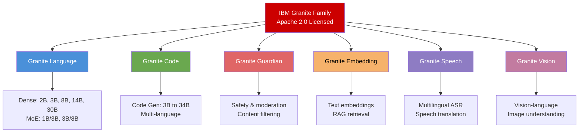
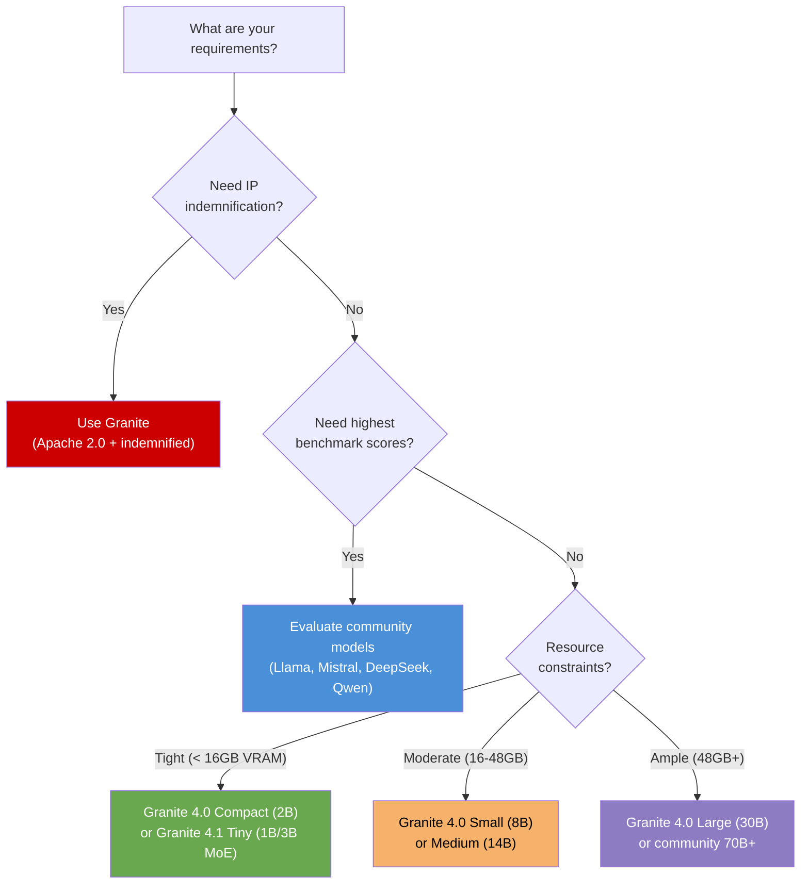

# L1-M1.2 — Red Hat AI Model Strategy: Granite and Beyond

**Level:** Foundations
**Duration:** 30 min

## Overview

This lesson covers the IBM Granite model family and Red Hat's broader model strategy. You will learn why Red Hat bets on Apache 2.0 licensed models, how the Granite family covers language, code, vision, speech, and safety use cases, and how Red Hat's validated model collections on HuggingFace extend support beyond Granite to include Llama, Mistral, DeepSeek, and other community models.

## Prerequisites

- Completed [L1-M1.1 — Red Hat AI Vision and Architecture](../1_vision_and_architecture/)
- Basic understanding of LLM concepts (parameters, context window, quantization)
- No cluster or software installation required — this is a conceptual lesson

## Concepts

### Why Models Matter for Platform Strategy

When choosing an AI platform, the model layer is often overlooked — but it determines your long-term flexibility. Key questions include:

- **Can you inspect the training data?** (For compliance and bias auditing)
- **Can you fine-tune and redistribute the model?** (For customization without legal risk)
- **Can you run it on your own infrastructure?** (For data sovereignty)
- **Is the model indemnified?** (For enterprise legal protection)

Red Hat's model strategy answers all four with the IBM Granite family and supplements it with validated community models for use cases where Granite is not the best fit.

---

### The IBM Granite Model Family

Granite is IBM's open-source model family, licensed under **Apache 2.0**. This is the most permissive license commonly used for LLMs — it allows commercial use, modification, fine-tuning, and redistribution with no royalties and no restrictions on output ownership.

Granite is not a single model. It is a family of models purpose-built for different AI tasks:



#### Granite Language Models (Granite 4.x)

The core text generation models. Granite 4.x represents a significant jump from the 3.x generation, with longer context windows, improved instruction following, and better multilingual support.

| Model | Parameters | Architecture | Context Window | Key Strengths |
|-------|-----------|-------------|----------------|---------------|
| Granite 4.1 Tiny | 1B (active) / 3B (total) | MoE | 128K | Ultra-lightweight, edge deployment |
| Granite 4.1 Small | 3B (active) / 8B (total) | MoE | 128K | Efficient for chat and simple tasks |
| Granite 4.0 Compact | 2B | Dense | 128K | Smallest dense model, resource-constrained environments |
| Granite 4.0 Tiny | 3B | Dense | 128K | Small footprint, good general performance |
| Granite 4.0 Small | 8B | Dense | 128K | Best balance of size and capability |
| Granite 4.0 Medium | 14B | Dense | 128K | Higher quality for complex reasoning |
| Granite 4.0 Large | 30B | Dense | 128K | Highest quality for demanding tasks |

**Dense vs MoE (Mixture of Experts):** Dense models activate all parameters for every token. MoE models have more total parameters but only activate a subset (the "active" count) for each token, making them faster and more memory-efficient at inference time. For example, Granite 4.1 Small has 8B total parameters but only uses 3B for any given token — giving you 8B-quality output at closer to 3B inference cost.

**Context window:** All Granite 4.x models support 128K tokens, with some configurations extending to 512K. This is important for RAG use cases where you need to fit many retrieved documents into the context.

#### Granite Code Models

Purpose-built for software development tasks: code generation, code completion, code explanation, and bug fixing. These models are trained on a curated code corpus covering 116+ programming languages.

| Model | Parameters | Optimized For |
|-------|-----------|--------------|
| Granite Code 3B | 3B | Code completion, inline suggestions |
| Granite Code 8B | 8B | Code generation, explanation, refactoring |
| Granite Code 20B | 20B | Complex code generation, multi-file reasoning |
| Granite Code 34B | 34B | Highest quality code generation, architecture-level tasks |

Granite Code models are particularly strong in enterprise languages (Java, Python, Go, JavaScript/TypeScript) and understand infrastructure-as-code formats (YAML, Terraform, Ansible).

#### Granite Guardian

A specialized model for AI safety. Granite Guardian evaluates LLM inputs and outputs for risks including:

- **Harmful content** — violence, hate speech, self-harm
- **Social bias** — gender, racial, and other biases in generated text
- **Jailbreak detection** — attempts to bypass safety guardrails
- **Groundedness** — whether the model's response is grounded in provided context (hallucination detection)
- **Relevance** — whether the response addresses the actual question

Granite Guardian is designed to run alongside a generation model as a safety layer. In production, you deploy both: the generation model answers the user's question, and Granite Guardian evaluates whether the response is safe to return.

#### Granite Embedding

Text embedding models optimized for retrieval-augmented generation (RAG). These models convert text into dense vector representations that can be stored in a vector database and searched by semantic similarity.

| Model | Dimensions | Max Tokens | Use Case |
|-------|-----------|------------|----------|
| Granite Embedding 30M | 384 | 512 | Lightweight RAG, resource-constrained |
| Granite Embedding 125M | 768 | 512 | General-purpose RAG, good quality/speed balance |
| Granite Embedding 278M | 1024 | 512 | Highest quality retrieval |

Using Granite Embedding with Granite Language creates an all-Granite RAG stack — same license, same vendor, same support contract.

#### Granite Speech

Multilingual automatic speech recognition (ASR) and speech translation. Granite Speech models handle:

- Speech-to-text transcription in 30+ languages
- Cross-language speech translation
- Speaker diarization (identifying who said what)

#### Granite Vision

Multimodal models that process both images and text. Use cases include:

- Document understanding (extracting information from scanned documents, forms, receipts)
- Image captioning and visual question answering
- Chart and diagram interpretation

---

### Why Red Hat Bets on Granite

Red Hat's strategic alignment with Granite is not arbitrary. Several properties make Granite uniquely suitable for an enterprise open-source platform:

**Apache 2.0 licensing.** Unlike Meta's Llama (custom license with usage restrictions above 700M monthly users) or Mistral's models (Apache 2.0 for some, proprietary for others), every Granite model uses Apache 2.0. This means:
- No usage restrictions at any scale
- You can fine-tune, modify, and redistribute without restrictions
- You own the outputs — no license claims on generated content
- No "phone home" requirements or usage reporting

**Training data transparency.** IBM publishes information about Granite's training data composition. This is critical for enterprises in regulated industries (finance, healthcare, government) that need to demonstrate their AI models were not trained on problematic data.

**Enterprise indemnification.** IBM and Red Hat provide intellectual property indemnification for Granite models — if a legal challenge arises regarding the model's training data, IBM assumes the legal risk, not the customer. This is a significant differentiator for risk-averse enterprises.

**Optimized for Red Hat's stack.** Granite models are the primary test target for vLLM optimizations in the Red Hat AI Inference Server, InstructLab fine-tuning workflows, and OpenShift AI model serving. They receive the most testing and performance tuning across the Red Hat AI stack.

---

### RedHatAI on HuggingFace

Red Hat maintains an organization on HuggingFace at [huggingface.co/RedHatAI](https://huggingface.co/RedHatAI) that serves two purposes:

1. **Pre-quantized Granite models** — ready to download and serve with vLLM
2. **Validated model collections** — community models that Red Hat has tested and certified for use with vLLM and OpenShift AI

#### Pre-quantized Models

Quantization reduces a model's memory footprint by storing weights in lower-precision formats. The RedHatAI HuggingFace organization provides Granite models pre-quantized in multiple formats:

| Quantization Format | Precision | Memory Savings | Quality Impact | Best For |
|--------------------|-----------|---------------|----------------|----------|
| FP16 (baseline) | 16-bit float | None (baseline) | None | Reference quality, ample GPU memory |
| FP8 | 8-bit float | ~50% vs FP16 | Minimal | Production serving with good quality |
| INT8 | 8-bit integer | ~50% vs FP16 | Low | Production serving, broad GPU support |
| GPTQ | 4-bit (grouped) | ~75% vs FP16 | Moderate | Memory-constrained GPUs |
| AWQ | 4-bit (activation-aware) | ~75% vs FP16 | Low-moderate | Best 4-bit quality, less memory |
| NVFP4 | 4-bit (NVIDIA) | ~75% vs FP16 | Low-moderate | NVIDIA GPUs with FP4 support |

Why this matters: a 30B parameter model in FP16 requires ~60 GB of GPU memory. In FP8, it fits in ~30 GB. In AWQ 4-bit, it fits in ~15 GB. Pre-quantized models save you the time and expertise of running quantization yourself.

The naming convention on HuggingFace follows a predictable pattern:
```
RedHatAI/granite-4.0-small-FP8
RedHatAI/granite-4.0-small-GPTQ-INT4
RedHatAI/granite-4.0-large-AWQ-INT4
```

#### Validated Model Collections

Every month, Red Hat publishes **validated model collections** — curated sets of models that have been tested against vLLM on OpenShift AI. These collections are not limited to Granite. Red Hat tests and validates models from across the open-source community:

| Model Family | Provider | License | Validated Sizes |
|-------------|----------|---------|-----------------|
| Granite | IBM | Apache 2.0 | 2B to 30B |
| Llama | Meta | Llama Community License | 3B to 405B |
| Mistral / Mixtral | Mistral AI | Apache 2.0 (some models) | 7B to 8x22B |
| DeepSeek | DeepSeek | MIT | 7B to 671B (MoE) |
| Qwen | Alibaba | Apache 2.0 (Qwen 2.5) | 0.5B to 72B |
| Gemma | Google | Gemma License | 2B to 27B |

**What "validated" means in practice:**
1. The model is tested for compatibility with the Red Hat AI Inference Server (vLLM-based)
2. Serving configurations (tensor parallelism, quantization settings) are verified
3. Performance benchmarks are recorded on reference hardware
4. The model is certified for use on OpenShift AI with a supported configuration

This does not mean Red Hat provides support for the model itself (only Granite gets full support), but it means you can deploy these models on OpenShift AI with confidence that the serving infrastructure works correctly.

---

### Model Selection Guidance

Choosing a model depends on your requirements across four dimensions:



**Use Granite when:**
- You need enterprise indemnification (regulated industries, risk-averse organizations)
- You want a single vendor for model + platform support (IBM/Red Hat)
- Training data transparency is a compliance requirement
- You prefer Apache 2.0 with no usage restrictions at any scale

**Use community models when:**
- You need the highest possible benchmark performance for a specific task
- You need a model size not available in the Granite family (e.g., 70B+ dense models)
- You are already invested in a specific model ecosystem (e.g., Llama fine-tunes)
- License restrictions are acceptable for your use case

**Practical guidance for common scenarios:**

| Scenario | Recommended Model | Why |
|----------|------------------|-----|
| General enterprise chatbot | Granite 4.0 Small (8B) | Good quality, moderate resources, fully supported |
| RAG application | Granite Embedding + Granite 4.0 Small | All-Granite stack, same license and support |
| Code assistant | Granite Code 8B or 20B | Strong enterprise language support |
| Content moderation layer | Granite Guardian | Purpose-built safety model |
| Maximum quality, cost no object | Llama 3.1 405B or DeepSeek-V3 | Highest benchmarks, but need significant GPU resources |
| Edge/mobile deployment | Granite 4.1 Tiny (1B/3B MoE) | Smallest footprint, MoE efficiency |
| Document processing | Granite Vision | Multimodal, handles scanned documents |
| Multilingual voice interface | Granite Speech + Granite Language | End-to-end speech pipeline |

---

### Granite Model Family Reference Table

A comprehensive reference of the Granite model family as of the current release:

| Model | Family | Parameters | Architecture | Context | License | Primary Use Case |
|-------|--------|-----------|-------------|---------|---------|-----------------|
| Granite 4.1 Tiny | Language | 1B/3B | MoE | 128K | Apache 2.0 | Edge, ultra-lightweight inference |
| Granite 4.1 Small | Language | 3B/8B | MoE | 128K | Apache 2.0 | Efficient chat and instruction following |
| Granite 4.0 Compact | Language | 2B | Dense | 128K | Apache 2.0 | Resource-constrained environments |
| Granite 4.0 Tiny | Language | 3B | Dense | 128K | Apache 2.0 | Small footprint general use |
| Granite 4.0 Small | Language | 8B | Dense | 128K | Apache 2.0 | General-purpose, best size/quality balance |
| Granite 4.0 Medium | Language | 14B | Dense | 128K | Apache 2.0 | Complex reasoning, higher quality |
| Granite 4.0 Large | Language | 30B | Dense | 128K | Apache 2.0 | Demanding tasks, highest quality |
| Granite Code 3B | Code | 3B | Dense | 128K | Apache 2.0 | Code completion, inline suggestions |
| Granite Code 8B | Code | 8B | Dense | 128K | Apache 2.0 | Code generation, explanation |
| Granite Code 20B | Code | 20B | Dense | 128K | Apache 2.0 | Complex code generation |
| Granite Code 34B | Code | 34B | Dense | 128K | Apache 2.0 | Architecture-level code tasks |
| Granite Guardian | Safety | varies | Dense | varies | Apache 2.0 | Content moderation, safety filtering |
| Granite Embedding 30M | Embedding | 30M | Encoder | 512 | Apache 2.0 | Lightweight RAG retrieval |
| Granite Embedding 125M | Embedding | 125M | Encoder | 512 | Apache 2.0 | General-purpose RAG |
| Granite Embedding 278M | Embedding | 278M | Encoder | 512 | Apache 2.0 | High-quality retrieval |
| Granite Speech | Speech | varies | Encoder-Decoder | varies | Apache 2.0 | ASR, speech translation |
| Granite Vision | Vision | varies | Vision-Language | varies | Apache 2.0 | Document understanding, VQA |

## Key Takeaways

- The **IBM Granite** model family is Apache 2.0 licensed with no usage restrictions, covering language, code, vision, speech, embeddings, and safety — a complete model ecosystem under a single permissive license.
- Red Hat bets on Granite for three reasons: **Apache 2.0 licensing** (no restrictions at any scale), **training data transparency** (auditable for compliance), and **enterprise indemnification** (IBM assumes legal risk).
- **RedHatAI on HuggingFace** provides pre-quantized models (FP8, INT8, GPTQ, AWQ, NVFP4) ready for deployment, plus monthly validated collections that extend beyond Granite to include Llama, Mistral, DeepSeek, Qwen, and Gemma.
- "Validated" means Red Hat has tested a model on vLLM and certified it for OpenShift AI — not that Red Hat provides full support for non-Granite models.
- Choose **Granite for enterprise use cases** where indemnification and transparency matter. Choose **community models** when you need maximum benchmark performance or model sizes outside the Granite range.

## Next Steps

Continue to [L1-M2.1 — Installing and Exploring Podman AI Lab](../../M2_podman_ai_lab/1_installing_and_exploring/) to get hands-on with the first tier of Red Hat's AI stack: downloading models, chatting with them locally, and running pre-built AI application recipes on your desktop.
