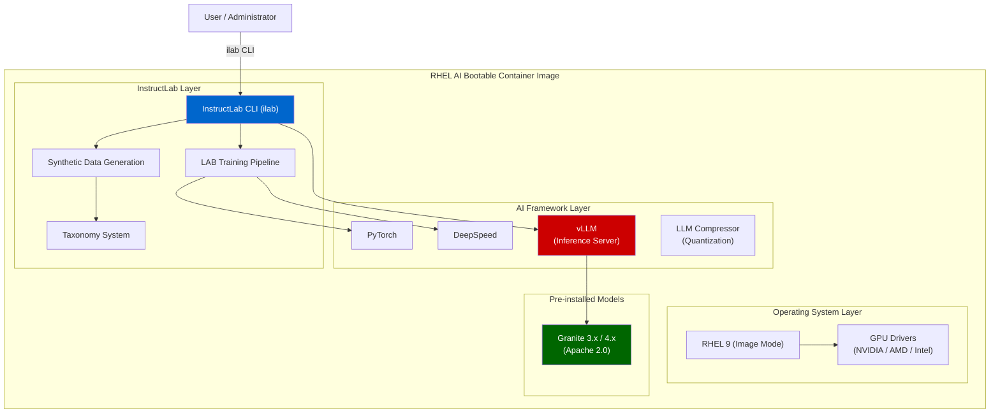

# L1-M3.1 — RHEL AI Architecture and Concepts

**Level:** Foundations
**Duration:** 45 min

## Overview

RHEL AI is Red Hat's foundation model platform delivered as a bootable container image — an entire AI development and serving environment packaged into a single deployable artifact. If you've worked with Kubernetes and understand container images, think of RHEL AI as an opinionated, GPU-ready operating system image that bundles everything needed to fine-tune and serve LLMs on a single server, no orchestrator required.

This lesson covers RHEL AI's architecture, its bundled components, hardware requirements, and when to choose RHEL AI versus OpenShift AI for your AI workloads.

## Prerequisites

- Familiarity with containers and container images (Docker/Podman)
- Completed: [L1-M1.1 — Red Hat AI Vision and Architecture](../../M1_ecosystem/1_vision_and_architecture/) (recommended)
- No RHEL AI instance required — this is a conceptual lesson

## Concepts

### What Is RHEL AI?

RHEL AI is a foundation model platform that ships as a **bootable container image**. Rather than installing an OS, then installing drivers, then installing Python, then installing PyTorch, then installing a serving framework — RHEL AI delivers all of this as a single atomic image that you deploy to bare metal or a VM.

The key idea: **manage your AI platform the same way you manage container images.** Version it, test it, roll it back, distribute it through a registry. This is Red Hat's "Image Mode for RHEL" applied to AI workloads.

### Architecture

The following diagram shows how RHEL AI's components are layered:

### Image Mode for RHEL

Traditional RHEL installations are mutable — you SSH in, `yum install` packages, and the system drifts over time. Image Mode for RHEL flips this: the entire OS is an immutable container image built with a Containerfile, stored in a registry, and deployed atomically.

For AI workloads, this means:

- **Reproducibility**: every deployment gets exactly the same drivers, libraries, and frameworks
- **Rollback**: if an upgrade breaks GPU compatibility, roll back to the previous image
- **Distribution**: push the image to a registry, pull it to any server with compatible hardware
- **Testing**: validate the image in a staging environment before deploying to production

### InstructLab CLI (ilab)

The `ilab` command is the primary interface for everything you do on RHEL AI:

| Command | Purpose |
|---------|---------|
| `ilab config init` | Initialize the InstructLab environment |
| `ilab model download` | Download a Granite model |
| `ilab model serve` | Start the vLLM inference server |
| `ilab model chat` | Chat interactively with the served model |
| `ilab taxonomy diff` | Validate taxonomy contributions |
| `ilab data generate` | Generate synthetic training data |
| `ilab model train` | Fine-tune the model using the LAB method |
| `ilab model evaluate` | Benchmark the fine-tuned model |

You do not interact with vLLM, DeepSpeed, or PyTorch directly — `ilab` orchestrates them for you.

### Bundled Components

| Component | Role | Why It's Included |
|-----------|------|-------------------|
| **InstructLab** | Taxonomy-based fine-tuning with synthetic data generation | The core workflow engine — defines how you teach new knowledge and skills to models |
| **vLLM** | High-throughput inference server | Serves models with PagedAttention for efficient GPU memory use; OpenAI-compatible API |
| **DeepSpeed** | Distributed training acceleration | Enables training on multi-GPU setups with ZeRO optimization |
| **PyTorch** | Model training framework | The underlying training engine used by InstructLab |
| **LLM Compressor** | Model quantization | Reduces model size (FP16 to FP8/INT8) for faster inference and lower VRAM requirements |

### Pre-installed Granite Models

RHEL AI ships with IBM Granite models pre-installed:

- **Granite 3.x / 4.x Language models** — general-purpose LLMs (3B, 8B, and larger variants)
- **Apache 2.0 licensed** — no usage restrictions, no royalties, full commercial use
- **Enterprise indemnification** — Red Hat provides IP indemnification for Granite models

The Granite models are the default for the InstructLab workflow. You download them with `ilab model download` and they serve as both the base model for fine-tuning and the teacher model for synthetic data generation.

### Hardware Support

RHEL AI supports multiple GPU vendors:

| Hardware | Status | Notes |
|----------|--------|-------|
| **NVIDIA A100** | GA | 40 GB / 80 GB variants; most widely tested |
| **NVIDIA H100** | GA | Highest throughput for training and inference |
| **NVIDIA H200** | GA | Extended memory variant of H100 |
| **AMD MI300X** | GA | Full workflow support (inference + training) |
| **Intel Gaudi** | Supported | Inference and training support |
| **CPU-only** | Limited | Small models only; useful for exploration but not production |

For fine-tuning with InstructLab, a minimum of one GPU with 40+ GB VRAM is recommended. Inference can run on smaller GPUs depending on the model size and quantization level.

### When to Use RHEL AI

RHEL AI fits specific deployment scenarios:

**Use RHEL AI when:**

- You have **dedicated GPU servers** and want a turnkey AI platform on bare metal
- You need to **fine-tune models** on proprietary data using a single server
- Your environment is **air-gapped** — the bootable image contains everything needed
- You want a **starting point** before scaling to OpenShift AI
- You need a **simple deployment** without Kubernetes overhead
- Your team is small (1-3 data scientists) and doesn't need multi-tenant GPU sharing

**Use OpenShift AI instead when:**

- You need **multi-user access** with RBAC and quotas
- You require **distributed training** across multiple nodes
- You need **MLOps pipelines**, model registry, and governance
- You want **GPU sharing** across teams with scheduling
- You need **auto-scaling** inference endpoints
- You're running **production workloads** at scale

### RHEL AI vs OpenShift AI

| Aspect | RHEL AI | OpenShift AI |
|--------|---------|--------------|
| **Deployment** | Single server, bootable container image | Kubernetes cluster, OpenShift operator |
| **Interface** | `ilab` CLI | Web dashboard + `oc` CLI + APIs |
| **Fine-tuning** | InstructLab CLI (`ilab model train`) | Training Hub, Kubeflow Trainer (distributed) |
| **Serving** | vLLM via `ilab model serve` | KServe + vLLM (auto-scaling, multi-model) |
| **Scale** | Single node, single user | Multi-node, multi-user, multi-team |
| **GPU management** | All GPUs on one machine | Cluster-wide GPU scheduling and sharing |
| **MLOps** | Manual (scripts, CLI) | Pipelines (Elyra/KFP), Model Registry, monitoring |
| **Model storage** | Local filesystem | S3 / OCI registry |
| **Updates** | Image-based OS upgrades | Operator upgrades via OLM |
| **Networking** | Single server, manual TLS | OpenShift Routes, Service Mesh, built-in TLS |
| **Cost** | Hardware only | Cluster infrastructure + OpenShift subscription |
| **Best for** | Data scientists, single-server fine-tuning | Platform teams, production serving, governance |

### Architecture Decision Matrix

Use this matrix to decide where to run your AI workload:

| Scenario | Recommended Tier | Why |
|----------|-----------------|-----|
| "I want to test if a model works for my use case" | Podman AI Lab | Minutes to start, zero infrastructure |
| "I need to fine-tune a model on my company's data" | RHEL AI | Single server, InstructLab workflow, dedicated GPU |
| "I need to serve a model to 100+ users" | OpenShift AI | Auto-scaling, load balancing, multi-replica |
| "I need to fine-tune and serve in an air-gapped environment" | RHEL AI | Self-contained bootable image, no external dependencies |
| "I need GPU sharing across 5 teams" | OpenShift AI | Kubernetes scheduling, quotas, RBAC |
| "I want to train on 8 GPUs across 2 servers" | OpenShift AI | Distributed training with Kubeflow Trainer |
| "I have one server with 4 GPUs and one data scientist" | RHEL AI | Simple, no orchestrator overhead |
| "I need a model registry and deployment pipelines" | OpenShift AI | Model Registry, KFP pipelines, GitOps |

## Key Takeaways

- RHEL AI is a **bootable container image** that packages an entire AI platform (RHEL 9 + InstructLab + vLLM + DeepSpeed + PyTorch) into a single deployable artifact.
- **Image Mode for RHEL** means you manage your AI platform like a container image — version, test, roll back, distribute through a registry.
- The **`ilab` CLI** is the single interface for serving, chatting, fine-tuning, and evaluating models — it orchestrates vLLM, DeepSpeed, and PyTorch under the hood.
- **Granite models** (Apache 2.0) ship pre-installed, providing a ready-to-use, commercially licensable foundation.
- RHEL AI is best for **single-server, dedicated-hardware scenarios** — fine-tuning on one machine, air-gapped deployments, or as a stepping stone to OpenShift AI.
- The **RHEL AI to OpenShift AI progression** is designed to be natural: models, taxonomies, and configurations transfer when you're ready to scale.

## Next Steps

Continue to [L1-M3.2 — RHEL AI Workflow: Serve, Chat, Fine-Tune](../2_workflow_serve_chat_finetune/) to walk through the complete InstructLab workflow — from initializing the environment to serving a fine-tuned model.
