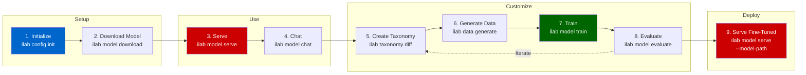

# L1-M3.2 — RHEL AI Workflow: Serve, Chat, Fine-Tune

**Level:** Foundations
**Duration:** 1 hour

## Overview

This lesson walks through the complete InstructLab workflow on RHEL AI — from initializing the environment to serving a fine-tuned model. InstructLab's `ilab` CLI defines a nine-step process that takes you from a base Granite model to a customized model trained on your own knowledge and skills, all on a single server.

If you have access to a RHEL AI instance with a GPU, you can follow along hands-on. If not, each step includes conceptual explanations so you understand the workflow before encountering it on real hardware.

## Prerequisites

- Completed: [L1-M3.1 — RHEL AI Architecture and Concepts](../1_architecture_and_concepts/)
- **For hands-on**: A RHEL AI instance (physical server or VM with GPU) with the bootable container image deployed
- **For conceptual walkthrough**: No hardware required — all commands and outputs are shown inline

## Concepts

### Installing RHEL AI

Before using the InstructLab workflow, you need a running RHEL AI instance. The installation process is different from a traditional RHEL install because RHEL AI uses Image Mode.

**Step 1: Download the bootable container image**

RHEL AI is distributed as a container image through the Red Hat registry:

```bash
# The image is available from Red Hat's registry (requires subscription)
# Example: registry.redhat.io/rhelai1/bootc-nvidia-rhel9:1.5
```

**Step 2: Deploy to bare metal or VM**

You can deploy the bootable container image using several methods:

- **Bare metal**: Write the image to disk using `bootc-image-builder` or Anaconda installer
- **VM**: Create a VM image (qcow2, vmdk, raw) from the bootable container using `bootc-image-builder`
- **Cloud**: Deploy to AWS, Azure, or GCP using the appropriate image format

```bash
# Example: build a qcow2 VM image from the bootable container
sudo podman run --rm -it --privileged \
  --pull=newer \
  -v ./output:/output \
  registry.redhat.io/rhel9/bootc-image-builder:latest \
  --type qcow2 \
  registry.redhat.io/rhelai1/bootc-nvidia-rhel9:1.5
```

**Step 3: First boot configuration**

On first boot, RHEL AI detects your GPU hardware and configures the appropriate drivers. You log in via SSH and the `ilab` CLI is immediately available.

```bash
# SSH into the RHEL AI instance
ssh user@rhel-ai-server

# Verify GPU is detected
nvidia-smi   # for NVIDIA GPUs
# or
rocm-smi     # for AMD GPUs

# Verify InstructLab is available
ilab --version
```

### The InstructLab Workflow

The InstructLab workflow is a nine-step process. The following diagram shows the full flow:



Each step is detailed below.

---

## Step-by-Step

### Step 1: Initialize the Environment

The `ilab config init` command creates the directory structure and configuration files that InstructLab needs.

```bash
ilab config init
```

This creates the following directory structure:

```
~/.local/share/instructlab/
├── config.yaml          # InstructLab configuration
├── models/              # Downloaded and fine-tuned models
├── datasets/            # Generated synthetic training data
├── taxonomy/            # Taxonomy tree (knowledge and skills)
├── phased/              # Multi-phase training checkpoints
└── internal/            # Internal state and cache
```

**What's happening**: InstructLab sets up its working directories and writes a default `config.yaml` that points to the correct GPU backend (CUDA for NVIDIA, ROCm for AMD). You can edit `config.yaml` later to adjust training parameters, model paths, and serving options.

---

### Step 2: Download the Base Model

Download a Granite model that will serve as both the base model for fine-tuning and the model you interact with.

```bash
# Download the default Granite model
ilab model download

# Or specify a particular model
ilab model download --repository instructlab/granite-7b-lab
```

**What's happening**: The model weights are downloaded to `~/.local/share/instructlab/models/`. Granite models are Apache 2.0 licensed, so there are no usage restrictions. The download size is typically 4-15 GB depending on the model variant.

> **Note**: On RHEL AI, some Granite models may already be pre-installed with the bootable image. Check `~/.local/share/instructlab/models/` before downloading.

---

### Step 3: Serve the Model

Start the vLLM inference server to make the model available for chat and API calls.

```bash
ilab model serve
```

Expected output:

```
INFO     Using model '/home/user/.local/share/instructlab/models/granite-7b-lab' with
         -1 gpu-layers
INFO     Starting server process, press CTRL+C to stop
INFO     After application startup complete see http://127.0.0.1:8000/docs for API.
```

**What's happening**: Under the hood, `ilab model serve` starts a vLLM server that loads the model onto the GPU and exposes an OpenAI-compatible API at `http://127.0.0.1:8000`. The server supports:

- `/v1/chat/completions` — chat API
- `/v1/completions` — text completion API
- `/v1/models` — list available models

You can also use this endpoint from external applications:

```bash
# Test the API with curl
curl http://127.0.0.1:8000/v1/chat/completions \
  -H "Content-Type: application/json" \
  -d '{
    "model": "granite-7b-lab",
    "messages": [{"role": "user", "content": "What is OpenShift?"}]
  }'
```

---

### Step 4: Chat with the Model

Open an interactive chat session with the served model.

```bash
# In a separate terminal (while ilab model serve is running)
ilab model chat
```

Expected output:

```
╭─────────────────────────────── system ────────────────────────────────╮
│ Welcome to InstructLab Chat!                                          │
│ Type /q to exit, /h for help.                                         │
╰───────────────────────────────────────────────────────────────────────╯

>>> What is Kubernetes?

╭──────────────────────────── granite-7b-lab ────────────────────────────╮
│ Kubernetes is an open-source container orchestration platform that     │
│ automates the deployment, scaling, and management of containerized     │
│ applications...                                                       │
╰───────────────────────────────────────────────────────────────────────╯
```

**What's happening**: The `ilab model chat` command connects to the running vLLM server and provides a terminal-based chat interface. This is useful for testing the model's baseline capabilities before you fine-tune it. Note areas where the model lacks knowledge or skills — these are candidates for taxonomy contributions.

---

### Step 5: Create Taxonomy Contributions

The taxonomy is where you define what new knowledge or skills you want to teach the model. This is the key concept in InstructLab's approach to fine-tuning.

```bash
# Navigate to the taxonomy directory
cd ~/.local/share/instructlab/taxonomy

# View the taxonomy structure
tree -L 2
```

The taxonomy is organized into two categories:

**Knowledge** — factual information the model doesn't know:

```yaml
# taxonomy/knowledge/my_company/product_docs/qna.yaml
created_by: your-name
version: 3
domain: my_company
seed_examples:
  - context: |
      Our product ShopInsights provides real-time analytics
      for e-commerce platforms. It supports Shopify, WooCommerce,
      and BigCommerce integrations.
    questions_and_answers:
      - question: What platforms does ShopInsights integrate with?
        answer: |
          ShopInsights integrates with Shopify, WooCommerce,
          and BigCommerce for real-time e-commerce analytics.
      - question: What is ShopInsights?
        answer: |
          ShopInsights is a real-time analytics product for
          e-commerce platforms.
      - question: Does ShopInsights support Shopify?
        answer: |
          Yes, ShopInsights supports Shopify along with
          WooCommerce and BigCommerce.
document:
  repo: https://github.com/your-org/product-docs
  commit: abc123
  patterns:
    - "docs/*.md"
```

**Skills** — new capabilities or behaviors:

```yaml
# taxonomy/compositional_skills/customer_support/response_style/qna.yaml
created_by: your-name
version: 3
seed_examples:
  - question: |
      Write a customer support response for a user who can't
      log into their account.
    answer: |
      Hi there! I'm sorry to hear you're having trouble logging in.
      Let me help you get back into your account. Could you try
      resetting your password using the "Forgot Password" link on
      the login page? If that doesn't work, I'll escalate this to
      our account team right away.
```

After creating taxonomy files, validate them:

```bash
ilab taxonomy diff
```

Expected output:

```
Taxonomy in /home/user/.local/share/instructlab/taxonomy is valid :)
└── knowledge
    └── my_company
        └── product_docs (new)
└── compositional_skills
    └── customer_support
        └── response_style (new)
```

**What's happening**: The taxonomy defines structured examples that the InstructLab system will use to generate synthetic training data. You provide a small number of high-quality examples (5-10 per topic), and the system generates hundreds or thousands of variations for training.

---

### Step 6: Generate Synthetic Training Data

Use the taxonomy to generate a large synthetic dataset for training.

```bash
ilab data generate
```

Expected output:

```
INFO     Generating synthetic data using 'granite-7b-lab' as teacher model
INFO     Synthesizing new instructions...
INFO     Generated 1000 samples in 45 minutes
INFO     Output saved to /home/user/.local/share/instructlab/datasets/
```

**What's happening**: This is the "LAB" part of the LAB method — **Large-scale Alignment for chatBots**. A teacher model (typically the same Granite model or a larger one) reads your taxonomy examples and generates diverse training data:

1. The teacher model reads each seed example from your taxonomy
2. It generates variations — different phrasings, follow-up questions, related topics
3. The generated data is filtered for quality and consistency
4. The output is a training-ready dataset in JSONL format

This step is the most time-consuming (30 minutes to several hours, depending on the number of taxonomy contributions and the hardware). The generated data quality directly affects training results.

---

### Step 7: Train the Model

Run multi-phase training on the base model using the generated synthetic data.

```bash
ilab model train
```

Expected output:

```
INFO     Training model with LAB multi-phase training
INFO     Phase 1: Knowledge tuning (learning new facts)
INFO     Phase 1 complete — 2 epochs, loss: 0.42
INFO     Phase 2: Skills tuning (learning new capabilities)
INFO     Phase 2 complete — 2 epochs, loss: 0.38
INFO     Training complete. Model saved to:
         /home/user/.local/share/instructlab/phased/phase2/model/
```

**What's happening**: InstructLab uses a multi-phase training approach:

| Phase | Purpose | What It Does |
|-------|---------|-------------|
| **Phase 1: Knowledge tuning** | Inject new facts | Trains the model on knowledge contributions from the taxonomy — new facts, documentation, domain-specific information |
| **Phase 2: Skills tuning** | Teach new capabilities | Trains the model on skills contributions — response formatting, reasoning patterns, task-specific behaviors |
| **Phase 3: Alignment** | Maintain quality | Ensures the model remains helpful, accurate, and safe after knowledge/skills injection |

This is a full fine-tune (not LoRA/adapter-based), which means the resulting model is a standalone checkpoint that can be served without the base model. Training time depends on dataset size and GPU hardware — expect 1-4 hours for a typical run on a single A100.

---

### Step 8: Evaluate the Fine-Tuned Model

Benchmark the fine-tuned model against the base model to verify improvement.

```bash
ilab model evaluate
```

Expected output:

```
INFO     Evaluating fine-tuned model against base model
INFO     Running knowledge evaluation...
INFO     Running skills evaluation...

Results:
┌──────────────────────┬───────────┬───────────────┐
│ Metric               │ Base      │ Fine-tuned    │
├──────────────────────┼───────────┼───────────────┤
│ Knowledge accuracy   │ 42%       │ 89%           │
│ Skills quality       │ 3.2/5     │ 4.5/5         │
│ General benchmarks   │ 72%       │ 71%           │
╰──────────────────────┴───────────┴───────────────╯
```

**What's happening**: The evaluation compares the fine-tuned model against the base model across three dimensions:

- **Knowledge accuracy**: Does the model now correctly answer questions about the new knowledge you added?
- **Skills quality**: Does the model exhibit the new skills you taught it?
- **General benchmarks**: Has the model's general capability regressed? (A small drop is normal; a large drop means the training data needs adjustment.)

If the results are unsatisfactory, iterate: adjust the taxonomy (Step 5), regenerate data (Step 6), and retrain (Step 7).

---

### Step 9: Serve the Fine-Tuned Model

Replace the base model with your fine-tuned version.

```bash
# Stop the current model server (Ctrl+C in the serve terminal)

# Serve the fine-tuned model
ilab model serve --model-path ~/.local/share/instructlab/phased/phase2/model/
```

Now `ilab model chat` and the API endpoint at `http://127.0.0.1:8000` will use your fine-tuned model with the new knowledge and skills you taught it.

```bash
# Chat with the fine-tuned model
ilab model chat

>>> What platforms does ShopInsights integrate with?
# The model should now answer accurately based on your taxonomy contributions
```

---

### Understanding the LAB Method

The LAB (Large-scale Alignment for chatBots) method is what makes InstructLab different from traditional fine-tuning approaches:

| Aspect | Traditional Fine-Tuning | InstructLab LAB Method |
|--------|------------------------|----------------------|
| **Input** | Hundreds/thousands of manually curated examples | 5-10 seed examples per topic in a taxonomy |
| **Data preparation** | Manual, labor-intensive | Automated synthetic data generation |
| **Training scope** | Narrow (LoRA) or broad (full fine-tune) | Multi-phase: knowledge, then skills, then alignment |
| **Knowledge injection** | Difficult — requires large datasets | Natural — taxonomy + SDG handles scale |
| **Skill teaching** | Requires careful example curation | Taxonomy structure guides generation |
| **Quality control** | Manual review of all training data | Teacher model generates, evaluation validates |

The taxonomy is the key abstraction: instead of curating thousands of training examples, you define structured knowledge and skills in YAML, and the system generates the training data for you.

### Exporting Models to OpenShift AI

Once you have a fine-tuned model on RHEL AI, you can move it to OpenShift AI for production serving:

**Option 1: Upload to S3**

```bash
# Package the model
tar -czf my-finetuned-model.tar.gz \
  -C ~/.local/share/instructlab/phased/phase2/model/ .

# Upload to S3 (accessible from OpenShift AI)
aws s3 cp my-finetuned-model.tar.gz s3://my-models/granite-finetuned/
```

Then create an `InferenceService` on OpenShift AI pointing to the S3 path.

**Option 2: Package as OCI image**

```bash
# Build an OCI image containing the model weights
podman build -t quay.io/my-org/granite-finetuned:v1 -f Modelfile .

# Push to a registry accessible from OpenShift AI
podman push quay.io/my-org/granite-finetuned:v1
```

Then reference the OCI image in a `ServingRuntime` on OpenShift AI.

This export path is covered in detail in [L1-M3.3 — RHEL AI as an OpenShift AI On-Ramp](../3_openshift_ai_onramp/).

## Verification

If you followed along on a RHEL AI instance, verify your setup:

1. **Environment initialized**: `ls ~/.local/share/instructlab/` shows `config.yaml`, `models/`, `taxonomy/`
2. **Model downloaded**: `ls ~/.local/share/instructlab/models/` shows a model directory
3. **Model serving**: `curl http://127.0.0.1:8000/v1/models` returns a model list
4. **Chat working**: `ilab model chat` opens an interactive session and the model responds
5. **Taxonomy valid**: `ilab taxonomy diff` reports the taxonomy is valid (if you added contributions)

## Key Takeaways

- The InstructLab workflow is a **nine-step process**: initialize, download, serve, chat, create taxonomy, generate data, train, evaluate, serve the fine-tuned model.
- The **taxonomy** is the key input — you define knowledge and skills in structured YAML files with a small number of seed examples (5-10 per topic).
- **Synthetic Data Generation (SDG)** uses a teacher model to expand your seed examples into a large training dataset, eliminating the need to manually curate thousands of examples.
- **Multi-phase training** (knowledge, skills, alignment) ensures the model learns new capabilities without losing its general abilities.
- The `ilab` CLI **orchestrates the entire workflow** — you don't need to interact with vLLM, DeepSpeed, or PyTorch directly.
- Fine-tuned models can be **exported to OpenShift AI** via S3 upload or OCI image packaging for production-scale serving.

## Next Steps

Continue to [L1-M3.3 — RHEL AI as an OpenShift AI On-Ramp](../3_openshift_ai_onramp/) to understand how models, taxonomies, and configurations transfer from RHEL AI to OpenShift AI when you're ready to scale.
