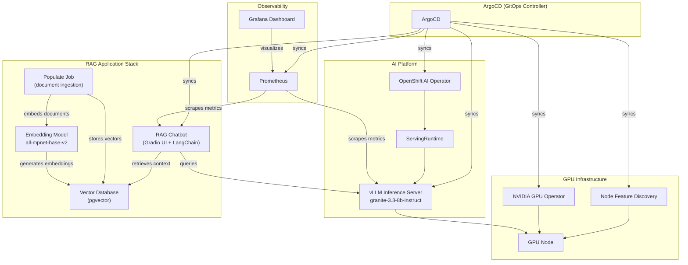

# L1-M4.1 — Validated Patterns for AI

**Level:** Foundations
**Duration:** 45 min

## Overview

Throughout this tutorial, you have learned to build AI workloads piece by piece -- selecting models, configuring inference servers, assembling RAG pipelines. Validated Patterns take the opposite approach: they give you a complete, tested, GitOps-managed reference architecture that you fork, configure, and deploy. This lesson explores the RAG + LLM GitOps Validated Pattern to understand how production-ready AI deployments are packaged as code, and when to use a pattern versus building from scratch.

## Prerequisites

- Completed: [L1-3.3 -- RHEL AI as an OpenShift AI On-Ramp](../../M3_rhel_ai/3_openshift_ai_onramp/)
- Familiarity with Helm, ArgoCD, and GitOps concepts (from the OpenShift tutorial L08/L09 or equivalent experience)
- `git` CLI installed
- No cluster required -- this lesson is an exploration of the pattern repository structure

## Concepts

### What Are Validated Patterns?

Validated Patterns are GitOps-ready reference architectures published at [validatedpatterns.io](https://validatedpatterns.io/). They are not documentation or blog posts -- they are complete, deployable repositories that install an entire application stack on OpenShift using ArgoCD.

The key properties:

- **Pre-built and tested.** Each pattern is continuously tested against OpenShift releases. The CI verifies that all components install, connect, and function together.
- **GitOps-managed.** Deployment uses ArgoCD. You fork the repo, configure your `values-*.yaml` files, push, and ArgoCD reconciles the cluster to match.
- **Maintained by Red Hat and the community.** Patterns are categorized by maturity tier: Sandbox (experimental), Tested (CI-verified), and Maintained (Red Hat-supported).
- **Composable.** Patterns use standard Helm charts and Kustomize overlays. You can swap components, add new ones, or strip out what you do not need.

Think of a Validated Pattern as an opinionated Helm umbrella chart combined with ArgoCD orchestration, operator subscriptions, and environment-specific configuration -- all version-controlled in a single Git repository.

### AI-Relevant Patterns

Several Validated Patterns focus on AI/ML workloads:

| Pattern | Description | Maturity |
|---------|-------------|----------|
| **RAG + LLM on GPU** | Complete RAG deployment with vLLM, vector database, embedding model, Gradio UI, and Prometheus/Grafana monitoring | Tested |
| **MLOps Fraud Detection** | End-to-end machine learning operations pipeline | Tested |
| **Medical Diagnosis** | AI-assisted medical diagnosis with AMX acceleration variants | Sandbox |
| **MaaS Code Assistant** | Multi-tenant AI code assistant deployment | Sandbox |

The RAG + LLM pattern is the most relevant to this tutorial's scope. It deploys a complete retrieval-augmented generation stack -- the same architecture you would build manually if you followed the OpenShift AI tutorial to its conclusion.

### Pattern Anatomy

Every Validated Pattern follows a consistent structure:

```
pattern-repo/
  values-global.yaml            # Global config: models, DB type, storage class
  values-hub.yaml               # Cluster config: namespaces, operators, ArgoCD apps
  values-secret.yaml.template   # Secrets template (never committed with real values)
  pattern.sh                    # Deployment script (wraps make targets)
  Makefile                      # Build and deploy automation
  charts/                       # Helm charts for all components
    all/
      rag-llm/                  # RAG application chart
      vllm-inference-service/   # Model serving chart
      llm-monitoring/           # Prometheus + Grafana chart
      nvidia-gpu-config/        # GPU operator configuration
      nfd-config/               # Node Feature Discovery
      rhods/                    # OpenShift AI operator (RHOAI)
      rag-llm-ui-config/        # UI console links
      llm-monitoring-config/    # Grafana console links
  overrides/                    # Cloud-specific overrides (Azure, etc.)
  ansible/                      # Infrastructure automation (GPU provisioning)
  tests/                        # Integration tests
```

Three layers of configuration drive the deployment:

1. **`values-global.yaml`** -- what to deploy (which model, which vector DB, which storage class).
2. **`values-hub.yaml`** -- how to deploy (which namespaces to create, which operators to subscribe to, which ArgoCD Applications to sync).
3. **`values-secret.yaml.template`** -- credentials (API keys, database passwords). You copy this to a local file and fill in your secrets. It integrates with HashiCorp Vault for production secret management.

### RAG + LLM GitOps Architecture

The RAG + LLM pattern deploys the following components, all managed by ArgoCD:



**How a user request flows through the pattern:**

1. A user submits a question through the Gradio web UI.
2. The RAG application generates an embedding of the question using the embedding model (`sentence-transformers/all-mpnet-base-v2`).
3. The embedding is used to query the vector database (pgvector) for relevant document chunks.
4. The retrieved context and the original question are sent to vLLM (`ibm-granite/granite-3.3-8b-instruct`) as a prompt.
5. vLLM generates a response on the GPU node.
6. The response is returned to the user, with source references.
7. Prometheus collects inference latency, token throughput, and application metrics. Grafana displays them.

### Patterns vs Building from Scratch

| Aspect | Validated Pattern | Build from Scratch |
|--------|-------------------|-------------------|
| **Time to deploy** | 15-20 minutes (after prerequisites) | Days to weeks |
| **Understanding** | You deploy first, understand later | You understand as you build |
| **Customization** | Fork and modify Helm values | Full control from the start |
| **Component choices** | Opinionated (vLLM, pgvector, Gradio) | You choose every component |
| **Testing** | CI-tested against OpenShift releases | You write your own tests |
| **Updates** | Pull upstream changes, merge | You manage all updates |
| **Learning value** | Lower -- it works, but why? | Higher -- you built it |
| **Production readiness** | High -- tested, documented patterns | Varies -- depends on your discipline |
| **Best for** | Getting to production fast, POCs, standardization across teams | Learning, highly custom requirements, novel architectures |

**The recommended approach:** Use the OpenShift AI tutorial (or this ecosystem tutorial) to understand the components, then use a Validated Pattern to deploy them at scale. Understanding the pieces makes you effective at customizing the pattern.

## Step-by-Step

This walkthrough explores the RAG + LLM GitOps pattern repository. You will clone the repo, examine the configuration files, understand how ArgoCD Applications are defined, and see how Helm charts are organized. No cluster is needed.

### Step 1: Clone the Pattern Repository

```bash
git clone https://github.com/validatedpatterns/rag-llm-gitops.git
cd rag-llm-gitops
```

Look at the top-level structure:

```bash
ls -la
```

The key files:

```
values-global.yaml            # What to deploy
values-hub.yaml               # How to deploy (ArgoCD apps, operators)
values-secret.yaml.template   # Secrets template
pattern.sh                    # Deployment entry point
Makefile                      # Build targets
charts/                       # Helm charts
overrides/                    # Cloud-specific config
ansible/                      # GPU provisioning playbooks
tests/                        # Integration tests
```

### Step 2: Examine the Global Configuration

The `values-global.yaml` file is the starting point for customization. This is where you configure what the pattern deploys:

```bash
cat values-global.yaml
```

```yaml
global:
  pattern: rag-llm-gitops
  options:
    useCSV: false
    syncPolicy: Automatic
    installPlanApproval: Automatic
  # Possible values for RAG vector DB db.type:
  #   REDIS    -> Redis (Local chart deploy)
  #   EDB      -> PGVector via EDB operator (Local chart deploy)
  #   PGVECTOR -> PGVector (Local Postgres chart deploy)
  #   ELASTIC  -> Elasticsearch (Local chart deploy)
  #   MSSQL    -> MS SQL Server (Local chart deploy)
  #   AZURESQL -> Azure SQL (Pre-existing in Azure)
  db:
    index: docs
    type: PGVECTOR
  # Models used by the inference service (should be a HuggingFace model ID)
  model:
    vllm: ibm-granite/granite-3.3-8b-instruct
    embedding: sentence-transformers/all-mpnet-base-v2

  storageClass: gp3-csi
```

Notice three things:

1. **Vector database is swappable.** Change `db.type` from `PGVECTOR` to `REDIS`, `ELASTIC`, or `EDB` and the pattern deploys a different backend. The application code handles all of them -- you just flip a config value.
2. **Models are HuggingFace IDs.** Change `model.vllm` to any vLLM-compatible model (e.g., `meta-llama/Llama-3.1-8B-Instruct`) and the pattern deploys it instead. Same for the embedding model.
3. **Storage class is environment-specific.** `gp3-csi` is AWS. On bare metal, you would change this to your local StorageClass.

This is the power of a pattern: swapping a database backend or model is a one-line YAML change, not a redesign.

### Step 3: Examine the Hub Configuration (ArgoCD Applications)

The `values-hub.yaml` file defines everything ArgoCD manages. This is the heart of the GitOps deployment:

```bash
cat values-hub.yaml
```

Key sections:

**Namespaces** -- the pattern creates dedicated namespaces for each concern:

```yaml
namespaces:
  - open-cluster-management
  - vault
  - golang-external-secrets
  - openshift-nfd
  - nvidia-gpu-operator
  - redhat-ods-operator:
      operatorGroup: true
      targetNamespaces: []
  - rag-llm:
      operatorGroup: true
      targetNamespaces:
        - rag-llm
      labels:
        opendatahub.io/dashboard: "true"
        modelmesh-enabled: 'false'
  - openshift-serverless:
      operatorGroup: true
      targetNamespaces: []
```

**Operator subscriptions** -- the pattern installs operators automatically:

```yaml
subscriptions:
  nfd:
    name: nfd
    namespace: openshift-nfd
  nvidia:
    name: gpu-operator-certified
    namespace: nvidia-gpu-operator
    source: certified-operators
  edb:
    name: cloud-native-postgresql
    namespace: openshift-operators
    source: certified-operators
  rhoai:
    name: rhods-operator
    namespace: redhat-ods-operator
```

This is equivalent to manually creating `Subscription` resources in the OpenShift console -- but version-controlled and repeatable.

**ArgoCD Applications** -- each component gets its own ArgoCD Application:

```yaml
applications:
  vllm-inference-service:
    name: vllm-inference-service
    namespace: rag-llm
    project: hub
    path: charts/all/vllm-inference-service
    syncPolicy:
      automated:
        selfHeal: true
      retry:
        limit: 20
  rag-llm:
    name: rag-llm
    namespace: rag-llm
    project: rag-llm
    path: charts/all/rag-llm
  llm-monitoring:
    name: llm-monitoring
    namespace: llm-monitoring
    project: llm-monitoring
    kustomize: true
    path: charts/all/llm-monitoring/kustomize/overlays/dev
```

Each application points to a `path` inside the repository (a Helm chart or Kustomize overlay). ArgoCD watches the Git repo and reconciles the cluster whenever the chart changes. The `selfHeal: true` on the vLLM service means ArgoCD will revert manual changes -- enforcing the Git state as the single source of truth.

Note the `llm-monitoring` application uses `kustomize: true` instead of Helm. Patterns can mix Helm and Kustomize within the same deployment.

### Step 4: Explore the Helm Charts

The `charts/all/` directory contains one Helm chart per component. Explore the vLLM inference service chart:

```bash
ls charts/all/vllm-inference-service/
```

```
Chart.yaml
templates/
  _helpers.tpl
  hardware-profile.yaml
  inference-service.yaml
  route.yaml
  serving-runtime.yaml
values.yaml
```

Examine the inference service template:

```bash
cat charts/all/vllm-inference-service/templates/inference-service.yaml
```

This creates a KServe `InferenceService` -- the same resource you would create manually in OpenShift AI. The template pulls the model name from `values-global.yaml` via Helm templating.

Now explore the main RAG application chart:

```bash
ls charts/all/rag-llm/
```

```
Chart.yaml
charts/              # Sub-charts for each vector DB backend
  azure-sql/
  edb/
  elastic/
  mssql/
  pgvector/
  redis-stack-server/
files/
  config.yaml
  redis_schema.yaml
templates/
  _helpers.tpl
  allow-from-all-ns-networkpolicy.yaml
  configmap.yaml
  deployment.yaml
  edb-pull-secret.yaml
  external-secret.yaml
  hpa.yaml
  populate-vectordb-job.yaml
  route.yaml
  service.yaml
  serviceaccount.yaml
values.yaml
```

The `charts/` subdirectory contains a sub-chart for each supported vector database. Helm conditionally includes the correct sub-chart based on `global.db.type` in `values-global.yaml`. This is how one YAML value change swaps the entire database backend.

The `populate-vectordb-job.yaml` template creates a Kubernetes Job that runs at deployment time to embed documents and load them into the vector database.

### Step 5: Examine the Monitoring Stack

The monitoring component uses Kustomize instead of Helm:

```bash
ls charts/all/llm-monitoring/kustomize/base/
```

```
grafana/
  ai-llm-grafana.yaml
  kustomization.yaml
  prometheus-datasource.yaml
grafanadashboard/
  ai-llm-dashboard.yaml
  kustomization.yaml
operators.coreos.com/
  operatorgroups/
  subscriptions/
prometheus/
  ai-llm-prometheus.yaml
  kustomization.yaml
rbac/
  clusterrole/
  clusterrolebinding/
routes/
  llm-ui.yaml
  kustomization.yaml
servicemonitor/
  ai-llm-gradio.yaml
  ai-llm-tgis.yaml
  kustomization.yaml
```

The `kustomize/overlays/dev/` directory provides environment-specific overrides:

```bash
ls charts/all/llm-monitoring/kustomize/overlays/dev/
```

```
kustomization.yaml
namespaces/
  namespace.yaml
  kustomization.yaml
```

This is the standard Kustomize base/overlay pattern. To add staging or production environments, you would create new overlay directories with different namespace names, resource limits, or retention policies.

### Step 6: Understand the Deployment Flow

The pattern deploys in this sequence:

```
1. Fork the repository
   └── git clone https://github.com/<your-fork>/rag-llm-gitops.git

2. Configure secrets
   └── cp values-secret.yaml.template ~/values-secret-rag-llm-gitops.yaml
   └── Edit with your API keys and credentials

3. Provision GPU nodes (if needed)
   └── ./pattern.sh make create-gpu-machineset

4. Deploy
   └── ./pattern.sh make install
       ├── Installs the Validated Patterns framework
       ├── Deploys ArgoCD (if not present)
       ├── Creates ArgoCD Applications from values-hub.yaml
       └── ArgoCD syncs all charts to the cluster

5. ArgoCD reconciliation loop
   ├── Creates namespaces
   ├── Installs operator subscriptions (NFD, NVIDIA, RHOAI, EDB)
   ├── Deploys vLLM InferenceService (downloads model, starts serving)
   ├── Deploys vector database (pgvector StatefulSet)
   ├── Runs populate-vectordb Job (embeds documents)
   ├── Deploys RAG application (Deployment + Service + Route)
   └── Deploys monitoring (Prometheus + Grafana + ServiceMonitors)
```

The entire deployment takes 15-20 minutes. Most of that time is the GPU operator initializing and vLLM downloading the model weights.

### Step 7: Understand Customization Points

If you were using this pattern as a starting point for your own project, here are the most common customizations:

**Swap the LLM model** -- edit `values-global.yaml`:

```yaml
global:
  model:
    vllm: RedHatAI/granite-4.1-8b-instruct-FP8   # your preferred model
```

**Change the vector database** -- edit `values-global.yaml`:

```yaml
global:
  db:
    type: REDIS   # switch from PGVECTOR to Redis
```

**Add your own documents** -- modify the populate job in `charts/all/rag-llm/templates/populate-vectordb-job.yaml` to point to your document sources instead of Red Hat product documentation.

**Add a new component** -- create a new chart in `charts/all/my-component/`, add an ArgoCD Application entry in `values-hub.yaml`, and push. ArgoCD picks it up automatically.

**Create environment overlays** -- add `overrides/values-staging.yaml` or `overrides/values-production.yaml` with different resource limits, replica counts, or model versions.

### Step 8: Review the Secrets Template

Examine how secrets are managed:

```bash
cat values-secret.yaml.template
```

This template shows what credentials the pattern needs (API keys, database passwords). In production, the pattern integrates with HashiCorp Vault via the External Secrets Operator -- secrets are never stored in Git. The `golang-external-secrets` namespace and application in `values-hub.yaml` handle this integration.

The flow: Vault stores secrets, the External Secrets Operator syncs them to Kubernetes Secrets, and the application pods mount those Secrets as environment variables or files. This is a production-grade secrets management pattern that you get for free with the Validated Pattern.

## Key Takeaways

- **Validated Patterns are deployable reference architectures**, not documentation. They are Git repositories with Helm charts, ArgoCD Applications, operator subscriptions, and environment configuration -- everything needed to deploy a complete stack.
- **The RAG + LLM GitOps pattern deploys a full RAG stack**: vLLM inference (Granite model on GPU), vector database (pgvector, Redis, or Elasticsearch), embedding model, Gradio-based chatbot UI, and Prometheus/Grafana monitoring -- all GitOps-managed.
- **Configuration is layered**: `values-global.yaml` (what), `values-hub.yaml` (how), and `values-secret.yaml.template` (credentials). Swapping a model or database backend is a one-line YAML change.
- **Patterns mix Helm and Kustomize**. Most components are Helm charts, but Kustomize overlays handle environment-specific customization (dev/staging/prod).
- **Use patterns when you want speed and standardization**. Use the build-from-scratch approach (as in the OpenShift AI tutorial) when you need deep understanding, novel architectures, or heavily customized deployments. The ideal path is to learn the components first, then deploy with a pattern.

## Next Steps

**Congratulations -- you have completed Level 1 of the Red Hat AI Ecosystem tutorial.**

Over nine lessons, you explored the full breadth of Red Hat's AI stack:

| Module | What You Learned |
|--------|-----------------|
| **M1: Ecosystem** | Red Hat's three-tier AI model (Desktop, Server, Platform), Granite model family, RedHatAI on HuggingFace |
| **M2: Podman AI Lab** | Local AI experimentation -- model catalog, playground, recipes, path to production |
| **M3: RHEL AI** | Single-server AI with InstructLab -- serve, chat, fine-tune, and scale to OpenShift AI |
| **M4: Validated Patterns** | GitOps-managed reference architectures for production AI deployments |

You now understand not just the OpenShift AI platform (covered in the separate OpenShift AI tutorial), but the ecosystem that surrounds it -- from desktop prototyping to single-server fine-tuning to production-ready GitOps deployments.

**Ready for Level 2?** Continue to [L2-M1.1 -- Custom Models and Catalogs](../../../level_2/M1_advanced_podman_ai_lab/1_custom_models_and_catalogs/) to go deeper: import custom models into Podman AI Lab, build your own recipe catalogs, dive into InstructLab taxonomy and synthetic data generation, and run end-to-end cross-tier workflows from desktop to cluster.

## References

- [Validated Patterns home](https://validatedpatterns.io/)
- [RAG + LLM GitOps pattern](https://validatedpatterns.io/patterns/rag-llm-gitops/)
- [RAG + LLM GitOps repository](https://github.com/validatedpatterns/rag-llm-gitops)
- [Validated Patterns framework documentation](https://validatedpatterns.io/learn/)
