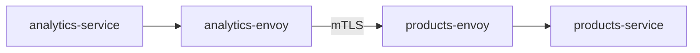

# LP-L03 — Service Mesh with Istio: mTLS, Canary, and Observability

**Level:** Personalized
**Duration:** 1 hr

## Overview

You have three microservices talking to each other over plain HTTP inside the cluster. The Analytics Service calls Products and Orders via Service DNS — and right now, any pod in the namespace could impersonate those services, sniff traffic, or flood them with requests. There is no encryption, no traffic control, and no visibility into what is calling what.

In this lesson, you add OpenShift Service Mesh (Istio) to the ShopInsights stack. This gives you three things at once: **security** (automatic mTLS between every service), **traffic management** (canary deployments and circuit breakers without changing application code), and **observability** (a live service graph in Kiali and distributed traces in Jaeger).

## Prerequisites

- Completed: [L01 — Deploy the Microservices Stack](../L01_deploy_microservices/) and [L02 — Expose Services Externally](../L02_expose_externally/)
- OpenShift cluster running (CRC with at least 16 GB RAM, or Developer Sandbox)
- Logged in as `kubeadmin` (operator installation requires cluster-admin)
- `oc` CLI installed and on PATH

**CRC resource note:** Service Mesh installs Istio, Kiali, Jaeger, and Grafana into the cluster. If you have not already increased CRC resources:

```bash
crc stop
crc config set memory 20480    # 20 GB
crc config set cpus 6
crc start
```

## K8s Context

In vanilla Kubernetes, adding Istio is a manual process:

1. Download `istioctl` and choose an installation profile
2. Run `istioctl install --set profile=demo`
3. Label namespaces with `istio-injection=enabled`
4. Manually install Kiali, Jaeger, Prometheus, and Grafana as separate Helm charts or manifests
5. Manage upgrades yourself

On OpenShift, the Service Mesh is an **operator**. You install it from OperatorHub, create a control plane custom resource, and the operator handles the rest — including the observability stack. This is your first operator installation in this tutorial, so we will take a moment to understand the pattern.

## Concepts

### Envoy Sidecar Proxy

Every pod in the mesh gets an additional container — an Envoy proxy — injected alongside the application container. This is why you will see `2/2 READY` instead of `1/1` after joining the mesh.

The sidecar intercepts all inbound and outbound network traffic for the pod. Your application code does not change — it still calls `http://products-service:8080` — but the request actually goes:



The Envoy proxies handle encryption, retry logic, load balancing, and telemetry — all transparently.

### Mutual TLS (mTLS)

In standard TLS (like HTTPS), only the server proves its identity. In mutual TLS, **both sides** present certificates. Every sidecar gets a certificate from the mesh's certificate authority (Istiod), and connections between sidecars are encrypted and authenticated.

This means:
- Traffic between services is encrypted in transit — even within the cluster network
- Services can verify the identity of callers — no more spoofing
- You get this without touching your application code or managing certificates

### Traffic Management: VirtualService and DestinationRule

Istio introduces two resources that give you fine-grained control over traffic routing:

- **DestinationRule**: defines *subsets* of a service (e.g., `v1` and `v2` based on pod labels) and connection policies (circuit breakers, load balancing)
- **VirtualService**: defines *routing rules* — which subset gets what percentage of traffic, enabling canary deployments, A/B testing, and fault injection

Together, they let you do a canary deployment: send 90% of traffic to the stable version and 10% to the canary, without modifying Kubernetes Services or Deployments.

### Observability: Kiali and Jaeger

- **Kiali** is a service mesh management console. It shows a live topology graph of service-to-service communication, highlights errors, and validates mesh configuration.
- **Jaeger** provides distributed tracing. When a request flows from Dashboard UI through Analytics to Products and Orders, Jaeger shows the complete trace with timing for each hop.

Both are automatically deployed when you create the ServiceMeshControlPlane.

### Circuit Breaker

A circuit breaker prevents cascading failures. If the Orders Service starts returning errors, the circuit breaker in the Envoy sidecar will stop sending new requests to it — returning errors immediately instead of piling up connections to a failing service. After a cooldown period, it lets a few requests through to test if the service has recovered.

This is configured in the DestinationRule, not in application code.

## Architecture with Service Mesh

```mermaid
graph TD
    EXT((External<br/>Traffic)) --> HAProxy["HAProxy Router<br/>(Routes — L02)"]
    HAProxy --> DashUI["dashboard-ui<br/>(not in mesh — serves<br/>static React assets)"]

    subgraph Istio Data Plane — All traffic mTLS encrypted
        AS["analytics-service<br/>+ envoy :8080"] <-->|mTLS| PS["products-service<br/>+ envoy :8080"]
        AS <-->|mTLS| OS["orders-service<br/>+ envoy :8080"]
    end
```

Routes (HAProxy) handle external ingress. Envoy sidecars handle internal service-to-service traffic with mTLS, traffic splitting, and circuit breaking.

---

## What Just Happened? — Your First Operator Install

> **Sidebar: How Operators Work on OpenShift**
>
> This is the first time in the tutorial you are installing an operator. Every operator you install later — Pipelines (L08), GitOps (L09), Serverless (L10) — follows this same pattern. Understanding it once means you understand them all.
>
> In vanilla Kubernetes, you install operators by applying CRDs and a Deployment from a YAML bundle or Helm chart. On OpenShift, operators are managed by the **Operator Lifecycle Manager (OLM)**, which is pre-installed.
>
> The flow:
>
> 1. **OperatorHub** — a catalog of operators available for installation. Think of it as an app store for cluster capabilities. Red Hat curates the `redhat-operators` catalog source; community operators come from `community-operators`.
>
> 2. **Subscription** — when you "install" an operator, you create a Subscription resource. It tells OLM: "I want the `servicemeshoperator` from the `redhat-operators` catalog, on the `stable` channel." This is what the manifests below do.
>
> 3. **InstallPlan** — OLM creates an InstallPlan that lists the CRDs, Deployments, RBAC, and other resources the operator needs. With `installPlanApproval: Automatic`, OLM applies it immediately. With `Manual`, a cluster admin must approve it first (used in production for change control).
>
> 4. **ClusterServiceVersion (CSV)** — the operator's "deployment descriptor." It contains the operator's Deployment, RBAC requirements, owned CRDs, and version info. When the CSV phase is `Succeeded`, the operator is running and ready to use.
>
> You can verify at any point:
> ```bash
> # List all installed operators
> oc get csv -n openshift-operators
>
> # Check a specific operator's status
> oc get csv -n openshift-operators | grep servicemesh
>
> # View install plans
> oc get installplan -n openshift-operators
> ```
>
> **Why does this matter?** Because every advanced OpenShift feature — Pipelines, GitOps, Serverless, Logging, even the internal image registry — is delivered as an operator. The pattern is always: Subscription → InstallPlan → CSV → Custom Resource.

---

## Step-by-Step

### Step 1: Install the Prerequisite Operators

Service Mesh depends on Kiali (observability dashboard) and the Distributed Tracing Platform (Jaeger). Install them first.

Log in as cluster admin:

```bash
oc login -u kubeadmin -p <password from crc start> https://api.crc.testing:6443
```

Install Kiali and Jaeger operators:

```bash
oc apply -f manifests/operator-kiali.yaml
oc apply -f manifests/operator-jaeger.yaml
```

Wait for both to reach `Succeeded`:

```bash
oc get csv -n openshift-operators -w
```

Expected output (it may take 2-3 minutes):

```
NAME                    DISPLAY                                    PHASE
kiali-operator.v1.x.x  Kiali Operator                            Succeeded
jaeger-operator.v1.x.x OpenShift distributed tracing platform    Succeeded
```

### Step 2: Install the Service Mesh Operator

```bash
oc apply -f manifests/operator-servicemesh.yaml
```

Wait for the CSV:

```bash
oc get csv -n openshift-operators -w | grep servicemesh
```

Expected:

```
servicemeshoperator.v2.x.x   Red Hat OpenShift Service Mesh   Succeeded
```

This installs the operator — it does not yet create a mesh. The operator watches for `ServiceMeshControlPlane` resources.

**Web Console alternative:** You can also install all three operators from the Web Console:
1. Navigate to **Operators > OperatorHub**
2. Search for "Service Mesh" and install the Red Hat OpenShift Service Mesh operator
3. The console will prompt you to install Kiali and Jaeger as dependencies

### Step 3: Create the Service Mesh Control Plane

The control plane runs Istiod (the brains of the mesh), plus Kiali, Jaeger, and Grafana for observability.

Create the namespace and apply the control plane manifest:

```bash
oc new-project istio-system
oc apply -f manifests/smcp.yaml
```

```yaml
# manifests/smcp.yaml (key sections)
apiVersion: maistra.io/v2
kind: ServiceMeshControlPlane
metadata:
  name: basic
  namespace: istio-system
spec:
  version: v2.5
  tracing:
    type: Jaeger
    sampling: 10000  # 100% sampling for demo
  addons:
    jaeger:
      install:
        storage:
          type: Memory  # Use Elasticsearch in production
    kiali:
      enabled: true
    grafana:
      enabled: true
  security:
    dataPlane:
      mtls: true  # mTLS enforced by default
```

Wait for the control plane to be ready (this takes 3-5 minutes on CRC):

```bash
oc get smcp -n istio-system -w
```

Expected:

```
NAME    READY   STATUS            PROFILES      VERSION   AGE
basic   10/10   ComponentsReady   ["default"]   2.5.x     5m
```

All 10 components must show `READY`. If some are pending, check for resource constraints:

```bash
oc get pods -n istio-system
```

You should see pods for `istiod`, `istio-ingressgateway`, `istio-egressgateway`, `jaeger`, `kiali`, and `grafana`.

### Step 4: Enroll the ShopInsights Namespace in the Mesh

In upstream Istio, you label namespaces with `istio-injection=enabled`. In OpenShift Service Mesh, enrollment is explicit — you add namespaces to a **ServiceMeshMemberRoll**.

```bash
oc apply -f manifests/smmr.yaml
```

```yaml
# manifests/smmr.yaml
apiVersion: maistra.io/v1
kind: ServiceMeshMemberRoll
metadata:
  name: default
  namespace: istio-system
spec:
  members:
    - shopinsights
```

Verify the namespace was enrolled:

```bash
oc get smmr -n istio-system -o wide
```

Expected:

```
NAME      READY   STATUS       AGE   MEMBERS
default   1/1     Configured   10s   ["shopinsights"]
```

### Step 5: Enable Sidecar Injection

With the namespace enrolled, you need to tell the mesh to inject Envoy sidecars into your pods. Add the sidecar injection annotation to your deployments:

```bash
# Annotate all ShopInsights deployments for sidecar injection
oc patch deployment products-service -n shopinsights -p '{"spec":{"template":{"metadata":{"annotations":{"sidecar.istio.io/inject":"true"}}}}}'
oc patch deployment orders-service -n shopinsights -p '{"spec":{"template":{"metadata":{"annotations":{"sidecar.istio.io/inject":"true"}}}}}'
oc patch deployment analytics-service -n shopinsights -p '{"spec":{"template":{"metadata":{"annotations":{"sidecar.istio.io/inject":"true"}}}}}'
```

The patch triggers a rollout — Kubernetes creates new pods with the sidecar injected.

**Note:** We do not inject the sidecar into the Dashboard UI. It serves static React assets and does not participate in service-to-service communication inside the cluster. The dashboard calls the backend services through their external Routes (set up in L02), which go through HAProxy, not the mesh.

Watch the rollout:

```bash
oc get pods -n shopinsights -w
```

Expected output — notice `2/2` (application container + Envoy sidecar):

```
NAME                                  READY   STATUS    RESTARTS   AGE
products-service-xxx-yyy              2/2     Running   0          30s
orders-service-xxx-yyy                2/2     Running   0          30s
analytics-service-xxx-yyy             2/2     Running   0          30s
dashboard-ui-xxx-yyy                  1/1     Running   0          10m
```

If pods show `1/2` or `Init:0/1`, wait — the Envoy sidecar needs to connect to Istiod to get its configuration and certificates.

### Step 6: Enforce Strict mTLS

By default, the mesh uses `PERMISSIVE` mode — it accepts both plaintext and mTLS connections. This is useful during migration. Now that all backend services have sidecars, switch to `STRICT` mode to reject any plaintext traffic:

```bash
oc apply -f manifests/peer-authentication.yaml -n shopinsights
```

```yaml
# manifests/peer-authentication.yaml
apiVersion: security.istio.io/v1beta1
kind: PeerAuthentication
metadata:
  name: default
  namespace: shopinsights
spec:
  mtls:
    mode: STRICT
```

Verify mTLS is active. From inside the mesh, service-to-service calls still work:

```bash
# This works — both pods have sidecars, mTLS is transparent
oc exec deploy/analytics-service -n shopinsights -c analytics-service -- \
  curl -s http://products-service:8080/healthz
```

If you had a pod *without* a sidecar trying to call a meshed service, it would fail — that is the point of STRICT mode.

You can verify mTLS status in Kiali (Step 9) — it shows a padlock icon on encrypted connections.

### Step 7: Deploy a Canary Version of Analytics Service

Now use Istio's traffic management to do a canary deployment. You will deploy a second version of the Analytics Service and split traffic between them.

First, add a `version` label to the existing deployment so the DestinationRule can distinguish it:

```bash
oc patch deployment analytics-service -n shopinsights -p '{"spec":{"template":{"metadata":{"labels":{"version":"v1"}}}}}'
```

Create a v2 deployment (simulating a new version — same image, different label):

```bash
# Create v2 by copying the existing deployment with a version label
oc get deployment analytics-service -n shopinsights -o yaml | \
  sed 's/name: analytics-service/name: analytics-service-v2/g' | \
  sed 's/version: v1/version: v2/g' | \
  oc apply -f -
```

Both versions are running behind the same Kubernetes Service (they both match `component: analytics-service`). Without Istio, traffic would be split roughly 50/50 by the Service's round-robin. With Istio, you control the exact ratio.

Apply the DestinationRule and VirtualService:

```bash
oc apply -f manifests/destination-rule-analytics.yaml -n shopinsights
oc apply -f manifests/virtualservice-analytics.yaml -n shopinsights
```

```yaml
# manifests/virtualservice-analytics.yaml — 90% to v1, 10% to v2
spec:
  hosts:
    - analytics-service
  http:
    - route:
        - destination:
            host: analytics-service
            subset: v1
          weight: 90
        - destination:
            host: analytics-service
            subset: v2
          weight: 10
```

Test the split by sending multiple requests and observing which pod responds:

```bash
for i in $(seq 1 20); do
  oc exec deploy/dashboard-ui -n shopinsights -- \
    curl -s http://analytics-service:8080/healthz 2>/dev/null
  echo ""
done
```

You should see roughly 18 responses from v1 and 2 from v2 (90/10 split). In a real canary, you would monitor error rates and latency in Kiali, then gradually shift more traffic to v2.

### Step 8: Add a Circuit Breaker for Orders Service

If the Orders Service becomes overloaded or starts failing, you do not want the Analytics Service to keep hammering it. Apply a DestinationRule with circuit breaker settings:

```bash
oc apply -f manifests/destination-rule-orders.yaml -n shopinsights
```

```yaml
# manifests/destination-rule-orders.yaml (key sections)
spec:
  host: orders-service
  trafficPolicy:
    connectionPool:
      tcp:
        maxConnections: 50
      http:
        http1MaxPendingRequests: 10
        http2MaxRequests: 50
        maxRequestsPerConnection: 5
    outlierDetection:
      consecutive5xxErrors: 3       # 3 errors and you're out
      interval: 10s                 # Check every 10 seconds
      baseEjectionTime: 30s         # Eject for at least 30 seconds
      maxEjectionPercent: 100       # Can eject all instances
```

How it works:
- **connectionPool**: limits concurrent connections — if the limit is hit, requests fail fast with a 503 instead of queueing indefinitely
- **outlierDetection**: if an Orders pod returns 3 consecutive 5xx errors, it is ejected from the load balancing pool for 30 seconds, giving it time to recover

This is defense without code changes. The Analytics Service still calls `http://orders-service:8080` — the Envoy sidecar enforces the limits.

### Step 9: Explore the Kiali Dashboard

Kiali gives you a live view of the service mesh topology.

Get the Kiali route:

```bash
oc get route kiali -n istio-system -o jsonpath='{.spec.host}{"\n"}'
```

Open the URL in your browser (prepend `https://`). Log in with your OpenShift credentials.

Navigate to **Graph** and select the `shopinsights` namespace. You should see:

```
analytics-service (v1) ──► products-service
                        ──► orders-service
analytics-service (v2) ──► products-service
                        ──► orders-service
```

Key things to look for:
- **Green edges**: healthy traffic, mTLS active (padlock icon)
- **Red edges**: errors (5xx responses)
- **Traffic animation**: shows request flow in real-time
- **Version badges**: v1 and v2 of analytics-service shown separately

Generate some traffic so the graph has data:

```bash
# Send 50 requests to analytics to populate the graph
for i in $(seq 1 50); do
  oc exec deploy/analytics-service -n shopinsights -c analytics-service -- \
    curl -s http://products-service:8080/products > /dev/null
  oc exec deploy/analytics-service -n shopinsights -c analytics-service -- \
    curl -s http://orders-service:8080/orders > /dev/null
done
```

### Step 10: View Distributed Traces in Jaeger

Jaeger collects traces that show the full journey of a request through your services.

Get the Jaeger route:

```bash
oc get route jaeger -n istio-system -o jsonpath='{.spec.host}{"\n"}'
```

Open the URL in your browser. In the Jaeger UI:

1. Select **Service**: `analytics-service.shopinsights`
2. Click **Find Traces**
3. Click on a trace to see the waterfall view

You should see spans like:

```
analytics-service.shopinsights
  └─ GET /analytics/summary (50ms)
       ├─ GET products-service:8080/products (15ms)
       └─ GET orders-service:8080/orders (20ms)
```

This trace shows that when the Analytics Service handles a `/analytics/summary` request, it makes two downstream calls — and you can see the latency of each. In a production debugging scenario, this is invaluable for finding the slow service in a call chain.

**Note:** The application code does not need any changes for basic tracing — Envoy sidecars generate spans automatically. For full trace correlation (connecting parent and child spans), the application should propagate tracing headers (like `x-request-id` and `x-b3-traceid`). FastAPI/Starlette does this if you add OpenTelemetry middleware, but the out-of-box Envoy traces are useful even without it.

### Step 11: Apply Network Policies (Defense in Depth)

> **Sidebar: Network Policies alongside mTLS**
>
> mTLS encrypts and authenticates traffic between sidecars, but it only protects services *inside the mesh*. Network Policies operate at the CNI (network) layer and restrict which pods can even establish connections — regardless of whether they are in the mesh.
>
> Think of it as two layers:
> - **NetworkPolicy** (L3/L4): "Only pods with label `app=shopinsights` can talk to each other"
> - **mTLS** (L7): "And that traffic is encrypted and authenticated"
>
> In production, use both. Network Policies stop traffic that should never happen. mTLS secures traffic that should.

Apply a NetworkPolicy that restricts traffic to the ShopInsights services:

```bash
oc apply -f manifests/network-policy.yaml -n shopinsights
```

```yaml
# manifests/network-policy.yaml — only ShopInsights pods can talk to each other
spec:
  podSelector:
    matchLabels:
      app: shopinsights
  ingress:
    - from:
        - podSelector:
            matchLabels:
              app: shopinsights
        - namespaceSelector:
            matchLabels:
              kubernetes.io/metadata.name: istio-system
```

This allows:
- ShopInsights pods to communicate with each other
- The Istio control plane (in `istio-system`) to reach the sidecars
- Denies all other ingress traffic to ShopInsights pods

### Step 12: (Optional) Create an Istio Gateway

You already have Routes from L02 for external access. But if you want traffic to flow through the Istio ingress gateway (for mesh-level traffic management on external requests), you can create an Istio Gateway:

```bash
oc apply -f manifests/gateway.yaml -n shopinsights
```

This is optional because:
- **Routes (HAProxy)** work independently of the mesh and are simpler for basic HTTP/HTTPS ingress
- **Istio Gateway** is useful when you want the mesh to manage external traffic too (e.g., canary on external requests, not just internal)
- In production, you might use both: Routes for simple endpoints, Istio Gateway for services that need mesh-level traffic control

## Verification

Run these commands to verify the full setup:

```bash
# 1. Control plane is ready
oc get smcp -n istio-system
# Expected: READY 10/10, STATUS ComponentsReady

# 2. Namespace is enrolled
oc get smmr -n istio-system -o jsonpath='{.items[0].spec.members}'
# Expected: ["shopinsights"]

# 3. Sidecars are injected (2/2 containers)
oc get pods -n shopinsights -l app=shopinsights
# Expected: products, orders, analytics show 2/2; dashboard shows 1/1

# 4. mTLS is enforced
oc get peerauthentication -n shopinsights
# Expected: default with mode STRICT

# 5. Traffic management resources exist
oc get virtualservice,destinationrule -n shopinsights
# Expected: analytics VirtualService, analytics and orders DestinationRules

# 6. Inter-service communication still works (through Envoy)
oc exec deploy/analytics-service -n shopinsights -c analytics-service -- \
  curl -s http://products-service:8080/healthz
# Expected: {"status": "healthy"} or similar

# 7. Kiali is accessible
oc get route kiali -n istio-system
# Open in browser — verify the service graph shows ShopInsights services

# 8. Jaeger is accessible
oc get route jaeger -n istio-system
# Open in browser — verify traces exist for analytics-service
```

## K8s vs OpenShift Comparison

| Aspect | Kubernetes | OpenShift |
|--------|-----------|-----------|
| Istio installation | `istioctl install` or Helm chart | Operator from OperatorHub (Subscription) |
| Namespace enrollment | Label: `istio-injection=enabled` | ServiceMeshMemberRoll (explicit list) |
| Control plane config | IstioOperator resource | ServiceMeshControlPlane (maistra.io/v2) |
| Kiali | Separate Helm install | Bundled — enabled in SMCP addons |
| Jaeger | Separate Helm install | Bundled — enabled in SMCP tracing config |
| Grafana | Separate Helm install | Bundled — enabled in SMCP addons |
| Operator upgrades | Manual (re-run istioctl) | OLM handles upgrades via Subscription channel |
| Multi-tenancy | Single mesh per cluster (default) | Multi-tenant by design (SMMR scopes the mesh) |
| mTLS | Configure PeerAuthentication | Same Istio API — works identically |
| VirtualService / DestinationRule | Standard Istio APIs | Same Istio APIs — works identically |

**Key difference:** OpenShift Service Mesh is multi-tenant by default. The ServiceMeshMemberRoll explicitly lists which namespaces are in the mesh. In upstream Istio, the mesh sees all labeled namespaces cluster-wide. This matters in shared clusters — teams cannot accidentally enroll other teams' namespaces.

## Key Takeaways

- **Envoy sidecars** intercept all traffic transparently — your application code does not change
- **mTLS** encrypts and authenticates all service-to-service traffic automatically — no certificate management
- **VirtualService + DestinationRule** enable canary deployments and circuit breakers without modifying Deployments or Services
- **Kiali** provides a live service graph — you can see every service call, error rate, and mTLS status at a glance
- **Jaeger** shows distributed traces — essential for debugging latency in multi-service call chains
- **Operators on OpenShift** follow a consistent pattern: Subscription → InstallPlan → CSV → Custom Resource. Every operator you install later works the same way.
- **Network Policies + mTLS** provide defense in depth — restrict connections at the network layer AND encrypt at the application layer

## Cleanup

```bash
# Remove mesh resources from shopinsights
oc delete virtualservice,destinationrule,peerauthentication,networkpolicy --all -n shopinsights

# Remove the canary deployment
oc delete deployment analytics-service-v2 -n shopinsights

# Remove sidecar injection annotations (triggers rollout without sidecars)
oc patch deployment products-service -n shopinsights --type=json -p '[{"op":"remove","path":"/spec/template/metadata/annotations/sidecar.istio.io~1inject"}]'
oc patch deployment orders-service -n shopinsights --type=json -p '[{"op":"remove","path":"/spec/template/metadata/annotations/sidecar.istio.io~1inject"}]'
oc patch deployment analytics-service -n shopinsights --type=json -p '[{"op":"remove","path":"/spec/template/metadata/annotations/sidecar.istio.io~1inject"}]'

# Remove the version label from analytics
oc patch deployment analytics-service -n shopinsights --type=json -p '[{"op":"remove","path":"/spec/template/metadata/labels/version"}]'

# Remove the control plane and member roll
oc delete smcp basic -n istio-system
oc delete smmr default -n istio-system
oc delete project istio-system

# Remove operators (optional — you may want them for later lessons)
oc delete subscription servicemeshoperator -n openshift-operators
oc delete subscription kiali-ossm -n openshift-operators
oc delete subscription jaeger-product -n openshift-operators

# Clean up CSVs
oc delete csv -n openshift-operators -l operators.coreos.com/servicemeshoperator.openshift-operators
oc delete csv -n openshift-operators -l operators.coreos.com/kiali-ossm.openshift-operators
oc delete csv -n openshift-operators -l operators.coreos.com/jaeger-product.openshift-operators
```

## Next Steps

Your services are now secured with mTLS and observable through Kiali and Jaeger. But you are still deploying from pre-built container images hosted on GHCR. In [L04 — Build & Image Resources](../L04_builds_and_images/), you will learn how OpenShift can build your container images from source code directly on the cluster — using BuildConfigs, Source-to-Image (S2I), and ImageStreams.

## Deep Dive

For the full conceptual treatment of topics introduced here, see the comprehensive tutorial:
- [L2-M3.1 OpenShift Service Mesh](../../tutorial/level_2/M3_service_mesh_serverless/1_openshift_service_mesh/) — full SMCP/SMMR setup with a demo app
- [L2-M3.2 Traffic Management & Canary](../../tutorial/level_2/M3_service_mesh_serverless/2_traffic_management_canary/) — VirtualService, DestinationRule, circuit breakers in depth
- [L2-M2.1 Operator Fundamentals](../../tutorial/level_2/M2_operators/) — OLM, Subscriptions, CSVs explained
