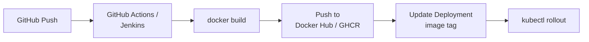

# LP-L04 — Build & Image Resources: BuildConfig, S2I, and ImageStreams

**Level:** Personalized
**Duration:** 1 hr

## Overview

In Kubernetes, you build images externally (GitHub Actions, Jenkins, local `docker build`) and push them to a registry. Kubernetes has no opinion about how images are produced — it only pulls them.

OpenShift can build your code inside the cluster. This lesson teaches BuildConfig (defines how to build), Source-to-Image (S2I — builds from source without a Dockerfile), and ImageStreams (abstract image references that enable automatic redeployment when a new image is built).

In L01-L03, you deployed ShopInsights from pre-built images on GHCR. Now you will build the Products Service and Dashboard UI from source directly on the cluster.

## Prerequisites

- Completed: L01, L02, L03
- OpenShift cluster running (CRC or Developer Sandbox)
- Logged in: `oc login -u developer -p developer https://api.crc.testing:6443`
- `shopinsights` project exists: `oc project shopinsights`

## K8s Context

In Kubernetes, the build pipeline is external:



Kubernetes itself has no build primitives. You need external CI (GitHub Actions, Jenkins, CircleCI), an external registry (Docker Hub, GHCR, ECR), and a mechanism to update the Deployment image reference (manual `kubectl set image`, Helm upgrade, ArgoCD sync, etc.).

This is flexible but requires assembling multiple tools. OpenShift offers an integrated alternative.

## Concepts

### BuildConfig

A BuildConfig is a Kubernetes-style resource (`build.openshift.io/v1`) that defines HOW to build a container image:

- **Source**: where to get the code (Git repo, local upload, binary)
- **Strategy**: how to build it (Source/S2I, Docker, Pipeline, Custom)
- **Output**: where to push the resulting image (usually an ImageStream in the internal registry)

When you create a BuildConfig and trigger a build, OpenShift spins up a builder pod that executes the build inside the cluster and pushes the result to the internal registry.

### Build Strategies

| Strategy | How it works | Dockerfile needed? |
|----------|-------------|-------------------|
| **Source (S2I)** | Injects your source code into a builder image (e.g., `python:3.11-ubi9`). The builder installs dependencies and produces a runnable image. | No |
| **Docker** | Runs a standard `docker build` using the Dockerfile in your repo. | Yes |
| **Pipeline** | Delegates to a Tekton/Jenkins pipeline. | Depends on pipeline |
| **Custom** | Runs your own builder image with full control. | No (you define the process) |

S2I is the most OpenShift-specific strategy. Docker strategy is what you already know. In this lesson you will use both.

### Source-to-Image (S2I)

S2I takes your source code and a builder image, then:

1. Clones your source code into the builder image
2. Runs an `assemble` script (provided by the builder image) that installs dependencies
3. Sets the `run` script as the default command
4. Pushes the resulting image

For the Products Service (Python/FastAPI), the `python:3.11-ubi9` builder image:
- Detects `pyproject.toml` (or `requirements.txt`) and installs dependencies with `pip`
- Sets the default command from a `CMD` or an `app.sh` script

The advantage: no Dockerfile needed. The disadvantage: less control over the build process (e.g., S2I uses `pip` internally, not `uv`). For simple apps, S2I is faster to set up. For production, the Docker strategy with your own Dockerfile gives you full control over the toolchain.

### ImageStreams

An ImageStream is an OpenShift abstraction over container image references. Instead of pointing your Deployment at `ghcr.io/lukaskellerstein/shopinsights-products:latest`, you point it at an ImageStream tag like `products-service:latest`.

Why this matters:

- **Decoupling**: the Deployment references a logical name, not a registry URL. You can change where the image comes from without modifying the Deployment.
- **Triggers**: when a new image is pushed to the ImageStream tag, OpenShift can automatically redeploy. No webhook, no ArgoCD — the platform handles it.
- **Build output**: BuildConfig pushes to an ImageStream by default. The internal registry stores the image, and the ImageStream tracks it.

### Image Change Triggers

You can annotate a Deployment so it watches an ImageStream tag. When a new build pushes a new image, the Deployment automatically rolls out a new version. This is the simplest form of continuous deployment — no pipeline needed.

### Where Do the Images Go?

BuildConfig pushes to OpenShift's built-in container registry by default. The internal registry is available at `image-registry.openshift-image-registry.svc:5000` inside the cluster. You never need to configure registry credentials for in-cluster builds.

In L08 (CI/CD), you will build with Tekton and push to an external registry (GHCR) instead. Both approaches work — internal registry for development, external registry for production artifacts that need to survive cluster rebuilds.

### Relationship to CI/CD

BuildConfig is the **build step**. CI/CD (Tekton, covered in L08) orchestrates the **full workflow** — clone, test, build, push, deploy. A BuildConfig can be one step inside a Tekton pipeline, or it can stand alone for simpler workflows.

Think of it this way:
- **BuildConfig alone**: push code, trigger build, auto-redeploy. Good for dev environments.
- **Tekton + BuildConfig**: push code, run tests, build, scan, deploy to staging, promote to prod. Good for production pipelines.

## Step-by-Step

### Step 1: Create an ImageStream for the Products Service

The ImageStream is the target for the build output. Create it first so the BuildConfig has somewhere to push.

```bash
oc apply -f manifests/products-imagestream.yaml
```

```yaml
# manifests/products-imagestream.yaml
apiVersion: image.openshift.io/v1
kind: ImageStream
metadata:
  name: products-service
  labels:
    app: shopinsights
    component: products-service
    tutorial: personalized
    lesson: "04"
```

Verify it exists (no tags yet — nothing has been built):

```bash
oc get imagestream products-service
```

### Step 2: Create a BuildConfig Using S2I Strategy

This BuildConfig tells OpenShift: "Build the Products Service from the Git repo using the Python 3.11 S2I builder image, and push the result to the `products-service:latest` ImageStream tag."

```bash
oc apply -f manifests/products-buildconfig-s2i.yaml
```

```yaml
# manifests/products-buildconfig-s2i.yaml (key parts)
apiVersion: build.openshift.io/v1
kind: BuildConfig
metadata:
  name: products-service-s2i
spec:
  source:
    type: Git
    git:
      uri: https://github.com/lukaskellerstein/openshift-tutorial.git
    contextDir: tutorial_personalized/shared_app/products-service
  strategy:
    type: Source
    sourceStrategy:
      from:
        kind: ImageStreamTag
        namespace: openshift
        name: python:3.11-ubi9
  output:
    to:
      kind: ImageStreamTag
      name: products-service:latest
```

Key points:
- `contextDir`: only the `products-service/` directory is sent to the builder, not the entire repo
- `sourceStrategy.from`: uses the `python:3.11-ubi9` builder image from the `openshift` namespace (pre-installed builder images)
- `output.to`: pushes to the `products-service:latest` ImageStream tag in the current project

### Step 3: Start the Build

```bash
oc start-build products-service-s2i
```

This creates a Build object (a one-time execution of the BuildConfig) and spins up a builder pod.

### Step 4: Watch the Build Logs

```bash
oc logs -f build/products-service-s2i-1
```

You will see:
1. The source code being cloned from GitHub
2. The S2I `assemble` script detecting `pyproject.toml` and extracting dependencies
3. `pip install` running inside the builder (S2I uses pip, not uv)
4. The final image being pushed to the internal registry

The build takes 2-5 minutes depending on your cluster resources and network speed.

Alternatively, list all builds to check status:

```bash
oc get builds
```

Expected output:

```
NAME                      TYPE     FROM          STATUS     STARTED         DURATION
products-service-s2i-1    Source   Git@main      Complete   2 minutes ago   2m30s
```

### Step 5: Verify the Image Was Pushed

```bash
oc get imagestream products-service
```

Expected output:

```
NAME               IMAGE REPOSITORY                                                              TAGS     UPDATED
products-service   image-registry.openshift-image-registry.svc:5000/shopinsights/products-service latest   30 seconds ago
```

The `TAGS` column now shows `latest` — the build pushed successfully. You can also inspect the image details:

```bash
oc describe imagestream products-service
```

### Step 6: Create ImageStream and BuildConfig for the Dashboard UI

The Dashboard UI has a multi-stage Dockerfile (Node build + nginx serve), so we use the Docker strategy instead of S2I.

```bash
oc apply -f manifests/dashboard-imagestream.yaml
oc apply -f manifests/dashboard-buildconfig.yaml
```

```yaml
# manifests/dashboard-buildconfig.yaml (key parts)
apiVersion: build.openshift.io/v1
kind: BuildConfig
metadata:
  name: dashboard-ui
spec:
  source:
    type: Git
    git:
      uri: https://github.com/lukaskellerstein/openshift-tutorial.git
    contextDir: tutorial_personalized/shared_app/dashboard-ui
  strategy:
    type: Docker
    dockerStrategy:
      dockerfilePath: Dockerfile
  output:
    to:
      kind: ImageStreamTag
      name: dashboard-ui:latest
```

The Docker strategy simply runs `docker build` (actually `buildah` in OpenShift) using the existing Dockerfile. This is what you already know — no new concepts.

Start the build and watch:

```bash
oc start-build dashboard-ui
oc logs -f build/dashboard-ui-1
```

The multi-stage build will:
1. Install npm dependencies and run `npm run build` (Stage 1)
2. Copy the built React app into an nginx image (Stage 2)
3. Push the final image to the `dashboard-ui:latest` ImageStream tag

This build will take longer (3-7 minutes) because of the npm install step.

### Step 7: Compare S2I vs Docker Strategy (Optional)

To see the difference, you can also create a Docker-strategy BuildConfig for the Products Service:

```bash
oc apply -f manifests/products-buildconfig-docker.yaml
oc start-build products-service-docker
oc logs -f build/products-service-docker-1
```

Both produce a working image, but:
- **S2I**: no Dockerfile needed, builder image handles everything, less control
- **Docker**: uses your Dockerfile as-is, full control over the build process

For the Products Service, both work. For the Dashboard UI (multi-stage build), only Docker strategy works because S2I does not support multi-stage builds.

### Step 8: Set Up an Image Change Trigger on the Deployment

Now the powerful part: make the Deployment automatically redeploy when a new image is built.

Apply the updated Deployment that references the ImageStream instead of GHCR:

```bash
oc apply -f manifests/products-deployment-trigger.yaml
```

```yaml
# manifests/products-deployment-trigger.yaml (key parts)
apiVersion: apps/v1
kind: Deployment
metadata:
  name: products-service
  annotations:
    image.openshift.io/triggers: >-
      [{"from":{"kind":"ImageStreamTag","name":"products-service:latest"},
        "fieldPath":"spec.template.spec.containers[?(@.name==\"products-service\")].image"}]
spec:
  template:
    spec:
      containers:
        - name: products-service
          image: products-service:latest
```

The `image.openshift.io/triggers` annotation tells OpenShift: "When the `products-service:latest` ImageStream tag changes, update the container image in this Deployment and trigger a rollout."

This replaces:
- Webhook-triggered CI that runs `kubectl set image`
- ArgoCD watching a Git repo for image tag changes
- Manual `oc set image` commands

### Step 9: Trigger a Rebuild and Watch Auto-Redeploy

Start a new build:

```bash
oc start-build products-service-s2i
```

In a second terminal, watch the Deployment:

```bash
oc rollout status deploy/products-service -w
```

When the build completes and pushes a new image to the ImageStream, the Deployment automatically rolls out a new ReplicaSet. No manual intervention, no webhook, no pipeline — the platform handles it.

### Step 10: View Builds in the Web Console

The Web Console provides a visual interface for builds:

1. Open https://console-openshift-console.apps-crc.testing
2. Switch to the **Developer** perspective (top-left dropdown)
3. Select the `shopinsights` project
4. Click **Builds** in the left navigation

You will see:
- All BuildConfigs listed
- Build history with status (Complete, Running, Failed)
- Build logs accessible with one click
- The ability to start a new build from the UI

Click on a BuildConfig to see its details: source, strategy, output, triggers, and build history.

## Verification

Run these commands to verify everything is working:

```bash
# ImageStreams exist and have tags
oc get imagestreams -l lesson=04
# Expected: products-service and dashboard-ui with "latest" tags

# All builds completed successfully
oc get builds
# Expected: STATUS=Complete for all builds

# Products Service is running from the ImageStream (not GHCR)
oc get deploy products-service -o jsonpath='{.spec.template.spec.containers[0].image}'
# Expected: image-registry.openshift-image-registry.svc:5000/shopinsights/products-service@sha256:...

# Image change trigger is configured
oc get deploy products-service -o jsonpath='{.metadata.annotations.image\.openshift\.io/triggers}' | python3 -m json.tool
# Expected: JSON showing the trigger configuration

# The Products Service still responds correctly
oc exec deploy/products-service -- curl -s http://localhost:8080/healthz
# Expected: {"status":"ok"}
```

## K8s vs OpenShift Comparison

| Aspect | Kubernetes | OpenShift |
|--------|-----------|-----------|
| Image building | External (GitHub Actions, Jenkins, etc.) | In-cluster (BuildConfig) or external |
| Build definition | CI config file (e.g., `.github/workflows/build.yml`) | BuildConfig resource (`build.openshift.io/v1`) |
| Dockerfile builds | `docker build` locally or in CI | Docker strategy (uses `buildah` internally) |
| Build without Dockerfile | Not natively supported | S2I (Source-to-Image) strategy |
| Image registry | External (Docker Hub, GHCR, ECR) | Built-in internal registry + external registries |
| Image reference | Direct registry URL in Deployment | ImageStream (abstract reference) |
| Auto-redeploy on new image | Requires webhook/ArgoCD/manual | Image change trigger annotation |
| Build history | In CI system (GitHub Actions logs) | In the cluster (`oc get builds`, Web Console) |
| Builder images | You choose and configure | Pre-installed S2I builders (Python, Node, Java, etc.) |

## Key Takeaways

- **BuildConfig** is an OpenShift resource that defines how to build a container image inside the cluster — no external CI needed for basic builds
- **S2I (Source-to-Image)** builds apps from source without a Dockerfile by injecting code into a builder image. Great for simple apps; use Docker strategy when you need full control.
- **ImageStreams** decouple Deployments from specific registry URLs and enable triggers
- **Image change triggers** on Deployments enable automatic redeployment when a new image is built — the simplest form of continuous deployment
- BuildConfig is the **build step**; CI/CD (Tekton, L08) orchestrates the **full workflow** including tests, scans, and multi-environment promotion

## Cleanup

```bash
# Delete builds and build configs
oc delete buildconfig -l lesson=04
oc delete builds -l buildconfig=products-service-s2i
oc delete builds -l buildconfig=products-service-docker
oc delete builds -l buildconfig=dashboard-ui

# Delete image streams
oc delete imagestream -l lesson=04

# Restore the original Deployment (pointing back to GHCR)
oc apply -f ../L01_deploy_microservices/manifests/products-deployment.yaml

# Delete all lesson-04 resources at once (alternative)
oc delete all -l tutorial=personalized,lesson=04
```

## Next Steps

Your services are now built from source inside the cluster. In [L05: Projects](../L05_projects/), you will learn how OpenShift Projects differ from Kubernetes Namespaces and set up separate dev and staging environments for ShopInsights.

## Deep Dive

For more on the concepts introduced here, see the comprehensive tutorial:
- [L1-M3.3 Source-to-Image Builds](../../tutorial/level_1/M3_application_deployment/3_s2i_builds/)
- [L1-M3.2 ImageStreams](../../tutorial/level_1/M3_application_deployment/2_imagestreams/)
- [L1-M3.5 Build Triggers & Webhooks](../../tutorial/level_1/M3_application_deployment/5_build_triggers_webhooks/)
- [L2-M1 CI/CD Pipelines](../../tutorial/level_2/M1_cicd/) (for the full Tekton integration in L08)
