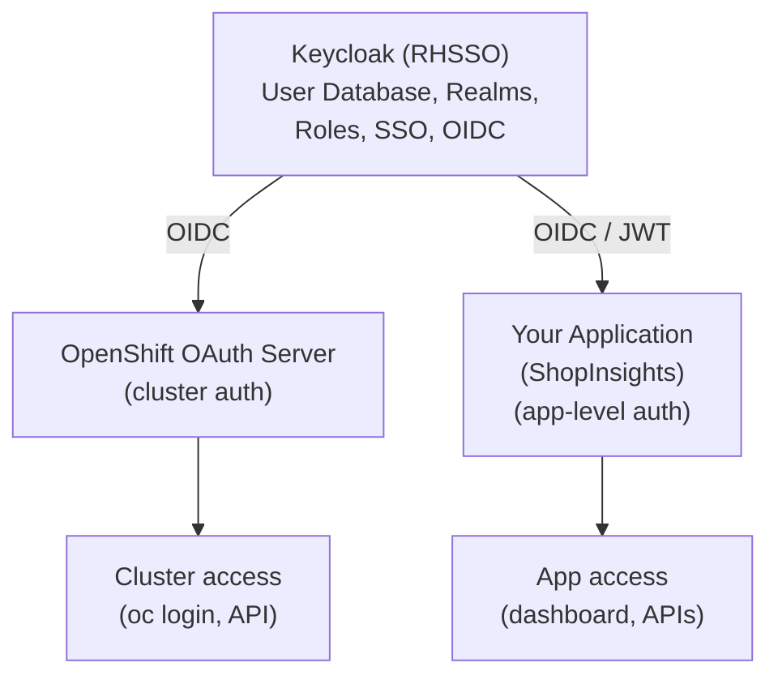

# LP-L06 — Authentication & Authorization: OAuth, RBAC, and Keycloak

**Level:** Personalized
**Duration:** 45 min

## Overview

OpenShift has a built-in OAuth server that handles cluster authentication — user login, token issuance, and session management. In this lesson, you configure an identity provider (HTPasswd), create users with different roles, and set up RBAC to control who can deploy to `shopinsights-dev` and `shopinsights-staging`. You also learn how the built-in OAuth server relates to Keycloak, which you already use for application-level authentication.

## Prerequisites

- Completed: [L05 — Projects](../L05_projects/) (dev and staging projects exist)
- Projects `shopinsights-dev` and `shopinsights-staging` created
- OpenShift cluster running (CRC or Developer Sandbox)
- Logged in as `kubeadmin` (some steps require cluster-admin privileges):
  ```bash
  oc login -u kubeadmin -p <password> https://api.crc.testing:6443
  ```
  (The kubeadmin password is printed when you run `crc start`)
- `htpasswd` command available (part of `httpd-tools` or `apache2-utils`):
  ```bash
  # macOS (usually pre-installed)
  which htpasswd

  # RHEL/Fedora
  sudo dnf install httpd-tools

  # Ubuntu/Debian
  sudo apt install apache2-utils
  ```

## K8s Context

In vanilla Kubernetes, authentication is entirely external. The API server accepts bearer tokens, client certificates, or OIDC tokens, but it does not manage users, passwords, or login flows. You either:

1. **Use cloud provider IAM** — AWS IAM, GCP IAM, Azure AD
2. **Install an OIDC provider** — Keycloak, Dex, or Auth0 — and configure the API server's `--oidc-*` flags
3. **Use client certificates** — generate certs per user, distribute them manually
4. **Use static token files** — a CSV file mounted into the API server (not recommended)

There is no `kubectl login` command. There is no built-in user database. There is no login page. Kubernetes delegates authentication entirely and only handles authorization (RBAC).

## Concepts

### OpenShift OAuth Server

OpenShift includes an OAuth 2.0 server that runs as a cluster component (in the `openshift-authentication` namespace). It provides:

- **A login page**: users authenticate via the Web Console or `oc login`
- **Token issuance**: OAuth access tokens for the API server
- **Session management**: token expiry, refresh, and revocation
- **Multiple identity providers**: HTPasswd, LDAP, GitHub, GitLab, Google, OpenID Connect

The OAuth server is configured via the cluster-level `OAuth` resource (`config.openshift.io/v1`). There is exactly one OAuth resource in the cluster, named `cluster`.

### Identity Providers

An identity provider tells the OAuth server how to verify user credentials. OpenShift supports:

| Provider | Use Case |
|----------|----------|
| **HTPasswd** | Development, small teams. Users stored in a file. |
| **LDAP** | Enterprise. Connects to Active Directory or OpenLDAP. |
| **GitHub / GitLab** | Developer teams. SSO via GitHub or GitLab accounts. |
| **OpenID Connect** | Any OIDC provider (Keycloak, Okta, Auth0, Azure AD). |
| **Basic Authentication** | Proxy to external auth service via HTTP header. |

You can configure multiple identity providers simultaneously. In this lesson, we use HTPasswd because it requires no external infrastructure.

### Tokens and Sessions

When you run `oc login -u dev-user`, the following happens:

1. The `oc` CLI contacts the OAuth server
2. The OAuth server validates credentials against the configured identity provider (HTPasswd in our case)
3. On success, the OAuth server issues an **access token**
4. The token is stored in `~/.kube/config` and sent with every API request
5. Tokens expire after 24 hours by default (configurable)

This is a complete login flow — no manual certificate generation, no OIDC flag configuration.

### RBAC: Roles and RoleBindings

RBAC in OpenShift works identically to Kubernetes, with the same four resources:

| Resource | Scope | Purpose |
|----------|-------|---------|
| `ClusterRole` | Cluster-wide | Define permissions (e.g., `admin`, `edit`, `view`) |
| `ClusterRoleBinding` | Cluster-wide | Grant a ClusterRole to a user across all projects |
| `Role` | Single project | Define project-scoped permissions |
| `RoleBinding` | Single project | Grant a Role or ClusterRole within a project |

OpenShift ships with several default ClusterRoles:

| Role | Permissions |
|------|-------------|
| `cluster-admin` | Full access to everything — the superuser |
| `admin` | Full access within a project — manage resources, RBAC, quotas |
| `edit` | Create, modify, delete most resources — no RBAC management |
| `view` | Read-only access — see resources but cannot modify them |
| `basic-user` | Can see own project list and basic info |

In Kubernetes, these roles exist too, but `admin` and `edit` are less commonly used because most clusters do not have multi-tenant user management out of the box.

### Service Accounts

Service accounts provide identities for workloads (pods) rather than human users. OpenShift automatically creates three service accounts per project:

- `default` — used by pods that do not specify a service account
- `deployer` — used by DeploymentConfigs (legacy)
- `builder` — used by BuildConfigs

You can create additional service accounts with limited permissions — for example, a service account that can only read ConfigMaps and Secrets in its own project.

## Your Question, Answered

> "Is OAuth a replacement for Keycloak?"

**For cluster authentication, yes. For application authentication, no.** They operate at different layers:

| Aspect | OpenShift OAuth Server | Keycloak / RHSSO |
|--------|----------------------|-------------------|
| **Purpose** | Cluster authentication — who can `oc login`, access the API, deploy workloads | Application authentication — user login to your app, JWT tokens, SSO |
| **Scope** | OpenShift API server and Web Console | Your application's APIs and UIs |
| **Users** | Cluster users (developers, operators, admins) | Application users (customers, employees) |
| **Protocols** | OAuth 2.0 (for cluster tokens) | OAuth 2.0, OIDC, SAML 2.0 |
| **Token usage** | Bearer tokens for `oc` CLI and API calls | JWT tokens for your application APIs |
| **User management** | Identity provider backend (HTPasswd, LDAP, OIDC) | Built-in user database + federation |
| **Fine-grained permissions** | RBAC roles (admin, edit, view) on K8s resources | Application-level roles, groups, scopes |
| **Self-service registration** | No — cluster admin creates users | Yes — login page, registration, password reset |
| **Multi-tenancy** | Projects (namespaces) with RBAC | Realms with client scopes |
| **Runs as** | Built-in cluster component | A pod in your cluster (or external) |

**Different layers. You likely need BOTH:**

- **OpenShift OAuth** controls who can access the cluster: `oc login`, deploy pods, create Routes, view logs
- **Keycloak** controls who can access your application: ShopInsights dashboard login, API authentication, user roles within the app

In fact, you can connect the two: configure OpenShift's OAuth to use Keycloak as an OpenID Connect identity provider. Your cluster users authenticate via Keycloak, and your application users do too — single sign-on across the platform and the application.



**Bottom line**: OpenShift OAuth replaces the "how do I authenticate users to my cluster" problem that you solve with Keycloak + OIDC flags in vanilla K8s. But Keycloak remains essential for application-level authentication in ShopInsights.

## Step-by-Step

### Step 1: View the Current OAuth Configuration

The OAuth server configuration is a cluster-scoped resource. Inspect it:

```bash
oc get oauth cluster -o yaml
```

On a fresh CRC installation, the output is minimal — the default identity provider is `kubeadmin` (a temporary admin account):

```yaml
apiVersion: config.openshift.io/v1
kind: OAuth
metadata:
  name: cluster
spec: {}
```

The empty `spec` means only `kubeadmin` can log in. We are about to add real users.

### Step 2: Create an HTPasswd File with Users

We will create three users with different roles:

| User | Role | Purpose |
|------|------|---------|
| `dev-user` | Developer | Can deploy to dev, read-only on staging |
| `ops-user` | Operations | Admin on both dev and staging |
| `admin-user` | Platform admin | Cluster-level administration |

Create the HTPasswd file:

```bash
# Create the file with the first user
htpasswd -c -B -b /tmp/shopinsights-users dev-user devpass123

# Add more users (-b flag passes password on command line)
htpasswd -B -b /tmp/shopinsights-users ops-user opspass123
htpasswd -B -b /tmp/shopinsights-users admin-user adminpass123
```

Flags:
- `-c`: create a new file (only for the first user)
- `-B`: use bcrypt hashing (more secure than default MD5)
- `-b`: take password from command line (for scripting; omit for interactive prompt)

Verify the file:

```bash
cat /tmp/shopinsights-users
```

You will see three lines with usernames and bcrypt-hashed passwords:

```
dev-user:$2y$05$...
ops-user:$2y$05$...
admin-user:$2y$05$...
```

Or use the provided script to automate this:

```bash
bash scripts/create-users.sh
```

### Step 3: Create a Secret with the HTPasswd File

The OAuth server reads credentials from a Secret in the `openshift-config` namespace:

```bash
oc create secret generic htpasswd-secret \
  --from-file=htpasswd=/tmp/shopinsights-users \
  -n openshift-config
```

Or apply the manifest (which contains pre-generated hashed passwords):

```bash
oc apply -f manifests/htpasswd-secret.yaml
```

```yaml
# manifests/htpasswd-secret.yaml
apiVersion: v1
kind: Secret
metadata:
  name: htpasswd-secret
  namespace: openshift-config
  labels:
    app: shopinsights
    tutorial: personalized
    lesson: "06"
type: Opaque
data:
  # Base64-encoded HTPasswd file with bcrypt hashes
  # dev-user:devpass123, ops-user:opspass123, admin-user:adminpass123
  htpasswd: ZGV2LXVzZXI6JDJ5JDA1JGVKcUxrUjRqWGtPaEF6NHlKaU41TE9OV0dKVjBYMEdFNnFDaHFBTzBUMjliTUF1VjRGSzdLCm9wcy11c2VyOiQyeSQwNSRVTnRhUGF2OElOLmZtN09YNGYwWjl1cmlCLjdMbDJzWi5JVFlEQ3VyU3RFc2FqSXNNSlNPaQphZG1pbi11c2VyOiQyeSQwNSRTZ0M2YkRJa3NjNDlLb2hVa3FSNXJ1cEs4M3FCc3VJb3YxVXdMdHJFRm9QbGE5ek1XajZZQwo=
```

Note: In production, you would not store the HTPasswd file in a manifest. You would create the Secret imperatively or use a secrets management tool. The manifest here is for tutorial reproducibility.

### Step 4: Configure the OAuth Server to Use HTPasswd

Patch the OAuth cluster resource to add the HTPasswd identity provider:

```bash
oc apply -f manifests/oauth-htpasswd.yaml
```

```yaml
# manifests/oauth-htpasswd.yaml
apiVersion: config.openshift.io/v1
kind: OAuth
metadata:
  name: cluster
spec:
  identityProviders:
    - name: shopinsights-htpasswd
      mappingMethod: claim
      type: HTPasswd
      htpasswd:
        fileData:
          name: htpasswd-secret
```

Key fields:

- **`name: shopinsights-htpasswd`**: A label for this identity provider (shown on the login page)
- **`mappingMethod: claim`**: The first login "claims" the identity. Subsequent logins with the same username from a different provider are rejected.
- **`type: HTPasswd`**: Tells the OAuth server to validate credentials against the HTPasswd file
- **`htpasswd.fileData.name`**: References the Secret containing the HTPasswd file

After applying, the OAuth pods restart automatically (this takes 1-2 minutes):

```bash
# Watch the OAuth pods restart
oc get pods -n openshift-authentication -w
```

Wait until the new pod shows `1/1 Running`:

```
NAME                               READY   STATUS    RESTARTS   AGE
oauth-openshift-xxxxxxxxxx-xxxxx   1/1     Running   0          30s
```

### Step 5: Log In as dev-user

Now test the new identity provider:

```bash
# Log out first
oc logout

# Log in as dev-user
oc login -u dev-user -p devpass123 https://api.crc.testing:6443
```

Expected output:

```
Login successful.

You don't have any projects. You can try to create a new project, by running

    oc new-project <projectname>
```

The user authenticated successfully, but cannot see any projects yet — we have not granted any RBAC permissions.

Verify the current user:

```bash
oc whoami
```

Output: `dev-user`

### Step 6: Create RoleBindings for dev-user

Log back in as `kubeadmin` to grant permissions:

```bash
oc login -u kubeadmin -p <password> https://api.crc.testing:6443
```

Grant dev-user the `edit` role on `shopinsights-dev` (can deploy, modify resources, but cannot manage RBAC):

```bash
oc apply -f manifests/rbac-dev-team.yaml
```

```yaml
# manifests/rbac-dev-team.yaml
apiVersion: rbac.authorization.k8s.io/v1
kind: RoleBinding
metadata:
  name: dev-user-edit
  namespace: shopinsights-dev
  labels:
    app: shopinsights
    tutorial: personalized
    lesson: "06"
subjects:
  - kind: User
    name: dev-user
    apiGroup: rbac.authorization.k8s.io
roleRef:
  kind: ClusterRole
  name: edit
  apiGroup: rbac.authorization.k8s.io
```

Grant dev-user the `view` role on `shopinsights-staging` (read-only — can see resources but not modify them):

```bash
oc apply -f manifests/rbac-staging-view.yaml
```

```yaml
# manifests/rbac-staging-view.yaml
apiVersion: rbac.authorization.k8s.io/v1
kind: RoleBinding
metadata:
  name: dev-user-view
  namespace: shopinsights-staging
  labels:
    app: shopinsights
    tutorial: personalized
    lesson: "06"
subjects:
  - kind: User
    name: dev-user
    apiGroup: rbac.authorization.k8s.io
roleRef:
  kind: ClusterRole
  name: view
  apiGroup: rbac.authorization.k8s.io
```

### Step 7: Create RoleBindings for ops-user

Grant ops-user the `admin` role on both projects (full control including RBAC management):

```bash
oc apply -f manifests/rbac-ops-team.yaml
```

```yaml
# manifests/rbac-ops-team.yaml
apiVersion: rbac.authorization.k8s.io/v1
kind: RoleBinding
metadata:
  name: ops-user-admin-dev
  namespace: shopinsights-dev
  labels:
    app: shopinsights
    tutorial: personalized
    lesson: "06"
subjects:
  - kind: User
    name: ops-user
    apiGroup: rbac.authorization.k8s.io
roleRef:
  kind: ClusterRole
  name: admin
  apiGroup: rbac.authorization.k8s.io
---
apiVersion: rbac.authorization.k8s.io/v1
kind: RoleBinding
metadata:
  name: ops-user-admin-staging
  namespace: shopinsights-staging
  labels:
    app: shopinsights
    tutorial: personalized
    lesson: "06"
subjects:
  - kind: User
    name: ops-user
    apiGroup: rbac.authorization.k8s.io
roleRef:
  kind: ClusterRole
  name: admin
  apiGroup: rbac.authorization.k8s.io
```

### Step 8: Test RBAC — dev-user Can Deploy to Dev But Not Staging

Log in as dev-user and test permissions:

```bash
oc login -u dev-user -p devpass123 https://api.crc.testing:6443
```

**Test 1: List projects** — dev-user should see both projects:

```bash
oc get projects
```

Expected output:

```
NAME                    DISPLAY NAME     STATUS
shopinsights-dev        ShopInsights Dev   Active
shopinsights-staging    ShopInsights Staging   Active
```

**Test 2: Create a resource in dev** — should succeed:

```bash
oc run test-pod --image=registry.access.redhat.com/ubi9/ubi-minimal:latest \
  --command -- sleep 3600 -n shopinsights-dev
```

Expected: `pod/test-pod created`

**Test 3: Create a resource in staging** — should be denied:

```bash
oc run test-pod --image=registry.access.redhat.com/ubi9/ubi-minimal:latest \
  --command -- sleep 3600 -n shopinsights-staging
```

Expected error:

```
Error from server (Forbidden): pods is forbidden: User "dev-user" cannot create
resource "pods" in API group "" in the namespace "shopinsights-staging"
```

**Test 4: View resources in staging** — should succeed (view role):

```bash
oc get pods -n shopinsights-staging
oc get deployments -n shopinsights-staging
```

These commands succeed because dev-user has `view` on staging.

Clean up the test pod:

```bash
oc delete pod test-pod -n shopinsights-dev
```

### Step 9: Create a ServiceAccount for the Analytics Service

The analytics-service needs to read ConfigMaps and Secrets in its project but should not have broader permissions. Create a dedicated ServiceAccount with a limited Role:

```bash
oc login -u kubeadmin -p <password> https://api.crc.testing:6443
oc apply -f manifests/service-account.yaml
```

```yaml
# manifests/service-account.yaml
apiVersion: v1
kind: ServiceAccount
metadata:
  name: analytics-service
  namespace: shopinsights-dev
  labels:
    app: shopinsights
    component: analytics-service
    tutorial: personalized
    lesson: "06"
---
apiVersion: rbac.authorization.k8s.io/v1
kind: Role
metadata:
  name: analytics-service-role
  namespace: shopinsights-dev
  labels:
    app: shopinsights
    tutorial: personalized
    lesson: "06"
rules:
  - apiGroups: [""]
    resources: ["configmaps", "secrets"]
    verbs: ["get", "list", "watch"]
  - apiGroups: [""]
    resources: ["pods"]
    verbs: ["get", "list"]
---
apiVersion: rbac.authorization.k8s.io/v1
kind: RoleBinding
metadata:
  name: analytics-service-binding
  namespace: shopinsights-dev
  labels:
    app: shopinsights
    tutorial: personalized
    lesson: "06"
subjects:
  - kind: ServiceAccount
    name: analytics-service
    namespace: shopinsights-dev
roleRef:
  kind: Role
  name: analytics-service-role
  apiGroup: rbac.authorization.k8s.io
```

This ServiceAccount can:
- Read ConfigMaps and Secrets (to load configuration)
- List pods (to discover other services)
- Nothing else — cannot create, modify, or delete resources

To use this ServiceAccount in a Deployment, add `serviceAccountName` to the pod spec:

```yaml
spec:
  template:
    spec:
      serviceAccountName: analytics-service
      containers:
        - name: analytics-service
          ...
```

Verify the ServiceAccount was created:

```bash
oc get serviceaccount analytics-service -n shopinsights-dev
```

Test what the ServiceAccount can and cannot do:

```bash
# Can it read ConfigMaps? (yes)
oc auth can-i get configmaps -n shopinsights-dev --as=system:serviceaccount:shopinsights-dev:analytics-service

# Can it create Deployments? (no)
oc auth can-i create deployments -n shopinsights-dev --as=system:serviceaccount:shopinsights-dev:analytics-service

# Can it delete pods? (no)
oc auth can-i delete pods -n shopinsights-dev --as=system:serviceaccount:shopinsights-dev:analytics-service
```

Expected output:

```
yes
no
no
```

### Step 10: View the OAuth Login Page

Open the OpenShift Web Console:

```
https://console-openshift-console.apps-crc.testing
```

You should now see a login page with the identity provider name `shopinsights-htpasswd` as an option. Click it and log in as `dev-user` / `devpass123`.

Once logged in:
1. Switch to the **Developer** perspective
2. You should see `shopinsights-dev` and `shopinsights-staging` in the project dropdown
3. Try switching to `shopinsights-staging` and creating a resource — the Web Console will show a permission error, just like the CLI

If `kubeadmin` is also listed as a login option, that is expected — CRC keeps the kubeadmin provider alongside any providers you add.

## Verification

Run these commands as `kubeadmin` to verify the full setup:

```bash
oc login -u kubeadmin -p <password> https://api.crc.testing:6443

echo "=== OAuth Configuration ==="
oc get oauth cluster -o jsonpath='{.spec.identityProviders[*].name}'
echo ""

echo ""
echo "=== Users ==="
oc get users

echo ""
echo "=== Identities ==="
oc get identities

echo ""
echo "=== RoleBindings in shopinsights-dev ==="
oc get rolebindings -n shopinsights-dev -l tutorial=personalized

echo ""
echo "=== RoleBindings in shopinsights-staging ==="
oc get rolebindings -n shopinsights-staging -l tutorial=personalized

echo ""
echo "=== ServiceAccount ==="
oc get serviceaccount analytics-service -n shopinsights-dev

echo ""
echo "=== RBAC Tests (dev-user) ==="
echo -n "dev-user can edit in dev: "
oc auth can-i create pods -n shopinsights-dev --as=dev-user
echo -n "dev-user can edit in staging: "
oc auth can-i create pods -n shopinsights-staging --as=dev-user
echo -n "dev-user can view in staging: "
oc auth can-i get pods -n shopinsights-staging --as=dev-user

echo ""
echo "=== RBAC Tests (ops-user) ==="
echo -n "ops-user can admin in dev: "
oc auth can-i create pods -n shopinsights-dev --as=ops-user
echo -n "ops-user can admin in staging: "
oc auth can-i create pods -n shopinsights-staging --as=ops-user
```

Expected output:

```
=== OAuth Configuration ===
shopinsights-htpasswd

=== Users ===
NAME          UID                                    FULL NAME   IDENTITIES
admin-user    ...                                                shopinsights-htpasswd:admin-user
dev-user      ...                                                shopinsights-htpasswd:dev-user
ops-user      ...                                                shopinsights-htpasswd:ops-user

=== Identities ===
NAME                                  IDP NAME                 IDP USER NAME   USER NAME    USER UID
shopinsights-htpasswd:admin-user      shopinsights-htpasswd    admin-user      admin-user   ...
shopinsights-htpasswd:dev-user        shopinsights-htpasswd    dev-user        dev-user     ...
shopinsights-htpasswd:ops-user        shopinsights-htpasswd    ops-user        ops-user     ...

=== RoleBindings in shopinsights-dev ===
NAME                        ROLE                     AGE
dev-user-edit               ClusterRole/edit         ...
ops-user-admin-dev          ClusterRole/admin        ...
analytics-service-binding   Role/analytics-service-role   ...

=== RoleBindings in shopinsights-staging ===
NAME                        ROLE                     AGE
dev-user-view               ClusterRole/view         ...
ops-user-admin-staging      ClusterRole/admin        ...

=== ServiceAccount ===
NAME                SECRETS   AGE
analytics-service   1         ...

=== RBAC Tests (dev-user) ===
dev-user can edit in dev: yes
dev-user can edit in staging: no
dev-user can view in staging: yes

=== RBAC Tests (ops-user) ===
ops-user can admin in dev: yes
ops-user can admin in staging: yes
```

Note: Users and Identities only appear after the users have logged in at least once. If you see no users, log in as each user first (`oc login -u dev-user ...`).

## K8s vs OpenShift Comparison

| Aspect | Kubernetes | OpenShift |
|--------|-----------|-----------|
| Built-in auth server | None — authentication is external | OAuth server built in, managed as a cluster component |
| User management | No built-in users — use certificates, tokens, or OIDC | Identity providers (HTPasswd, LDAP, GitHub, OIDC) |
| Login flow | No `kubectl login` — configure kubeconfig manually | `oc login -u <user>` — prompts or accepts password |
| Login page | No built-in UI login | Web Console login with identity provider selection |
| Token management | Manual kubeconfig entries | Automatic token issuance and refresh via OAuth |
| Default roles | `cluster-admin`, `admin`, `edit`, `view` exist but rarely used | Same roles, actively used for multi-tenant access |
| Project self-provisioning | N/A — namespaces require admin access | Users can create their own projects (configurable) |
| Service accounts | Same | Same — plus `deployer` and `builder` auto-created per project |
| RBAC resources | Role, ClusterRole, RoleBinding, ClusterRoleBinding | Identical — same API, same YAML |
| Multi-tenancy | Manual setup with PSA, NetworkPolicy, ResourceQuotas | Projects with built-in RBAC, quotas, and network isolation |

## Key Takeaways

- OpenShift's **built-in OAuth server** replaces the need to configure external authentication for cluster access — no OIDC flags, no certificate distribution, no static token files
- **HTPasswd** is the simplest identity provider for development; production clusters typically use LDAP or OpenID Connect
- **RBAC works identically** to Kubernetes — same Role, ClusterRole, RoleBinding, ClusterRoleBinding resources
- **OpenShift OAuth is for cluster access; Keycloak is for application access** — they solve different problems at different layers, and you likely need both
- You can connect them: use Keycloak as an OIDC identity provider for OpenShift, giving you SSO across the platform and your application
- **ServiceAccounts** provide workload identity with least-privilege access — always create dedicated service accounts for your services instead of using the `default` one
- The `oc auth can-i` command is invaluable for testing RBAC policies before users hit permission errors

## Cleanup

Remove the resources created in this lesson:

```bash
# Log in as kubeadmin
oc login -u kubeadmin -p <password> https://api.crc.testing:6443

# Remove RoleBindings
oc delete rolebinding -l tutorial=personalized,lesson=06 -n shopinsights-dev
oc delete rolebinding -l tutorial=personalized,lesson=06 -n shopinsights-staging

# Remove ServiceAccount and Role
oc delete serviceaccount analytics-service -n shopinsights-dev
oc delete role analytics-service-role -n shopinsights-dev

# Remove users and identities
oc delete user dev-user ops-user admin-user
oc delete identity shopinsights-htpasswd:dev-user shopinsights-htpasswd:ops-user shopinsights-htpasswd:admin-user

# Remove the HTPasswd secret
oc delete secret htpasswd-secret -n openshift-config

# Restore the default OAuth configuration (removes HTPasswd provider)
oc patch oauth cluster --type=json -p='[{"op":"remove","path":"/spec/identityProviders"}]'
```

Note: This removes the HTPasswd identity provider. After cleanup, only `kubeadmin` can log in.

## Next Steps

Your cluster now has proper authentication and RBAC. In [L07: Monitoring & Logging](../L07_monitoring_and_logging/), you will add custom Prometheus metrics to the ShopInsights services, create ServiceMonitors, set up alerts, and configure log forwarding — giving you production-grade observability.

## Deep Dive

For the full conceptual treatment of authentication, RBAC, and security in OpenShift, see the comprehensive tutorial:
- [L1-M2.1 Projects vs Namespaces](../../tutorial/level_1/M2_projects_users_rbac/1_projects_vs_namespaces/)
- [L1-M2.2 Users and Groups](../../tutorial/level_1/M2_projects_users_rbac/2_users_and_groups/)
- [L1-M2.3 RBAC Deep Dive](../../tutorial/level_1/M2_projects_users_rbac/3_rbac_deep_dive/)
- [L2-M5.1 OAuth and Identity Providers](../../tutorial/level_2/M5_security_hardening/1_oauth_identity_providers/)
