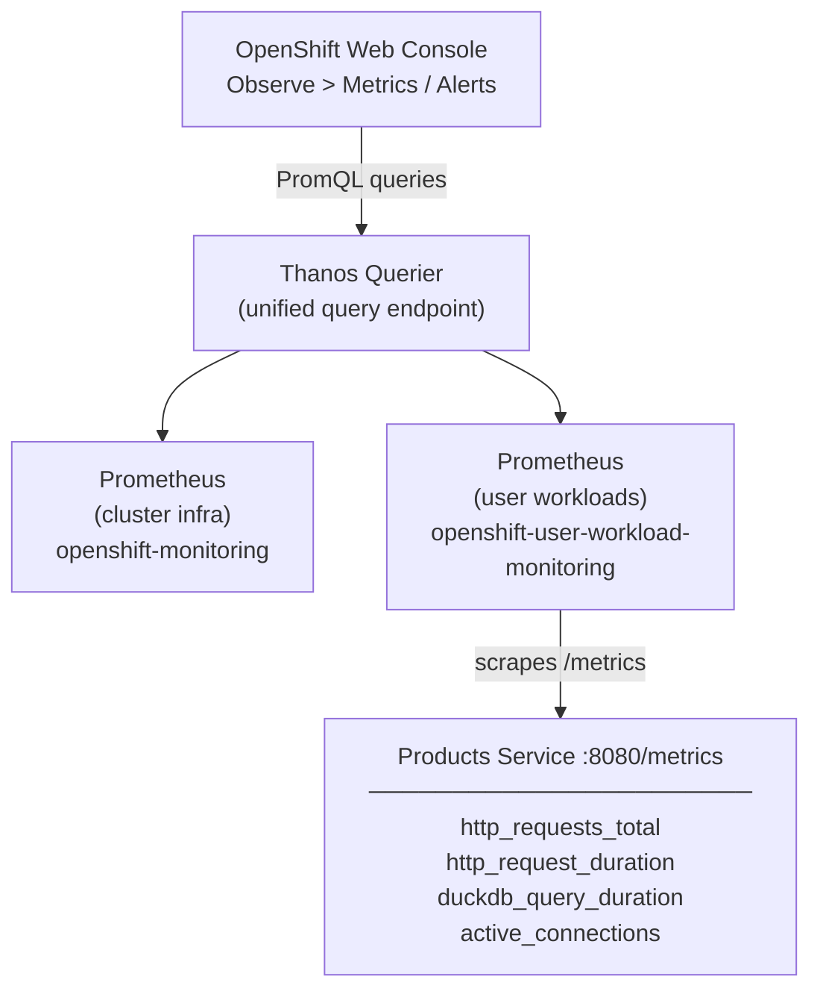

# LP-L07 — Monitoring & Logging: Custom Metrics from Python

**Level:** Personalized
**Duration:** 1 hr

## Overview

OpenShift ships with a complete monitoring stack -- Prometheus, Alertmanager, and Grafana -- pre-installed and pre-configured for cluster infrastructure. In this lesson you enable **user workload monitoring** so that same stack also scrapes *your* applications, then instrument the Products Service with custom Prometheus metrics using the `prometheus_client` Python library.

By the end you will have request-rate counters, latency histograms, and DuckDB query timers flowing into the built-in Prometheus, visible in the Web Console, and backed by an alerting rule that fires when latency spikes.

## Prerequisites

- Completed: L01 through L06
- OpenShift cluster running (CRC or Developer Sandbox)
- ShopInsights stack deployed in the `shopinsights` project
- `kubeadmin` access (needed once to enable user workload monitoring)
- `oc` CLI installed and on PATH

## K8s Context

In vanilla Kubernetes, monitoring is entirely DIY. You install the Prometheus Operator (or kube-prometheus-stack Helm chart), configure scrape targets, set up Alertmanager, deploy Grafana, and maintain all of it yourself. Every upgrade, every configuration change, every new scrape target is your responsibility.

On OpenShift, the monitoring stack is **pre-installed and managed by the Cluster Monitoring Operator**. You never touch Prometheus configuration files. Instead you:

1. Flip a single flag to enable user workload monitoring
2. Create a `ServiceMonitor` custom resource (the same CR the Prometheus Operator uses) to tell Prometheus how to scrape your service
3. Create a `PrometheusRule` to define alerts

The APIs are identical -- if you have used the Prometheus Operator on Kubernetes, the CRDs are the same. The difference is that OpenShift manages the Prometheus lifecycle for you.

## Concepts

### The Built-In Monitoring Stack

OpenShift deploys these components in the `openshift-monitoring` namespace:

- **Prometheus** -- scrapes cluster components (API server, etcd, kubelet, node-exporter)
- **Alertmanager** -- routes alerts from Prometheus rules to notification channels
- **Grafana** -- pre-built dashboards for cluster health (read-only, managed by the operator)
- **Thanos Querier** -- provides a unified query endpoint across multiple Prometheus instances

You do not install, upgrade, or configure any of these. They are managed by the **Cluster Monitoring Operator**.

### User Workload Monitoring

By default, the built-in Prometheus only scrapes OpenShift infrastructure. To monitor your own applications you must enable **user workload monitoring** by setting `enableUserWorkload: true` in the `cluster-monitoring-config` ConfigMap.

Once enabled, OpenShift deploys a **second Prometheus instance** in the `openshift-user-workload-monitoring` namespace. This instance is dedicated to scraping user applications -- it reads ServiceMonitor and PodMonitor CRs from your project namespaces.

### ServiceMonitor

A `ServiceMonitor` tells Prometheus:
- **Which Service to scrape** (via label selectors)
- **Which port and path** to hit (e.g., port 8080, path `/metrics`)
- **How often** to scrape (interval)

It is a CRD from the Prometheus Operator -- the same one used on vanilla Kubernetes if you install the operator yourself.

### PrometheusRule

A `PrometheusRule` defines alerting and recording rules. You write PromQL expressions and thresholds, and the built-in Alertmanager evaluates them. On vanilla Kubernetes you would edit `prometheus.rules` files directly; on OpenShift you create a CR in your namespace and it is automatically loaded.

### Prometheus Metric Types (Python)

The `prometheus_client` Python library provides four metric types:

| Type | Purpose | Example |
|------|---------|---------|
| **Counter** | Monotonically increasing total | Total HTTP requests |
| **Histogram** | Distribution of values in buckets | Request latency |
| **Gauge** | Value that goes up and down | Active connections |
| **Summary** | Similar to Histogram but with quantiles | (less common) |

In this lesson we use Counter, Histogram, and Gauge.

### OpenShift Logging (Overview)

OpenShift also provides a managed logging stack (Loki or Elasticsearch + Fluentd/Vector). While we focus on metrics in the hands-on steps, the logging stack works similarly:
- Install the OpenShift Logging operator from OperatorHub
- Create a `ClusterLogForwarder` CR to configure log collection and forwarding
- Structured JSON logs from your application are automatically parsed and indexed
- View logs in the Web Console under **Observe > Logs**

For this lesson, we use `oc logs` for container logs and focus on Prometheus metrics for observability.

## Architecture



## Step-by-Step

### Step 1: Enable User Workload Monitoring

This step requires `kubeadmin` (cluster-admin) privileges. You only need to do this once per cluster.

```bash
# Login as kubeadmin
oc login -u kubeadmin -p <password> https://api.crc.testing:6443
```

Apply the ConfigMap that enables user workload monitoring:

```bash
oc apply -f manifests/enable-user-workload-monitoring.yaml
```

```yaml
# manifests/enable-user-workload-monitoring.yaml
apiVersion: v1
kind: ConfigMap
metadata:
  name: cluster-monitoring-config
  namespace: openshift-monitoring
data:
  config.yaml: |
    enableUserWorkload: true
```

Wait for the user workload monitoring pods to start:

```bash
oc get pods -n openshift-user-workload-monitoring -w
```

You should see `prometheus-user-workload-*` and `thanos-ruler-user-workload-*` pods reach `Running` state. This usually takes 1-2 minutes.

```
NAME                                   READY   STATUS    RESTARTS   AGE
prometheus-user-workload-0             6/6     Running   0          90s
prometheus-user-workload-1             6/6     Running   0          90s
thanos-ruler-user-workload-0           4/4     Running   0          85s
thanos-ruler-user-workload-1           4/4     Running   0          85s
```

Switch back to the developer user for the rest of the lesson:

```bash
oc login -u developer -p developer https://api.crc.testing:6443
oc project shopinsights
```

### Step 2: Examine the Instrumented Products Service

Open `app/products_service_with_metrics.py` and review what changed compared to the original `shared_app/products-service/app.py`:

**Four custom metrics are defined:**

```python
from prometheus_client import Counter, Gauge, Histogram, make_asgi_app

http_requests_total = Counter(
    "http_requests_total",
    "Total number of HTTP requests",
    ["method", "endpoint", "status"],
)

http_request_duration_seconds = Histogram(
    "http_request_duration_seconds",
    "HTTP request duration in seconds",
    ["method", "endpoint"],
    buckets=(0.005, 0.01, 0.025, 0.05, 0.1, 0.25, 0.5, 1.0, 2.5, 5.0),
)

duckdb_query_duration_seconds = Histogram(
    "duckdb_query_duration_seconds",
    "DuckDB query duration in seconds",
    ["query_type"],
)

active_connections = Gauge(
    "active_connections",
    "Number of currently active HTTP connections",
)
```

**A middleware automatically tracks every request:**

```python
@app.middleware("http")
async def metrics_middleware(request: Request, call_next):
    active_connections.inc()
    start_time = time.perf_counter()
    try:
        response = await call_next(request)
        status_code = response.status_code
    except Exception:
        status_code = 500
        raise
    finally:
        duration = time.perf_counter() - start_time
        endpoint = _normalise_path(request.url.path)
        http_requests_total.labels(method=request.method, endpoint=endpoint, status=str(status_code)).inc()
        http_request_duration_seconds.labels(method=request.method, endpoint=endpoint).observe(duration)
        active_connections.dec()
    return response
```

**DuckDB queries are wrapped with timing:**

```python
with duckdb_query_duration_seconds.labels(query_type="select_all").time():
    rows = conn.execute("SELECT ...").fetchall()
```

**The `/metrics` endpoint is mounted automatically:**

```python
metrics_app = make_asgi_app()
app.mount("/metrics", metrics_app)
```

The `make_asgi_app()` function from `prometheus_client` creates an ASGI application that serves the Prometheus text exposition format at the mounted path.

### Step 3: Build and Deploy the Instrumented Version

You need to rebuild the Products Service image with the new code and the `prometheus_client` dependency. If you set up a BuildConfig in L04, use it:

```bash
# Option A: Using an existing BuildConfig (from L04)
# Copy the instrumented app into the build context
oc start-build products-service --from-file=app/products_service_with_metrics.py --follow
```

```bash
# Option B: Build locally with Podman and push to the internal registry
cd app/

# Create a Dockerfile for the instrumented version
cat > Dockerfile.metrics << 'EOF'
FROM python:3.11-slim

COPY --from=ghcr.io/astral-sh/uv:latest /uv /uvx /bin/

WORKDIR /app

# Create a pyproject.toml with the metrics dependency added
RUN cat > pyproject.toml << 'PYPROJECT'
[project]
name = "products-service-metrics"
version = "1.0.0"
requires-python = ">=3.11"
dependencies = [
    "fastapi>=0.115.0",
    "uvicorn>=0.30.6",
    "duckdb>=1.1.0",
    "pydantic>=2.9.0",
    "pyarrow>=17.0.0",
    "prometheus_client>=0.21.0",
]
PYPROJECT

RUN uv lock && uv sync --frozen --no-dev --no-install-project

COPY products_service_with_metrics.py app.py

EXPOSE 8080

CMD ["uv", "run", "uvicorn", "app:app", "--host", "0.0.0.0", "--port", "8080"]
EOF

# Build and push (adjust registry URL for your environment)
podman build -f Dockerfile.metrics -t default-route-openshift-image-registry.apps-crc.testing/shopinsights/products-service:metrics .

# Login to the internal registry and push
oc registry login --skip-check
podman push default-route-openshift-image-registry.apps-crc.testing/shopinsights/products-service:metrics

cd ..
```

Update the Products Service Deployment to use the new image tag:

```bash
oc set image deployment/products-service \
  products-service=image-registry.openshift-image-registry.svc:5000/shopinsights/products-service:metrics
```

Wait for the rollout:

```bash
oc rollout status deployment/products-service
```

### Step 4: Verify the /metrics Endpoint

Port-forward to the Products Service and check that metrics are being exposed:

```bash
oc port-forward svc/products-service 8080:8080 &
PF_PID=$!

# Hit a few endpoints to generate some metrics
curl -s http://localhost:8080/products
curl -s http://localhost:8080/healthz
curl -s http://localhost:8080/products/1

# Now check the metrics endpoint
curl -s http://localhost:8080/metrics

kill $PF_PID
```

You should see Prometheus text format output including your custom metrics:

```
# HELP http_requests_total Total number of HTTP requests
# TYPE http_requests_total counter
http_requests_total{endpoint="/products",method="GET",status="200"} 1.0
http_requests_total{endpoint="/healthz",method="GET",status="200"} 1.0
http_requests_total{endpoint="/products/{id}",method="GET",status="200"} 1.0

# HELP http_request_duration_seconds HTTP request duration in seconds
# TYPE http_request_duration_seconds histogram
http_request_duration_seconds_bucket{endpoint="/products",method="GET",le="0.005"} 0.0
http_request_duration_seconds_bucket{endpoint="/products",method="GET",le="0.01"} 1.0
...

# HELP duckdb_query_duration_seconds DuckDB query duration in seconds
# TYPE duckdb_query_duration_seconds histogram
...

# HELP active_connections Number of currently active HTTP connections
# TYPE active_connections gauge
active_connections 0.0
```

### Step 5: Create a ServiceMonitor

The ServiceMonitor tells the user-workload Prometheus instance to scrape the Products Service:

```bash
oc apply -f manifests/products-servicemonitor.yaml
```

```yaml
# manifests/products-servicemonitor.yaml
apiVersion: monitoring.coreos.com/v1
kind: ServiceMonitor
metadata:
  name: products-service-monitor
  labels:
    app: shopinsights
    component: products-service
    tutorial: personalized
    lesson: "07"
spec:
  selector:
    matchLabels:
      app: shopinsights
      component: products-service
  endpoints:
    - port: "8080"
      path: /metrics
      interval: 15s
      scheme: http
```

Key fields:
- **selector.matchLabels**: must match the labels on your Kubernetes Service (from L01)
- **endpoints[].port**: the port name or number on the Service
- **endpoints[].path**: where the metrics are exposed
- **endpoints[].interval**: how often Prometheus scrapes (15s is aggressive but good for demos)

Verify the ServiceMonitor was created:

```bash
oc get servicemonitor
```

```
NAME                       AGE
products-service-monitor   10s
```

### Step 6: Verify Prometheus Is Scraping

Wait 30-60 seconds for Prometheus to pick up the new ServiceMonitor, then verify the scrape target is active.

**Option A: Web Console**

1. Open https://console-openshift-console.apps-crc.testing
2. Switch to the **Administrator** perspective
3. Navigate to **Observe > Targets**
4. Look for `products-service-monitor` -- it should show state `UP`

**Option B: PromQL query from the CLI**

```bash
# Use the Thanos Querier to run a quick test query
TOKEN=$(oc whoami -t)
THANOS_URL=$(oc get route thanos-querier -n openshift-monitoring -o jsonpath='{.spec.host}' 2>/dev/null || echo "thanos-querier-openshift-monitoring.apps-crc.testing")

curl -sk -H "Authorization: Bearer $TOKEN" \
  "https://$THANOS_URL/api/v1/query?query=up{job='products-service'}" | python3 -m json.tool
```

You should see a result with `"value": [<timestamp>, "1"]` -- meaning the target is UP.

### Step 7: Run PromQL Queries

Now that metrics are flowing, explore them with PromQL. You can run these in the Web Console (**Observe > Metrics**) or via the CLI.

**Request rate per endpoint (last 5 minutes):**

```promql
sum(rate(http_requests_total[5m])) by (endpoint)
```

**P95 latency across all endpoints:**

```promql
histogram_quantile(0.95, sum(rate(http_request_duration_seconds_bucket[5m])) by (le))
```

**P95 latency broken down by endpoint:**

```promql
histogram_quantile(0.95, sum(rate(http_request_duration_seconds_bucket[5m])) by (le, endpoint))
```

**DuckDB query duration by query type (P95):**

```promql
histogram_quantile(0.95, sum(rate(duckdb_query_duration_seconds_bucket[5m])) by (le, query_type))
```

**Current active connections:**

```promql
active_connections
```

**Error rate (5xx responses as a percentage):**

```promql
sum(rate(http_requests_total{status=~"5.."}[5m])) / sum(rate(http_requests_total[5m])) * 100
```

To run these from the Web Console:

1. Navigate to **Observe > Metrics**
2. Paste a PromQL query into the query field
3. Click **Run Queries**
4. Toggle between **Table** and **Graph** views

### Step 8: Create Alerting Rules

Apply the PrometheusRule that defines alerts for the Products Service:

```bash
oc apply -f manifests/products-prometheusrule.yaml
```

This creates two alerts:

1. **ProductsHighLatency** -- fires when average request latency exceeds 500ms for 5 minutes
2. **ProductsHighErrorRate** -- fires when more than 5% of requests return 5xx errors for 5 minutes

Verify the rules are loaded:

```bash
oc get prometheusrule
```

```
NAME                      AGE
products-alerting-rules   10s
```

View the alerts in the Web Console:

1. Navigate to **Observe > Alerting**
2. You should see `ProductsHighLatency` and `ProductsHighErrorRate` in the list
3. Both should be in `Inactive` state (no issues yet)

### Step 9: Generate Traffic and Observe Metrics

Generate some load to see metrics in action:

```bash
# Port-forward to products-service
oc port-forward svc/products-service 8080:8080 &
PF_PID=$!

# Generate 100 requests
for i in $(seq 1 100); do
  curl -s http://localhost:8080/products > /dev/null
  curl -s http://localhost:8080/products/1 > /dev/null
  curl -s http://localhost:8080/healthz > /dev/null
done

# Create a few products
for i in $(seq 1 10); do
  curl -s -X POST http://localhost:8080/products \
    -H "Content-Type: application/json" \
    -d "{\"name\": \"Load Test Product $i\", \"category\": \"test\", \"price\": 9.99, \"stock\": 100}" > /dev/null
done

echo "Traffic generation complete."
kill $PF_PID
```

Now go to the Web Console (**Observe > Metrics**) and run:

```promql
sum(rate(http_requests_total[5m])) by (endpoint, method)
```

You should see the request rate spike across your endpoints. Switch to the **Graph** view to see the time series.

### Step 10: Structured Logging with oc logs

While Prometheus handles metrics, application **logs** are the other half of observability. OpenShift collects container stdout/stderr automatically.

View logs for the Products Service:

```bash
# Stream live logs
oc logs -f deploy/products-service

# View last 50 lines
oc logs deploy/products-service --tail=50

# View logs from all pods of a deployment
oc logs deploy/products-service --all-containers

# Filter by time (last 5 minutes)
oc logs deploy/products-service --since=5m
```

For structured logging best practices, write JSON logs in your Python services:

```python
import logging
import json

class JSONFormatter(logging.Formatter):
    def format(self, record):
        log_entry = {
            "timestamp": self.formatTime(record),
            "level": record.levelname,
            "message": record.getMessage(),
            "module": record.module,
            "function": record.funcName,
        }
        return json.dumps(log_entry)

handler = logging.StreamHandler()
handler.setFormatter(JSONFormatter())
logger = logging.getLogger("products-service")
logger.addHandler(handler)
logger.setLevel(logging.INFO)
```

JSON-structured logs are automatically parsed by the OpenShift Logging stack (if installed), making them searchable by field in Kibana or the Log Console.

### Step 11: Explore the Web Console Monitoring Dashboard

The OpenShift Web Console provides built-in monitoring views that you cannot get from the Kubernetes Dashboard:

1. **Observe > Dashboards** -- pre-built dashboards for cluster and namespace-level metrics
2. **Observe > Metrics** -- ad-hoc PromQL query interface (you used this in Step 7)
3. **Observe > Alerting** -- view firing, pending, and silenced alerts
4. **Observe > Targets** -- see which ServiceMonitors are active and their scrape status

In the **Developer** perspective:

1. Select the `shopinsights` project
2. Click **Observe** in the left nav
3. The **Metrics** tab shows CPU, memory, and your custom metrics
4. The **Events** tab shows Kubernetes events for your project

### Step 12: (Optional) Deploy the Grafana Dashboard

The built-in Grafana in OpenShift is read-only (managed by the operator). To use custom dashboards, you can deploy a community Grafana instance:

```bash
# Apply the dashboard ConfigMap
oc apply -f manifests/grafana-dashboard-configmap.yaml
```

The ConfigMap contains a pre-built dashboard JSON with panels for:
- Request rate by endpoint
- Error rate percentage
- P50/P95/P99 latency
- DuckDB query duration by type
- Active connections
- Total request count
- Requests by status code

If you install the Grafana Operator from OperatorHub, you can create a `GrafanaDashboard` CR that references this ConfigMap to automatically provision the dashboard.

## Verification

Run these checks to confirm everything is working:

```bash
# 1. User workload monitoring is enabled
oc get pods -n openshift-user-workload-monitoring | grep prometheus-user-workload

# 2. ServiceMonitor exists
oc get servicemonitor products-service-monitor -o yaml

# 3. PrometheusRule exists
oc get prometheusrule products-alerting-rules -o yaml

# 4. Metrics endpoint is reachable
oc exec deploy/products-service -- curl -s http://localhost:8080/metrics | head -20

# 5. Prometheus is scraping (query returns data)
TOKEN=$(oc whoami -t)
THANOS_URL=$(oc get route thanos-querier -n openshift-monitoring -o jsonpath='{.spec.host}' 2>/dev/null || echo "thanos-querier-openshift-monitoring.apps-crc.testing")
curl -sk -H "Authorization: Bearer $TOKEN" \
  "https://$THANOS_URL/api/v1/query?query=http_requests_total" | python3 -c "
import sys, json
data = json.load(sys.stdin)
if data.get('data', {}).get('result'):
    print('Prometheus is scraping metrics successfully.')
    for r in data['data']['result'][:3]:
        print(f\"  {r['metric'].get('endpoint', 'unknown')}: {r['value'][1]}\")
else:
    print('WARNING: No metrics found. Check ServiceMonitor and wait 30-60s.')
"

# 6. Alerts are loaded
oc get prometheusrule products-alerting-rules
```

## K8s vs OpenShift Comparison

| Aspect | Kubernetes | OpenShift |
|--------|-----------|-----------|
| Prometheus | Install yourself (Helm chart, Operator) | Pre-installed, managed by Cluster Monitoring Operator |
| Alertmanager | Install and configure yourself | Pre-installed, accessible in Web Console |
| Grafana | Install yourself, full admin access | Pre-installed (read-only), deploy your own for custom dashboards |
| ServiceMonitor CRD | Available if you install Prometheus Operator | Available out of the box |
| PrometheusRule CRD | Available if you install Prometheus Operator | Available out of the box |
| User workload monitoring | You configure scrape targets manually | Flip one flag, create ServiceMonitors in your namespace |
| Metrics UI | Port-forward to Prometheus, or install Grafana | Built-in Web Console Observe tab with PromQL editor |
| Alert management | Configure Alertmanager YAML | Web Console UI for viewing, silencing, and routing alerts |
| Log aggregation | Install EFK/Loki stack yourself | OpenShift Logging operator (managed) |
| Log viewing | `kubectl logs` only | `oc logs` + Web Console log viewer + optional Kibana/Loki |
| Maintenance | You upgrade and patch everything | Cluster Monitoring Operator handles upgrades |

## Key Takeaways

- OpenShift's monitoring stack (Prometheus, Alertmanager, Grafana) is **pre-installed and managed** -- you never install or upgrade it yourself
- Enable user workload monitoring with a single ConfigMap change (`enableUserWorkload: true`) to start scraping your own applications
- `ServiceMonitor` and `PrometheusRule` CRDs are the same APIs used by the Prometheus Operator on vanilla Kubernetes -- your existing knowledge transfers directly
- The `prometheus_client` Python library makes instrumentation straightforward: define metrics, add middleware, mount `/metrics`
- Use **Counters** for totals (requests), **Histograms** for distributions (latency), and **Gauges** for current state (active connections)
- The Web Console's **Observe** section provides PromQL querying, alert management, and target status without needing to port-forward to Prometheus
- Structured JSON logging from your Python services integrates with the OpenShift Logging stack for field-level searching

## Cleanup

```bash
# Remove the monitoring resources
oc delete servicemonitor products-service-monitor
oc delete prometheusrule products-alerting-rules
oc delete configmap shopinsights-grafana-dashboard

# Roll back the products-service to the original image
oc set image deployment/products-service \
  products-service=ghcr.io/lukaskellerstein/shopinsights-products:latest
oc rollout status deployment/products-service

# (Optional) Disable user workload monitoring — requires kubeadmin
# oc login -u kubeadmin ...
# oc delete configmap cluster-monitoring-config -n openshift-monitoring

# Clean up test products created during traffic generation
oc exec deploy/products-service -- curl -s http://localhost:8080/products | python3 -c "
import sys, json
products = json.load(sys.stdin)
test_products = [p for p in products if p.get('category') == 'test']
if test_products:
    print(f'Found {len(test_products)} test products to clean up manually.')
else:
    print('No test products found.')
"
```

## Next Steps

Your services are now observable with custom metrics and alerts. In [L08: CI/CD Pipeline](../L08_cicd_pipeline/), you will set up OpenShift Pipelines (Tekton) to automate building, testing, and deploying the ShopInsights stack -- including running the instrumented version of the Products Service through a full pipeline.

## Deep Dive

For more on the concepts introduced here, see the comprehensive tutorial:
- [L1-M6.1 Monitoring with Prometheus](../../tutorial/level_1/M6_monitoring_logging/1_monitoring_with_prometheus/)
- [L1-M6.2 Alerting with Alertmanager](../../tutorial/level_1/M6_monitoring_logging/2_alerting_with_alertmanager/)
- [L1-M6.3 Logging Architecture](../../tutorial/level_1/M6_monitoring_logging/3_logging_architecture/)
- [L2-M5.3 Audit Logging](../../tutorial/level_2/M5_security_hardening/3_audit_logging/)
- [L3-M3.1 Performance Monitoring](../../tutorial/level_3/M3_performance_troubleshooting/1_performance_monitoring/)
