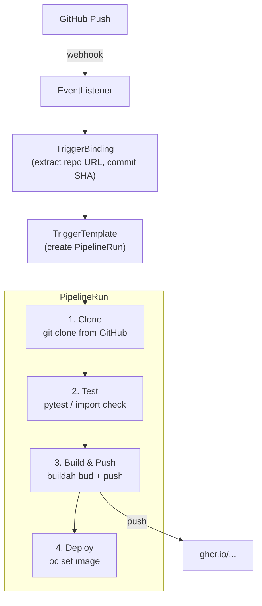

# LP-L08 — CI/CD Pipeline: GitHub to GHCR to OpenShift

**Level:** Personalized
**Duration:** 1 hr 15 min

## Overview

In L04 you used BuildConfig to build images inside the cluster and push them to the internal registry. That is a single build step. In this lesson, you build a complete CI/CD pipeline using OpenShift Pipelines (Tekton): clone source code from GitHub, run tests, build a container image with buildah, push it to GitHub Container Registry (GHCR), and deploy the new image to OpenShift. Then you wire up a webhook so the pipeline fires automatically on every `git push`.

This is the difference between "the cluster can build" and "the cluster runs your entire software delivery lifecycle."

## Prerequisites

- Completed: [L01](../L01_deploy_microservices/) through [L07](../L07_monitoring_and_logging/)
- All ShopInsights services running in the `shopinsights` project
- GitHub account with a repository containing the ShopInsights application code
- GitHub Personal Access Token (PAT) with `write:packages` scope (for pushing to GHCR)
  - Create one at: https://github.com/settings/tokens/new?scopes=write:packages
- OpenShift cluster running (CRC or Developer Sandbox)
- `tkn` CLI installed (optional but recommended — the Tekton CLI for managing pipelines)

## K8s Context

In vanilla Kubernetes, CI/CD is entirely external. You use GitHub Actions, Jenkins, GitLab CI, or another system outside the cluster to build images, run tests, and deploy. Kubernetes has no built-in pipeline system — you wire up external tools, manage their credentials, and hope the deploy step's `kubectl apply` has the right kubeconfig.

OpenShift Pipelines (Tekton) runs CI/CD inside the cluster. The pipeline engine is a Kubernetes-native system: Tasks are pods, Pipelines are custom resources, and PipelineRuns are execution records stored in etcd. Everything is declarative YAML, versioned, and observable through the same tools you use for your workloads.

## Concepts

### Tekton Primitives

Tekton introduces four core custom resources:

| Resource | What it is | Analogy |
|----------|-----------|---------|
| **Task** | A sequence of Steps that run in a single pod | A function — one unit of work |
| **Pipeline** | An ordered graph of Tasks with dependencies | A workflow — chain functions together |
| **PipelineRun** | An execution of a Pipeline with specific parameters | A function call — invoke the workflow |
| **Workspace** | A shared volume that passes data between Tasks | A shared filesystem — clone once, use everywhere |

Each Step in a Task runs as a separate container in the same pod. Steps share the pod's filesystem, so one step can write a file and the next step can read it. Tasks in a Pipeline share data through Workspaces — a PVC that gets mounted into each Task's pod.

### How This Relates to L04

In L04, you used **BuildConfig** — the cluster builds your code using S2I or Docker strategy and pushes the image to the internal registry. That is one step in a larger process.

Here, **Tekton orchestrates the full lifecycle**: clone, test, build, push, deploy. You could even use a BuildConfig as a step inside a Tekton pipeline (via `oc start-build`), but in this lesson we use buildah directly for more control and to push to an external registry (GHCR) instead of the internal one.

Think of it this way:
- **BuildConfig** = "cluster, build this image for me" (single step)
- **Tekton Pipeline** = "cluster, run my entire CI/CD workflow" (multi-step)

### ClusterTasks and Tekton Hub

OpenShift Pipelines comes with pre-installed **ClusterTasks** — reusable Tasks available cluster-wide. Common ones include `git-clone`, `buildah`, `openshift-client`, and `s2i-python`. You can list them with:

```bash
oc get clustertasks
```

You can also find community Tasks on [Tekton Hub](https://hub.tekton.dev/). In this lesson, we write our own Tasks to understand the internals, but in production you would reuse ClusterTasks where possible.

### Triggers: Automating Pipeline Execution

Tekton Triggers extend Tekton with three resources for webhook-driven automation:

| Resource | Purpose |
|----------|---------|
| **EventListener** | A pod that listens for incoming HTTP requests (webhooks) |
| **TriggerBinding** | Extracts values from the webhook payload (e.g., repo URL, commit SHA) |
| **TriggerTemplate** | Creates a PipelineRun using the extracted values |

The flow: GitHub sends a webhook POST to the EventListener -> TriggerBinding extracts the repo URL and commit SHA -> TriggerTemplate creates a PipelineRun with those values -> the Pipeline runs automatically.

### Pipeline Architecture



## Step-by-Step

### Step 1: Install OpenShift Pipelines Operator

OpenShift Pipelines is installed via the Operator Lifecycle Manager (OLM). If you are on CRC, it may already be installed. Check first:

```bash
oc get csv -n openshift-operators | grep pipelines
```

If not installed, install it from the Web Console:

1. Log in as `kubeadmin`:
   ```bash
   oc login -u kubeadmin -p $(cat ~/.crc/machines/crc/kubeadmin-password) https://api.crc.testing:6443
   ```
2. Open the Web Console: https://console-openshift-console.apps-crc.testing
3. Navigate to **Operators > OperatorHub**
4. Search for "Red Hat OpenShift Pipelines"
5. Click **Install**, accept the defaults, click **Install** again
6. Wait for the operator to reach "Succeeded" status

Or install via CLI:

```bash
cat <<EOF | oc apply -f -
apiVersion: operators.coreos.com/v1alpha1
kind: Subscription
metadata:
  name: openshift-pipelines-operator
  namespace: openshift-operators
spec:
  channel: latest
  name: openshift-pipelines-operator-rh
  source: redhat-operators
  sourceNamespace: openshift-marketplace
EOF
```

Wait for the operator to install:

```bash
oc get csv -n openshift-operators -w
```

Switch back to the `developer` user:

```bash
oc login -u developer -p developer https://api.crc.testing:6443
oc project shopinsights
```

Verify Tekton is ready:

```bash
oc get pods -n openshift-pipelines
```

You should see the Tekton controller, webhook, and triggers pods running.

### Step 2: Set Up GHCR Credentials

The pipeline needs to authenticate to GitHub Container Registry to push images. We create a Docker config secret and link it to the pipeline ServiceAccount.

**Option A: Use the setup script** (recommended):

```bash
chmod +x scripts/setup-ghcr-credentials.sh
./scripts/setup-ghcr-credentials.sh
```

The script prompts for your GitHub username and PAT, creates the secret, and links it to the ServiceAccount.

**Option B: Manual setup**:

```bash
# Create the docker-registry secret
oc create secret docker-registry ghcr-credentials \
  --docker-server=ghcr.io \
  --docker-username=YOUR_GITHUB_USERNAME \
  --docker-password=YOUR_GITHUB_PAT \
  -n shopinsights

# Add labels for cleanup
oc label secret ghcr-credentials \
  app=shopinsights tutorial=personalized lesson=08

# Annotate for Tekton
oc annotate secret ghcr-credentials \
  "tekton.dev/docker-0=https://ghcr.io"
```

### Step 3: Create the Pipeline ServiceAccount

The pipeline runs under a dedicated ServiceAccount that has access to the GHCR credentials and permissions to update Deployments.

```bash
oc apply -f manifests/pipeline-sa.yaml
```

```yaml
# manifests/pipeline-sa.yaml
apiVersion: v1
kind: ServiceAccount
metadata:
  name: shopinsights-pipeline
  labels:
    app: shopinsights
    tutorial: personalized
    lesson: "08"
secrets:
  - name: ghcr-credentials
```

Link the secret and grant the ServiceAccount permission to manage Deployments:

```bash
# Link GHCR credentials to the ServiceAccount
oc secrets link shopinsights-pipeline ghcr-credentials

# Grant edit role so the pipeline can update Deployments
oc adm policy add-role-to-user edit -z shopinsights-pipeline -n shopinsights
```

The `edit` role allows the ServiceAccount to create, update, and delete most namespaced resources (Deployments, Services, ConfigMaps) but not RBAC resources. This is least-privilege for a CI/CD pipeline.

### Step 4: Create the Clone Task

The first Task in the pipeline clones the Git repository into a shared workspace.

```bash
oc apply -f manifests/task-clone.yaml
```

```yaml
# manifests/task-clone.yaml
apiVersion: tekton.dev/v1
kind: Task
metadata:
  name: git-clone-shopinsights
  labels:
    app: shopinsights
    tutorial: personalized
    lesson: "08"
spec:
  description: Clone a Git repository into the workspace
  params:
    - name: repo-url
      type: string
      description: The Git repository URL to clone
    - name: revision
      type: string
      description: The Git revision (branch, tag, or commit SHA) to checkout
      default: main
  workspaces:
    - name: source
      description: The workspace to clone the repo into
  steps:
    - name: clone
      image: registry.redhat.io/openshift-pipelines/pipelines-git-init-rhel8:v1.14
      script: |
        #!/usr/bin/env sh
        set -eu
        echo "Cloning $(params.repo-url) at revision $(params.revision)"
        git clone --branch $(params.revision) --depth 1 \
          $(params.repo-url) $(workspaces.source.path)/repo
        cd $(workspaces.source.path)/repo
        echo "Cloned commit: $(git rev-parse HEAD)"
        echo "Repository contents:"
        ls -la
```

Key points:
- **`params`**: Inputs to the Task — the repo URL and revision are passed from the Pipeline.
- **`workspaces`**: A volume mounted into the Task's pod. The cloned repo is written to `$(workspaces.source.path)/repo`.
- **`steps`**: Each step runs as a container. The `pipelines-git-init-rhel8` image has `git` pre-installed.
- **`--depth 1`**: Shallow clone for speed — we only need the latest commit for building.

### Step 5: Create the Test Task

The test Task installs Python dependencies and runs pytest (or an import check if no tests exist yet).

```bash
oc apply -f manifests/task-test.yaml
```

```yaml
# manifests/task-test.yaml
apiVersion: tekton.dev/v1
kind: Task
metadata:
  name: run-tests
  labels:
    app: shopinsights
    tutorial: personalized
    lesson: "08"
spec:
  description: Install dependencies and run pytest on the Python services
  params:
    - name: service-path
      type: string
      description: >
        Relative path to the service directory inside the repo
        (e.g., shared_app/products-service)
  workspaces:
    - name: source
      description: The workspace containing the cloned repo
  steps:
    - name: install-and-test
      image: python:3.11-slim
      workingDir: $(workspaces.source.path)/repo
      script: |
        #!/usr/bin/env sh
        set -eu

        # Install uv
        pip install --quiet uv

        SERVICE_DIR="$(params.service-path)"
        echo "=== Running tests for ${SERVICE_DIR} ==="

        cd "${SERVICE_DIR}"

        # Install project dependencies via uv + pytest/httpx for testing
        uv sync --frozen --no-dev
        uv pip install --system --quiet pytest httpx

        # Run tests if they exist, otherwise run a basic import + health check
        if [ -d "tests" ] || find . -name "test_*.py" -o -name "*_test.py" | grep -q .; then
          echo "Found test files — running pytest"
          uv run pytest -v
        else
          echo "No test files found — running import check and linting"
          uv run python -c "import app; print('Module import OK')"
          echo "Import check passed"
        fi

        echo "=== Tests complete for ${SERVICE_DIR} ==="
```

The Task is designed to work even before you write tests. The `if` block checks for test files; if none exist, it does a basic import check to verify the module loads without errors. As you add tests later, the same Task will find and run them automatically.

### Step 6: Create the Build and Push Task

This Task uses buildah to build a container image and push it to GHCR.

```bash
oc apply -f manifests/task-build-push.yaml
```

```yaml
# manifests/task-build-push.yaml (key sections)
apiVersion: tekton.dev/v1
kind: Task
metadata:
  name: build-push-ghcr
  labels:
    app: shopinsights
    tutorial: personalized
    lesson: "08"
spec:
  description: Build a container image with buildah and push to GitHub Container Registry
  params:
    - name: context-dir
      type: string
      description: Path to the build context relative to the workspace root
    - name: image-name
      type: string
      description: Full image reference (e.g., ghcr.io/lukaskellerstein/shopinsights-products:v1.0)
    - name: dockerfile
      type: string
      default: Dockerfile
  workspaces:
    - name: source
      description: The workspace containing the source code
  steps:
    - name: build
      image: registry.redhat.io/rhel8/buildah:latest
      workingDir: $(workspaces.source.path)/$(params.context-dir)
      securityContext:
        capabilities:
          add:
            - SETFCAP
      script: |
        #!/usr/bin/env bash
        set -eu
        buildah bud \
          --storage-driver=vfs \
          --format=oci \
          --tls-verify=true \
          --layers \
          -f $(params.dockerfile) \
          -t $(params.image-name) \
          .
    - name: push
      image: registry.redhat.io/rhel8/buildah:latest
      script: |
        #!/usr/bin/env bash
        set -eu
        buildah push \
          --storage-driver=vfs \
          --tls-verify=true \
          $(params.image-name)
```

Key details:
- **`--storage-driver=vfs`**: Required when running buildah in an unprivileged container. The `overlay` driver needs kernel capabilities that OpenShift restricts.
- **`--format=oci`**: Produces an OCI-standard image. GHCR accepts both OCI and Docker formats.
- **`--layers`**: Enables layer caching for faster subsequent builds.
- **`SETFCAP` capability**: Needed by some build operations. The `pipelines` SCC granted by the OpenShift Pipelines operator allows this.
- **Credentials**: Tekton automatically mounts the ServiceAccount's docker-registry secrets into the pod. The `tekton.dev/docker-0` annotation on the secret tells Tekton which registry the credentials are for.

### Step 7: Create the Deploy Task

The deploy Task uses the `oc` CLI to update the Deployment image and wait for the rollout.

```bash
oc apply -f manifests/task-deploy.yaml
```

```yaml
# manifests/task-deploy.yaml (key sections)
apiVersion: tekton.dev/v1
kind: Task
metadata:
  name: deploy-to-openshift
  labels:
    app: shopinsights
    tutorial: personalized
    lesson: "08"
spec:
  description: Update an OpenShift Deployment with a new container image
  params:
    - name: deployment-name
      type: string
    - name: image-name
      type: string
    - name: container-name
      type: string
    - name: namespace
      type: string
      default: shopinsights
  steps:
    - name: patch-deployment
      image: registry.redhat.io/openshift4/ose-cli:latest
      script: |
        #!/usr/bin/env bash
        set -eu
        oc set image deployment/$(params.deployment-name) \
          $(params.container-name)=$(params.image-name) \
          -n $(params.namespace)
        oc rollout status deployment/$(params.deployment-name) \
          -n $(params.namespace) --timeout=120s
```

This Task uses `oc set image` rather than `oc apply` — it patches only the image field, leaving everything else untouched. The `oc rollout status` command blocks until the new pods are running or the timeout expires.

### Step 8: Create the Pipeline

Now we chain all four Tasks into a Pipeline.

```bash
oc apply -f manifests/pipeline.yaml
```

```yaml
# manifests/pipeline.yaml
apiVersion: tekton.dev/v1
kind: Pipeline
metadata:
  name: shopinsights-cicd
  labels:
    app: shopinsights
    tutorial: personalized
    lesson: "08"
spec:
  description: >
    Build, test, and deploy a ShopInsights service.
    Clones from GitHub, runs tests, builds with buildah,
    pushes to GHCR, and updates the Deployment.
  params:
    - name: repo-url
      type: string
    - name: revision
      type: string
      default: main
    - name: service-path
      type: string
    - name: image-name
      type: string
    - name: deployment-name
      type: string
    - name: container-name
      type: string
    - name: namespace
      type: string
      default: shopinsights
  workspaces:
    - name: shared-workspace
      description: Workspace shared between Tasks for source code
  tasks:
    - name: clone
      taskRef:
        name: git-clone-shopinsights
      workspaces:
        - name: source
          workspace: shared-workspace
      params:
        - name: repo-url
          value: $(params.repo-url)
        - name: revision
          value: $(params.revision)

    - name: test
      taskRef:
        name: run-tests
      runAfter:
        - clone
      workspaces:
        - name: source
          workspace: shared-workspace
      params:
        - name: service-path
          value: $(params.service-path)

    - name: build-push
      taskRef:
        name: build-push-ghcr
      runAfter:
        - test
      workspaces:
        - name: source
          workspace: shared-workspace
      params:
        - name: context-dir
          value: repo/$(params.service-path)
        - name: image-name
          value: $(params.image-name)

    - name: deploy
      taskRef:
        name: deploy-to-openshift
      runAfter:
        - build-push
      params:
        - name: deployment-name
          value: $(params.deployment-name)
        - name: image-name
          value: $(params.image-name)
        - name: container-name
          value: $(params.container-name)
        - name: namespace
          value: $(params.namespace)
```

The `runAfter` field defines the dependency chain: clone -> test -> build-push -> deploy. Each Task runs only after the previous one succeeds. If any Task fails, the Pipeline stops.

The `shared-workspace` Workspace is a PVC that gets mounted into every Task. The clone Task writes the source code, and subsequent Tasks read from it.

### Step 9: Run the Pipeline Manually

Create a PipelineRun to execute the pipeline for the products-service:

```bash
oc create -f manifests/pipelinerun.yaml
```

Note: We use `oc create` (not `oc apply`) because `generateName` creates a unique name for each run. Applying the same PipelineRun manifest twice would create two separate runs.

```yaml
# manifests/pipelinerun.yaml
apiVersion: tekton.dev/v1
kind: PipelineRun
metadata:
  generateName: shopinsights-products-run-
  labels:
    app: shopinsights
    tutorial: personalized
    lesson: "08"
    tekton.dev/pipeline: shopinsights-cicd
spec:
  pipelineRef:
    name: shopinsights-cicd
  taskRunTemplate:
    serviceAccountName: shopinsights-pipeline
  params:
    - name: repo-url
      value: https://github.com/lukaskellerstein/shopinsights.git
    - name: revision
      value: main
    - name: service-path
      value: shared_app/products-service
    - name: image-name
      value: ghcr.io/lukaskellerstein/shopinsights-products:latest
    - name: deployment-name
      value: products-service
    - name: container-name
      value: products-service
    - name: namespace
      value: shopinsights
  workspaces:
    - name: shared-workspace
      volumeClaimTemplate:
        spec:
          accessModes:
            - ReadWriteOnce
          resources:
            requests:
              storage: 1Gi
```

The `volumeClaimTemplate` creates a temporary PVC for this PipelineRun. It is automatically cleaned up when the PipelineRun is deleted.

Alternatively, use the `tkn` CLI to start the pipeline interactively:

```bash
tkn pipeline start shopinsights-cicd \
  --serviceaccount shopinsights-pipeline \
  --param repo-url=https://github.com/lukaskellerstein/shopinsights.git \
  --param revision=main \
  --param service-path=shared_app/products-service \
  --param image-name=ghcr.io/lukaskellerstein/shopinsights-products:latest \
  --param deployment-name=products-service \
  --param container-name=products-service \
  --param namespace=shopinsights \
  --workspace name=shared-workspace,volumeClaimTemplateFile=- \
  --showlog
```

### Step 10: Watch the Pipeline Run

Monitor the PipelineRun from the CLI:

```bash
# List PipelineRuns
oc get pipelinerun -l tekton.dev/pipeline=shopinsights-cicd

# Watch logs of the latest PipelineRun
tkn pipelinerun logs -f --last

# Or follow a specific PipelineRun
tkn pipelinerun logs shopinsights-products-run-xxxxx -f
```

Or watch from the Web Console:

1. Open https://console-openshift-console.apps-crc.testing
2. Switch to the **Developer** perspective
3. Navigate to **Pipelines** in the left sidebar
4. Click on `shopinsights-cicd`
5. Click the **PipelineRuns** tab
6. Click on the running PipelineRun to see the visual graph

The Web Console shows a live pipeline graph with each Task as a node. Completed Tasks turn green, running Tasks pulse blue, and failed Tasks turn red. Click any Task to see its logs.

Expected flow:

```
clone (30s) ──> test (45s) ──> build-push (3-5 min) ──> deploy (30s)
```

The build-push step takes the longest because it downloads base images and builds the container. Subsequent runs are faster due to layer caching.

### Step 11: Set Up Webhook Triggers

Now automate the pipeline so it runs on every `git push`. This requires three resources: EventListener, TriggerBinding, and TriggerTemplate.

Apply all three:

```bash
oc apply -f manifests/triggerbinding.yaml
oc apply -f manifests/triggertemplate.yaml
oc apply -f manifests/eventlistener.yaml
```

```yaml
# manifests/triggerbinding.yaml
apiVersion: triggers.tekton.dev/v1beta1
kind: TriggerBinding
metadata:
  name: shopinsights-github-binding
  labels:
    app: shopinsights
    tutorial: personalized
    lesson: "08"
spec:
  params:
    - name: repo-url
      value: $(body.repository.clone_url)
    - name: revision
      value: $(body.after)
```

The TriggerBinding uses JSONPath expressions to extract values from the GitHub webhook payload. `$(body.repository.clone_url)` gets the repo URL, and `$(body.after)` gets the commit SHA that was just pushed.

```yaml
# manifests/triggertemplate.yaml
apiVersion: triggers.tekton.dev/v1beta1
kind: TriggerTemplate
metadata:
  name: shopinsights-pipeline-trigger
  labels:
    app: shopinsights
    tutorial: personalized
    lesson: "08"
spec:
  params:
    - name: repo-url
    - name: revision
  resourcetemplates:
    - apiVersion: tekton.dev/v1
      kind: PipelineRun
      metadata:
        generateName: shopinsights-webhook-run-
        labels:
          app: shopinsights
          tutorial: personalized
          lesson: "08"
          trigger: github-push
      spec:
        pipelineRef:
          name: shopinsights-cicd
        taskRunTemplate:
          serviceAccountName: shopinsights-pipeline
        params:
          - name: repo-url
            value: $(tt.params.repo-url)
          - name: revision
            value: $(tt.params.revision)
          - name: service-path
            value: shared_app/products-service
          - name: image-name
            value: ghcr.io/lukaskellerstein/shopinsights-products:latest
          - name: deployment-name
            value: products-service
          - name: container-name
            value: products-service
          - name: namespace
            value: shopinsights
        workspaces:
          - name: shared-workspace
            volumeClaimTemplate:
              spec:
                accessModes:
                  - ReadWriteOnce
                resources:
                  requests:
                    storage: 1Gi
```

Wait for the EventListener pod to start:

```bash
oc get pods -l eventlistener=shopinsights-webhook
```

The EventListener creates a Service automatically. Expose it with a Route so GitHub can reach it:

```bash
oc get svc -l eventlistener=shopinsights-webhook

# Create a Route for the EventListener
oc create route edge shopinsights-webhook \
  --service=el-shopinsights-webhook \
  --port=http-listener \
  --insecure-policy=Redirect
```

Get the webhook URL:

```bash
echo "https://$(oc get route shopinsights-webhook -o jsonpath='{.spec.host}')"
```

### Step 12: Configure the GitHub Webhook

1. Go to your GitHub repository: https://github.com/lukaskellerstein/shopinsights/settings/hooks
2. Click **Add webhook**
3. Set the **Payload URL** to the Route URL from Step 11
4. Set **Content type** to `application/json`
5. Select **Just the push event**
6. Click **Add webhook**

**Testing without a real webhook** (for CRC where GitHub cannot reach your cluster):

Since CRC runs locally and is not accessible from the internet, you can simulate a webhook with `curl`:

```bash
WEBHOOK_URL="https://$(oc get route shopinsights-webhook -o jsonpath='{.spec.host}')"

curl -sk -X POST "${WEBHOOK_URL}" \
  -H "Content-Type: application/json" \
  -d '{
    "after": "main",
    "repository": {
      "clone_url": "https://github.com/lukaskellerstein/shopinsights.git"
    }
  }'
```

This sends a fake push event payload that triggers the pipeline. Check that a new PipelineRun was created:

```bash
oc get pipelinerun -l trigger=github-push --sort-by=.metadata.creationTimestamp
```

## Verification

Run these commands to verify the pipeline infrastructure is working:

```bash
echo "=== Tekton Operator ==="
oc get csv -n openshift-operators | grep pipelines

echo ""
echo "=== Pipeline Tasks ==="
oc get tasks -l app=shopinsights

echo ""
echo "=== Pipeline ==="
oc get pipeline shopinsights-cicd

echo ""
echo "=== ServiceAccount ==="
oc get sa shopinsights-pipeline -o yaml | grep -A5 secrets

echo ""
echo "=== PipelineRuns ==="
oc get pipelinerun -l tekton.dev/pipeline=shopinsights-cicd \
  --sort-by=.metadata.creationTimestamp

echo ""
echo "=== EventListener ==="
oc get eventlistener shopinsights-webhook
oc get pods -l eventlistener=shopinsights-webhook

echo ""
echo "=== Webhook Route ==="
oc get route shopinsights-webhook
```

To verify a completed PipelineRun:

```bash
# Check the latest PipelineRun status
tkn pipelinerun describe --last

# Verify the Deployment was updated with the new image
oc get deployment products-service -o jsonpath='{.spec.template.spec.containers[0].image}'
echo ""

# Verify the new pod is running
oc get pods -l component=products-service
```

## K8s vs OpenShift Comparison

| Aspect | Kubernetes | OpenShift |
|--------|-----------|-----------|
| CI/CD engine | External (GitHub Actions, Jenkins, GitLab CI) | Built-in (Tekton via OpenShift Pipelines operator) |
| Pipeline definition | YAML in external CI system (e.g., `.github/workflows/`) | Tekton Pipeline CRD in the cluster |
| Build system | External (Docker, kaniko in CI) or none | Built-in: BuildConfig (L04) or Tekton + buildah (this lesson) |
| Image registry | External (GHCR, DockerHub, ECR) | Built-in internal registry + external support |
| Credentials | Stored in CI system (GitHub Secrets, Jenkins Credentials) | Kubernetes Secrets + ServiceAccount linking |
| Pipeline visibility | CI system dashboard (GitHub Actions tab) | OpenShift Web Console Developer > Pipelines |
| Webhook handling | CI system handles webhooks natively | Tekton Triggers (EventListener + TriggerBinding) |
| Pipeline runs as | Containers in CI provider infrastructure | Pods in your cluster (same namespace as your app) |
| Reusable steps | CI-specific (GitHub Actions marketplace, Jenkins plugins) | Tekton Tasks (ClusterTasks, Tekton Hub) |
| Cost | CI minutes (GitHub: 2000 free/month, then paid) | Cluster resources only — no per-minute billing |

## Key Takeaways

- **OpenShift Pipelines (Tekton)** runs CI/CD inside the cluster as Kubernetes-native resources. No external CI system required.
- **Tasks** are the building blocks (clone, test, build, deploy). **Pipelines** chain them together. **PipelineRuns** execute them.
- **Workspaces** (PVCs) share data between Tasks — clone once, use the source in every subsequent Task.
- **BuildConfig vs Tekton**: BuildConfig handles a single build step to the internal registry. Tekton orchestrates the full CI/CD lifecycle and can push to external registries like GHCR.
- **Tekton Triggers** automate pipeline execution via webhooks — every `git push` creates a new PipelineRun.
- **buildah** runs unprivileged on OpenShift (with `--storage-driver=vfs`) — no Docker daemon needed, no root required.
- The **Web Console** provides a visual pipeline graph with live logs — far better than scrolling through CI log files.

## Cleanup

Remove all pipeline resources created in this lesson:

```bash
# Delete PipelineRuns first (they reference the Pipeline)
oc delete pipelinerun -l tekton.dev/pipeline=shopinsights-cicd

# Delete trigger resources
oc delete route shopinsights-webhook
oc delete eventlistener shopinsights-webhook
oc delete triggertemplate shopinsights-pipeline-trigger
oc delete triggerbinding shopinsights-github-binding

# Delete the Pipeline and Tasks
oc delete pipeline shopinsights-cicd
oc delete task -l tutorial=personalized,lesson=08

# Delete the ServiceAccount and Secret
oc delete sa shopinsights-pipeline
oc delete secret ghcr-credentials

# Clean up workspace PVCs created by PipelineRuns
oc delete pvc -l tekton.dev/pipeline=shopinsights-cicd
```

Or delete everything with the lesson label:

```bash
oc delete all -l tutorial=personalized,lesson=08
oc delete secret -l tutorial=personalized,lesson=08
oc delete sa shopinsights-pipeline
oc delete pvc -l tekton.dev/pipeline=shopinsights-cicd
```

Note: This does not uninstall the OpenShift Pipelines operator — it stays installed for other projects and for L09 (GitOps).

## Next Steps

Your pipeline builds and deploys on every push, but the pipeline itself is the only thing managing your cluster state. What happens if someone runs `oc edit deployment` and changes the image manually? In [L09: GitOps with ArgoCD](../L09_gitops/), you will set up OpenShift GitOps so that Git is the single source of truth — ArgoCD continuously reconciles the cluster state with your Git repository, and any manual drift is automatically corrected.

## Deep Dive

For the full conceptual treatment of CI/CD concepts and Tekton internals, see the comprehensive tutorial:
- [L2-M1 CI/CD with OpenShift Pipelines](../../tutorial/level_2/M1_cicd/)
- [L1-M3.4 BuildConfigs and S2I](../../tutorial/level_1/M3_application_deployment/4_buildconfigs_s2i/)
- [L2-M2 Operators](../../tutorial/level_2/M2_operators/) — for understanding how the Pipelines operator is installed via OLM
